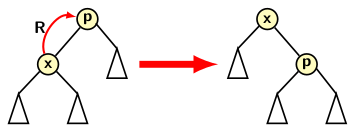
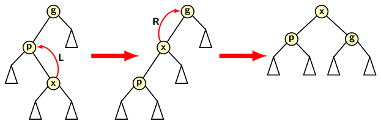

## Amortised Time Analysis for Splay Trees

The contents of this blog is bit mathematical and requires a bit of maturity in understanding. We
have discussed splaying operation in a previous blog. In course of discussion we mentioned that
splay tree data structure support a sequence of O(<i>m</i>) operations in average O(<i>log n</i>)
unit of time per operation or overall time of O(<i>m log n</i>) time. In a completely left or right
skewed tree, the time for accessing the leaf node could be as expensive as O(<i>n</i>), where 
<i>n</i> is the number of nodes in the tree. The average time we mentioned is actually amortized 
time or time partitioned over a sequence of operations. If we consider an operation in isolation then
the average bound does not work. So, we need to provide an analysis of the amortized time.

We start with a potential function. A potential function is a kind of reserve energy as a physicist 
may define. The reserve energy tells us a system's intrinsic capabilities to work. When we execute 
some activities potentials reduce. We can increase potential by eating nutritious food and
train under a physical trainer. Amortised cost relies on doing some expensive activities to make
future activities easier. 
  
How we define a potential for operations on splay trees? The operations supported by splay trees
normal BST operations of search, insert and delete. These operations depend on the length of the
tree path from the root to the accessed node in the tree or the height of the tree in the 
worst-case. So, we define the potential by the following function

  &#x3D5;(T) = &Sigma;log(<i>S(i)</i>)

Where <i>S(i)</i> denotes the number of descendants of <i>i</i> (including itself). Let us define 
log <i>S(i)=R(i)</i>, where <i>R(i)</i> is the rank (or height) of node <i>i</i>. Thus <i>R(T)</i>
is the height of the tree <i>T</i>. 

We need a preliminary result for our analysis which is given in Lemma 1.

<strong>Lemma 1</strong>: If <i>a + b &le; c</i> where <i>a</i> and <i>b</i> are both positive
integers then log <i>a</i> + log <i>b</i> &lt; 2log <i>c</i> - 2.

<strong>Proof</strong>: We know arithmetic mean is less than equal to geometric mean. So,
&radic;(<i>ab</i>) &le; <i>(a+b)/2</i> &le; <i>c/2</i>. Taking square of both side of previous 
inequality, we have <i>ab</i> &le; <i>c2/4</i>. Now take log of both side to get
the result.

We are ready to analyze the time for splaying. As explained already, the fundamental opreations 
are zig, zig-zig and zig-zag. So we focus on complexitie of these operations. 

Let the ranks and sizes of a node <i>x</i> be denoted respectively by:

- Before splaying: <i>Ri(x)</i> and <i>Si(x)</i> 
- After splaying: <i>Rf(x)</i> and <i>Sf(x)</i> 

<strong>Zig step</strong>: For completeness of description, zig type splaying is shown in the figure
below. 

  

Actual time for zig step is 1 because it is a rotation. The computation of potential 
change is easy. Since splaying affects subtress under <i>x</i> 
and its parent <i>p</i>, we need to compute change with respect to these two subtree.

  <i>1+Rf(x) + Rf(p) - Ri(x) - Ri(p)</i>

The size of the subtree of <i>p</i> decreases after splaying. So we have 
<i>Rf(p) &lt; Ri(p)</i>. However, the size of subtree of <i>x</i>
increases. So, <i>Rf(x) &gt; Ri(x)</i>. We can now simplify the
expression for average time <i>ATzig</i> for zig type splaying as follows:

  <i>ATzig &lt; 1+Rf(x) - Ri(x)</i>

Since <i>Rf(x) - Ri(x)</i> we conclude that 

  <i>ATzig &lt; 1+3(Rf(x) - Ri(x))</i>

<strong>Zig-zag step</strong>: A zig-zig type splaying requires a double rotation as shown in 
the image below. 

  

Actual time for zig-zag is 2 (double rotation). The potential change occurs for three subtrees
under <i>x</i>, <i>p</i> and <i>g</i>. The reader can observe that potential change is given
by the following expression.

  <i>2+Rf(x) + Rf(p) + Rf(g) - Ri(x) - Ri(p) - Ri(g)</i> 

From the figure we observe <i>Sf(p) + Sf(g) &lt; Sf(x)</i>. Therefore, from the above lemma we can conclude:
<i>log Sf(p) + log Sf(g) &lt; 2 log Sf(x) - 2</i>. Since log <i>Size = height</i>, we have <i>Rf(p) + Rf(g) &lt; 2Ri(x)-2</i>.

Summarizing the observation from the figure, we get the following:

- <i>Rf(x) = Ri(g)</i>.
- <i>Ri(g) &gt; Ri(x)</i>.
- <i>Rf(p) + Rf(g) &lt; 2Ri(x) - 2</i>.

Substituting <i>Rf(g)</i> for <i>Rf(x)</i>, we get

  <i>2 + Ri(g) +  Rf(p) + Rf(g) - Ri(x) - Ri(p) - Ri(g)</i>  
  

Let us consider the earlier example of splaying explained in <a href="./splayTree.md">Splay Trees</a>.
Suppose we apply splaying on node 2. The series of trees after each
splay is give below as <i>T1</i>, <i>T2</i>, <i>T3</i>, and
<i>T4</i>. Consider the rank of node 2 in the four trees. The first operation is a
zig-zag on tri-node configuration 2-1-4. Its cost is at most 3(<i>R2 - R1</i>).

  - Initial access cost for 2 is <i>R1</i>
  - 
