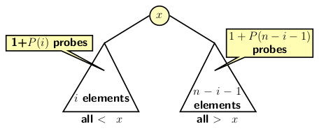

## Analysis of Binary Search Tree

For analysis of time complexity for operations on BST we explore following questions.

- What could be a worst-case scenario?, and
- What could be a best-case scenario? 

Search is the important first step for both insertion and deletion. 
In the worst-case, a successful or an unsuccessful search depends on the length of the tree path from the root to the farthest leaf node. 

The pathological cases for insertions and deletions are exhibited by a right skewed or a left skewed BSTs. These case occur respectively as follows: 

- Perform an ascending sequence of <i>n</i> insertions on an initially empty BST it generates a right skewed tree.
- Perform a descending sequence of <i>n</i> insertions on an initially empty BST it generates a left skewed tree.

A completely skewed tree requires time of O(<i>n</i>) for any operation. On the other hand, an operation on a balanced binary search tree takes 
O(<i>log n</i>).
Therefore, 
- A right skewed or a left skewed BST provides the worst-case scenario, and
- A balanced BST gives provides a best-case scenario for BSTs. 

When we have a random input source, then all distributions of values are equally likely. So, it is important to analyze the average case time 
complexity. Let us find the average case analysis of BST. Our focus will be on average path length in a BST, because any operation depends on the 
path length.   

We begin with an example. Consider the tree of shown below. The total internal path length of the tree is 15. 

The first problem we need to address is:

- How to compute internal path length of a BST in a dynamic situation? 

The dynamic situation is presented by the possibilities of insertions and deletions happening in any possible order. We use the following assumptions:

- <i>P(n)</i>: the  average path length of a node in a BST with <i>n</i> nodes 
- Initial values are: <i>P(0) = 0</i> and <i>P(1)=1</i>.
- <i>x</i>: is the root of the BST or the first node to be inserted
- <i>x</i>: may equally likely to be 1st, 2nd, 3rd or <i>n</i>th element in the input  

Now consider <i>i</i>th insertion for a fixed <i>i</i> for <i>i = 0, 1, 2, ..., n-1</i>. The configuration of BST at this point should be as shown in 
the figure below:

Consider how the next insertion occurs.
- The root node will be probed in any case.
- If left subtree of the root is probed for <i>i+1</i> insertion then path length is <i>1+P(i)</i>
- If right subtree of the root is probed for <i>i+1</i> insertion then path length is <i>1+P(n-1-i)</i>
- The probability of searching any element is <i>1/n</i>.
So the average number of probes for <i>i+1</i>the insertion would be:

   
  
  

