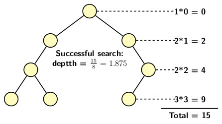

## Analysis of Binary Search Tree

For analysis of time complexity for operations on BST we explore the following questions.
- What could be a worst-case scenario?, and
- What could be a best-case scenario?

Search is the critical first step any operation including both insertion and deletion on a binary search tree. A successful or unsuccessful search depends on 
the length of the tree path from the root to the farthest leaf node. A right-skewed or a left-skewed BSTs exhibit pathological cases for insertions and 
deletions. These cases occur as follows:

- Perform an ascending sequence of <i>n</i> insertions on an initially empty BST it generates a right-skewed tree.
- Perform a descending sequence of <i>n</i> insertions on an initially empty BST it generates a left-skewed tree.

A completely skewed tree requires a time of <i>O(n)</i> for any operation. On the other hand, an operation on a balanced binary search tree takes <i>O(log n)</i>. Therefore, 

- A right-skewed or a left-skewed BST provides the worst-case scenario, and
- A balanced BST gives a best-case scenario for BSTs.

When we have a random input source, all distributions of the values are equally likely. So, it is important to analyze the average case time complexity. The
average case analysis of BST depends on the average path length traversed on a BST for performing an operation. We begin with an example. Consider the tree
shown below. The total internal path length of the tree is 15.

The first problem we need to address is:

- How to compute the internal path length of a BST in a dynamic situation where an operation can choose to traverse any section of a BST? 

We capture such a dynamic situation by considering the possibilities of insertions and deletions happening in any possible order. We use the following
assumptions:

- <i>P(n)</i>: the  average path length of a node in a BST with <i>n</i> nodes 
- Initial values are: <i>P(0) = 0</i> and <i>P(1)=1</i>.
- <i>x</i>: is the root of the BST or the first node to be inserted
- <i>x</i>: may equally likely to be 1st, 2nd, 3rd or <i>n</i>th element in the input  

Now consider <i>i</i>th insertion for a fixed <i>i</i> for <i>i = 0, 1, 2, ..., n-1</i>. The configuration of BST at this point is illustrated in 
the figure below:

Consider how the subsequent insertion occurs.

- The root node will be probed in any case.
- If left subtree of the root is probed for <i>i+1</i> insertion then path length is <i>1+P(i)</i>
- If right subtree of the root is probed for <i>i+1</i> insertion then path length is <i>1+P(n-1-i)</i>
- The probability of searching any element is <i>1/n</i>.

So the average number of probes for <i>i+1</i>the insertion would be:

  

The average value is obtained by letting <i>i</i> to be any of the <i>n</i> elements. So, the average value is given by the expression:

 

In the above equation, we use the expression found earlier to replace <i>P(n,i)</i>. Since the pair of sums for <i>P(i)</i> and <i>P(n,i)</i> are symmetric, the
simplified expression for <i>P(n)</i> becomes:

  
Now apply induction to prove . The induction 
requires a base case, an induction hypothesis and a proof for the induction step.

<b>Base case</b>: We know <i>P(1) = 1</i>,  and evaluation of the expression for <i>n=1</i> gives us: 

<b>Induction hypothesis</b>: Assume 

  
  

  for any <i>i</i> less than <i>n</i>. 
  
 <b>Proof of induction step</b>: With the induction hypothesis in mind we apply to terms of the sum in the expression for <i>P(n)</i> and simplify it further
 to obtain: 

Consider the sum on the right-hand side of previous inequality and apply simplification:

  

Replacing the sum by the final expression, we finally get 

Therefore, the average case complexity of an operation on BST is of the order of <i>log n</i>

[Back to Index](../index.md)
