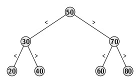
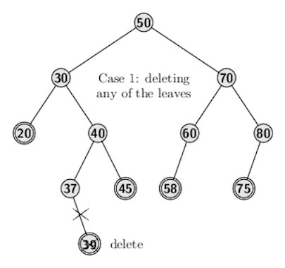
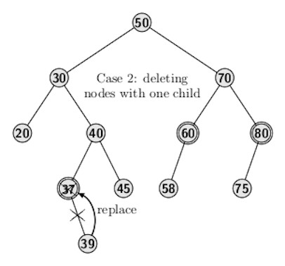
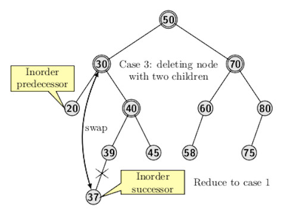
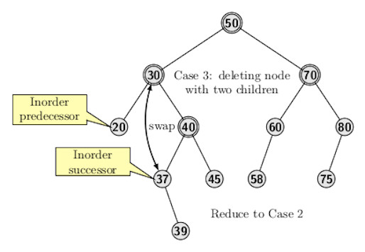

## Introduction to Binary Search Trees

The most extensive use of binary trees is for search and indexing applications where elements are from a totally ordered set. It is based on the idea of 
making search faster by the principle of exclusion and inclusion like binary search.It supports the following set of operations as most of the other data
structures:
- Insertions
- Deletions
- Search
The nodes' arrangement in a BST facilitates a search much like a binary search.

- The elements stored at nodes in the left subtree of a node <i>n</i> are less than the element stored at <i>n</i>.
- The elements stored at nodes nodes in the right subtree of a node <i>n</i> are greater or equal than that stored at <i>n</i>
- Both left and right subtrees of a node also recursively satisfy the two BST properties stated above.

The average time complexity of any operation is 

The figure below provides an example of a binary search tree.
<p align="center">

</p>
The link or tree branch label indicates the relationships between the elements stored at end nodes. All elements in the right subtree of 50 are greater than 50. 
Likewise, all elements in the left subtree of 50 are smaller than 50. 
The node structure of a BST remains the same as that of a binary tree.

The most frequent operation on a BST is searching. Search is essentially a traversal of the tree. It terminates either successfully or reporting that the element does not exist. The search works as follows:
- Search begins at the root.
- If the element being searched is greater than the element at the current node, then the search is carried out in the right subtree 
- If the element being searched is smaller than the element at the current node, then the search is carried out in the left subtree 
The search function appears below:
```
TNODE * searchNode(TNODE * t, int x) { 
    if (t == NULL || t->info == x) 
        return t;
    if (t->info > x)  {
        // Searched element is smaller 
        t = searchNode(t->left, x);
        return t;
    }
    if (t->info < x) { 
        // Searched element is larger
        t = searchNode(t->right, x) ;
        return t;
    }
}
```

Insertion operation also uses search. After insertion the tree must satisfy the BST property. So the position where insertion of an element <i>e</i> should
occur would be between a pair of elements <i>e<sub>1</sub></i> and <i>e<sub>2</sub></i> such that:  
- <i>e<sub>1</sub></i>  is the largest element in <i>T</i> which is smaller than <i>e</i>
- <i>e<sub>2</sub></i>  is the smallest element in <i>T</i> which is smaller than <i>e</i>
These two elements can be located easily through search as the elements are from a totally ordered set.

Inserting <i>e</i> into an empty tree is simple, it just returns a pointer to the new node containing <i>e</i>. For insertion into a non-empty tree, 
we find the position in the left subtree if the element at the current node is larger than <i>e</i>; otherwise, we search for the appropriate position in the
right subtree of the current node. The insertion function appears below:
```
TNODE * insert(TNODE * node, int info) {
    if (node == NULL) // Insert first node
        return newNode(info); 
    if (info < node->info)
        // Insert into left subtree
        node->left = insert(node->left, info); 
    else if (info > node->info)
        // Insert into right subtree
        node->right = insert(node->right, info);
    return node; 
}
```

The deletion operation is a bit involved. We need to handle three cases:

- If the element to be deleted is at a leaf node.
- If the element to be deleted is at an internal node with only one child. 
- If the element to be deleted is at an internal node with two children. 

Case 1 can be handled by deleting the concerned leaf node. It does not affect the rest of the tree. The figure below illustrates this case. Double circles indicate the leaf nodes. 
<p align="center">

</p>

Case 2 can be handled simply by promoting the child of the node to be deleted to the parent's position. The subtree below is unaffected. 
Since the child occupies the position of its previous parent, the absence of the parent node does not affect the rest of the tree. This case is illustrated
below. The nodes having one child are indicated by double circles in the figure below.
<p align="center">

</p>

Case 3 is little involved. We need to find the inorder successor or the inorder predecessor of the node to be deleted. For consistency in description, we will
use inorder successor. The node is swapped with the inorder successor. Then the 
node is deleted from the new position. Either case 1 or case 2 would apply to the problem of deleting the node at a new position. So, we need to prove that
inorder successor is either a leaf node or a node with one child. Before proceeding with the proof, examine the figure below 
, which illustrates case 3. All internal nodes having two children are marked by double circles in the figures below
<p align="center">

</p>

<p align="center">

</p>

The inorder successor of a node is the leftmost node in the node's right subtree to be deleted. If the successor is not a leaf node, then it can only have a 
right child because the presence of a left child would mean the node identified as the inorder successor is not correct. It cannot be the leftmost node in the 
node's right subtree to be deleted. The deletion function is given below.
```
TNODE * deleteNode(TNODE * root, int x) {
    TNODE * temp;
    if (root == NULL) {
        printf("Error: empty tree or element not present\n");
        return root;
    }
 
    // If element is smaller than that at the root delete from the left subtree
    if (x < root->info)
        root->left = deleteNode(root->left, x);
 
    // If element is bigger than the element at the root delete from the right subtree
    else if (x > root->info)
        root->right = deleteNode(root->right, x);
 
    // If element at the root equal to element to be deleted, delete the root. 
    else {
        // Node has only one child or no child
        if (root->left == NULL) {
            temp = root->right;
            printf("Delete %d success\n",root->info);
            free(root);
            return temp;
        }
        else if (root->right == NULL) {
            temp = root->left;
            printf("Delete %d success\n",root->info);
            free(root);
            return temp;
        }
 
        // For a node with two children get the inorder successor
        // Inorder successor is the smallest node in the right subtree
        
        temp = smallestNode(root->right);
 
        // Copy the inorder successor's content to this node
        root->info = temp->info;
 
        // Delete the inorder successor, recursive call will take care of the applicable case
        root->right = deleteNode(root->right, temp->info);
    }
    return root;
} 

```

[Back to Index](../index.md)
