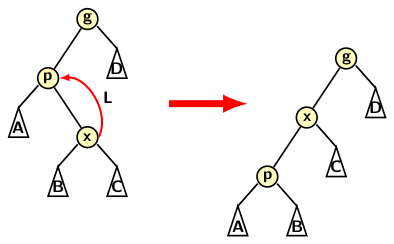

## Basic Operations on Splay Trees

We have learned about splaying operations on a BST. We have also learned about insert, delete, and
search operations on BST. Now we consider how these basic operations are implementable for spay 
trees. We use a basic structure of nodes. A splay tree node does not require any extra information
bit like AVL or Red Black tree. But splaying needs parent information. So, the definitions of
a splay tree and its node are as follows:
```
typedef struct node {
   int info; // Information field
   struct node *left; // Left child ptr
   struct node *right; // Right child ptr
   struct node *parent; // Parent ptr
} NODE;

typedef struct splay_tree {
   struct node *root;  // Root of the tree
} SPLAYTREE;
```
The left and right rotations are fundamental to a splay operation. We have already explained the 
rotations in the first blog on splay tree. So, we now deal with implementation of the rotation
operations. A double operation is a sequence of two rotations. So we need to focus only on 
two different types of single rotations: left and right rotations. The code inlcudes explanatory 
enough comments. Further the two rotations are symmetric. Therefore, it suffices to
focus on important points of the implementation of only one rotation. 

Let us consider left rotation. A node and its right child are involved in a left rotation. For 
completeness of description let us diagrammatically view the rotation once again.
<p style="text-align:center>
     
</p>

                                          
```
void leftRotate(SPLAYTREE *t, NODE *p) {
   // Rotation with reference to the parent node
   // Right child and parent to be rotated left 
   NODE *x = p->right;  // Get p's right child
   p->right = x->left;  
   if(x->left != NULL) {
        // p is now parent of x's left child
        x->left->parent = p;
   }
   // Grandparent adopts x as child
   x->parent = p->parent; 
   if(p->parent == NULL) { 
        // If parent was root, make x new root
        t->root = x; 
   } else if(p == p->parent->left) { 
        // p was left child of its parent
        p->parent->left = x;
   } else { 
        // p was right child of its parent
        p->parent->right = x; 
   }
   // p is now left child of x
   x->left = p; 
   p->parent = x; 
}

void rightRotate(SPLAYTREE *t, NODE *p) {
   // Rotation with reference to the parent node
   // Left child and parent to be rotated right 
   NODE *x = p->left;
   p->left = x->right;
   if(x->right != NULL) {
        // p is now parent of x's right child
        x->right->parent = p;
   }
   // Grandparent adopts x as child
   x->parent = p->parent;
   if(p->parent == NULL) { 
        // If p was root make x as new root
        t->root = x;
   }
   else if(p == p->parent->right) {
        // p is left child
        p->parent->right = x;
   }
   else {
        // p is right child
        p->parent->left = x;
   }
   // p is now left child of x
   x->right = p;
   p->parent = x;
}
```
