## Analysis of Quick Sort

<strong>Worst-case analysis</strong>

Worst-case behaviour occurs if excluding the partitioning elements, partition returns one array
of size <i>n - 1</i>. The worst-case materializes when we have a sorted input. The cost of 
partitioning in this case is &Theta;(<i>n</i>). The recurrence relation for running time is:

  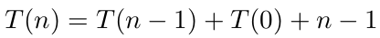

  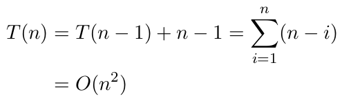

<strong>Best case analysis</strong>

The best-case occurs if the partition produces two equal subarrays, i.e., if the pivot is
the median element. In this case, the partition sizes are:

- one of size &lfloor;<i>n/2</i>&rfloor; and 
- another of size &lceil;<i>n/2</i>&rceil;

The recurrence equation for time complexity is given by

  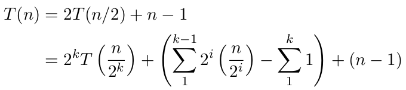

Using <i>T(1) = 0</i>, 2k = <i>n</i>, we get <i>k = log n</i>. Simplifying the above
recurrence equation:

  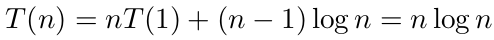

<strong>Balanced partitioning</strong>

The average case of quick sort is more close to the best case than worst case. It is because balance
of partitioning is reflected in recurrence for running time. Suppose the partitioning always produces
9-to-1 proportional split, then the recurrence relation will then be:

  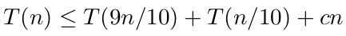

  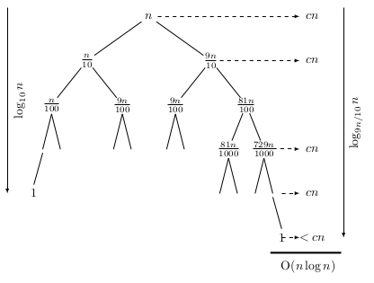

<strong>Average case analysis</strong>

Quick sort average case analysis is based on the following assumptions:

- All permutation of the input sequence is equally likely so that we can choose the first element as the pivot
- The pivots used at all-recursive levels are random 

Therefore, the recurrence formula for time complexity is:

  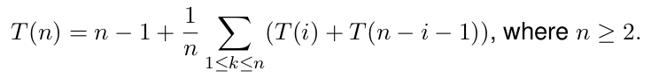

Since we move the pivot out of the way during partitioning, one comparison takes place for
each of <i>n-1</i> elements. The remaining part of the recurrence relation is explained as 
follows. If <i>i</i> elements are in one partition then <i>n-i-1</i> elements are in the other
partition. Now by the symmetry of expression within the summation sign, we simplify the recurrence
relation as:

  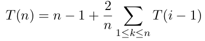

                                                                
We multiply both sides of the above equation by <i>n</i> and substract <i>T(n-1)</i>
from <i>T(n)</i> and get:                                                              

  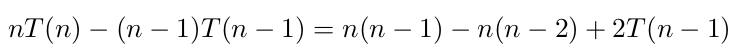

Rearranging terms and simplifying, we have:

  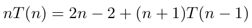

Now the recurrence is in a form we can solve by unfolding the recurrence.

  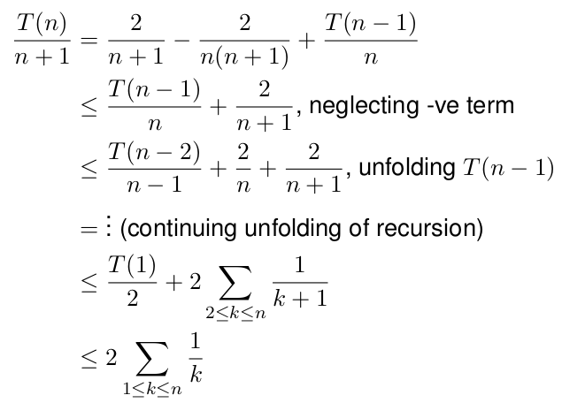

Approximating summation by integral 

  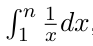

we get:

  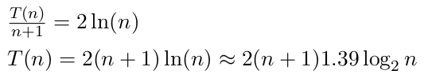

