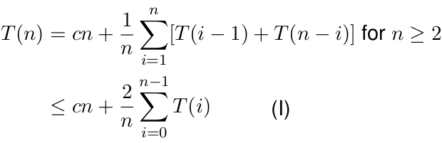
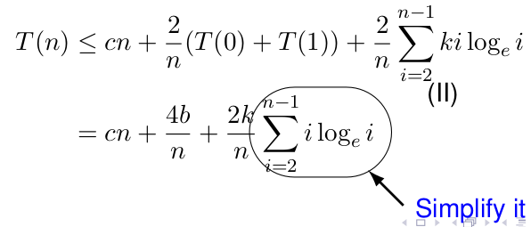
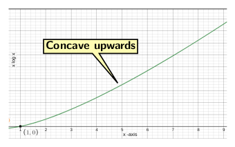
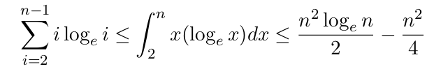
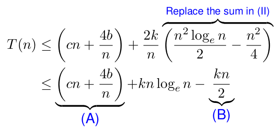

## Analysis of Quick Sort

<strong>Worst-case analysis</strong>

Worst-case behaviour occurs if excluding the partitioning elements, partition returns one array
of size <i>n - 1</i>. The worst-case materializes when we have a sorted input. The cost of 
partitioning in this case is &Theta;(<i>n</i>). The recurrence relation for running time is:

  

  

<strong>Average case analysis</strong>

Quick sort average case analysis is based on the following assumptions:

- All permutation of the input sequence is equally likely, 
- The pivots used at all-recursive levels are random.

It implies some splits may be bad and others are good. So, by recursive partitioning, the bad 
splits are compensated by good splits. Let <i>T(n)</i> be the expected running time. For the 
boundary condition we have <i>T(0) = T(1) = b</i>, where <i>b</i> is some constant. Assume that
the pivot is the <i>i</i>th element of the array. So, the split produces one partition of size
<i>i - 1</i> and the other of size <i>n - i</i>

Therefore, the recurrence formula for time complexity is:

  

We want to prove that for <i>n</i> &ge;2, <i>T(n) &le; k</i> loge<i>n</i>, where 
<i> k = 2c + 2b</i>. Let us check the validity for <i>n = 2</i>. 

- <i>T(2) = c.2 + T(01) + T(1)</i>. So, <i>T(2) = 2b + 2c</i>.

If we substitute <i>n = 2</i> in the expression <i>k</i> loge<i>n</i>, then we get

   <i>k</i>.2 loge2 = 2<i>k</i> * 0.69173 .. > <i>k = 2b + 2c</i>.

Now we let <i>n</i> &ge; 2. The reformulate the inequality (I) as:

  

To simplify the summation in above equation, from Figure 2, we observe that the function 
<i>i</i>loge<i> i</i> is concave upwards. 

  
   
  Figure 1: The function <i>i</i>loge<i> i</i> is concave upwards. 

Therefore,

  

 
So, the overall expression for <i>T(n)</i> is now simplified as:

  

 
For <i>n</i> &ge; 2 and <i>k = 2b + 2c</i>,

  

<strong>Best case analysis</strong>

The best-case occurs if the partition produces two equal subarrays, i.e., if the pivot is
the median element. In this case, the partition sizes are:

- one of size &lfloor;<i>n/2</i>&rfloor; and 
- another of size &lceil;<i>n/2</i>&rceil;

The recurrence equation for time complexity is given by

  

Using <i>T(1) = 0</i>, 2k = <i>n</i>, we get <i>k = log n</i>. Simplifying the above
recurrence equation:

  

<strong>Balanced partitioning</strong>

The average case of quick sort is more close to the best case than worst case. It is because balance
of partitioning is reflected in recurrence for running time. Suppose the partitioning always produces
9-to-1 proportional split, then the recurrence relation will then be:

  

  
   
  Figure 2: Cost of every level is <i>cn</i> up to depth log10 <i>n</i>. 

After depth log10 <i>n</i> the cost becoems less than <i>cn</i>. So the 
expression <i>cn</i> log10<i>n</i> dominates the cost. It implies that the balanced-case is
closer to average case than worst-case. 

