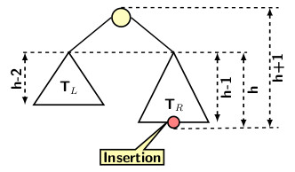
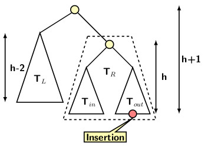
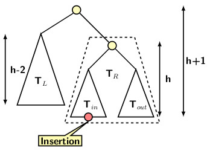
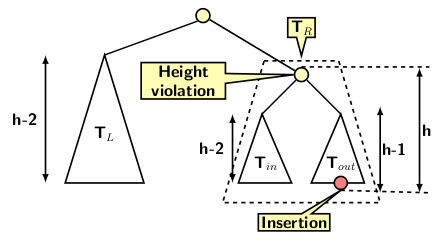
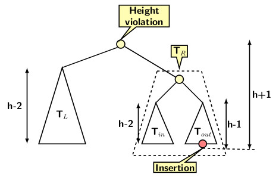

## Fixing Height Violation in AVL Tree

Let <i>h</i> be the height of an AVL tree T before an insertion. After a new insertion, one of the following conditions may occur:
<ul>
  <li>No height violation is caused, or</li>
  <li>A height violation is caused. </li>
</ul>
The first case requires no fixing or rotation, as the height invariance is maintained at every node. The BST property is maintained by the insertion.
Therefore, the tree preserves both height balance property and the BST property.  

A height violation may occur after an insertion into TR where TR is the right subtree of T. We only consider the insertions into 
TR. Symmetric cases occur if the insertion were made to TL. 

  TR must be as taller than TL for the height violation to take place. Since the height of the orignal tree T is <i>h</i>,   
<ul>
  <li>The height of TR should be <i>h-1</i>, and</li>
  <li>The height of TL should be <i>h-2</i>.</li> 
</ul>

  After an insertion the height of TR becomes <i>h</i>, and the height of T becomes <i>h+1</i>. The difference between heights of TR and 
  TL increases to 2. Obviously, TR cannot be empty. If so, then TL is empty, and <i>h = 0</i>. Let us expand T_R into its components subtrees.
<ul>
  <li>Its left subtree is referred to as inner tree and denoted by Tin,</li>
  <li>Its right subtree is referred as outer tree, and denote by Tout.</li>
</ul>

Let us consider insertion in Tout. What would be heights of Tin and Tout? For a height violation, the height of Tout
should be as high as possible. Therefore, 
<ul>
  <li>he height of Tout should be <i>h-2</i></li>
</ul>

The insertion can be either in Tout or Tin.  The first figure below illustrates the insertion into To 

The second depicts the insertion scenario for Tin. 

Let us examine the two scenarios in the figures above. In the first one, the height of Tin can be either <i>h-3</i> or <i>h-2</i>. 
The height violation takes place only if Tout is as tall as possible. Its height should be <i>h-2</i>. If the height of Tin 
is <i>h-3</i>, then the lowest node where height violation occurs at the root of TR. Fixing height violation at the lowest node autmatically
resolve height violations at ancestors.

If Tin's height is <i>h-2</i>, then a single left rotation should be ok to fix the tree. We have already proved that left rotation preserves BST
property. The next figure illustrates the case of both subtrees with same height.

We leave it to the reader to convince that a similar set of arguments can prove that fixing height violation at the lowest node restores height invariant for 
the AVL tree. However, double rotations are needed for fixing height violations due to insertions in Tin.

[Back to Index](../index.md)
  
