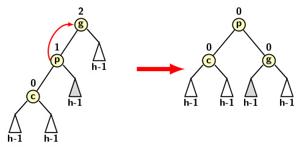
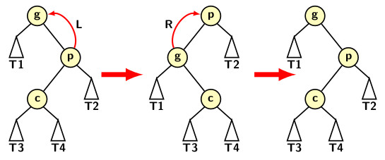
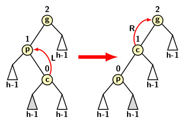
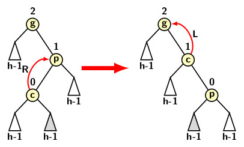

## AVL Tree

The average case analysis of Binary Search Trees (BST) shows that the any operation (search, inserion, deletion)  on balanced BSTs requires worst-case time of 
<i>O(log n)</i>. Before proceeding further, let us formally define the balance property. 

<strong>Balance Property</strong>: A BST is possesses balance property if the difference between the heights of the left and the right subtrees of every node of the tree is 1, 0, or -1. 

A leaf node node has no left or right child. Therefore, the height difference between its left and right subtree is 0. In other words, every leaf node
of a binary tree possesses the balance property.

We cannot always depend a nice random input distribution to expect that the tree preserves balance property. However, as a BST undergoes a series of insertions 
and deletions, balance property is disturbed. Therefore, for the worst-case time of <i>O(log n)</i> per operation on BST, tree should maintain balance propertyin presence of a sequence of insertions and deletions that can happen in any order. It basically implies that we need to address the following question. 

- How the balance property in a BST could be restored after each mutating operation like an insertion or a deletions? 

We refer to an insertion or a deletion as a mutating operation, because the BST is altered by such an operation. On the other hand, a search is a non-mutating operation because it never modifies a tree. 

Adelson-Velsky-Landis (AVL) proposed a recursive O(1) operation to balance a BST if it loses the balance property. The operation is known as rotation. 
Rotation is required after every operation when a disbalance occurs in the tree. AVL tree requires a node to also maintain height information along with 
other required information as needed for a BST node. We use a define an AVL tree node minimally as follows:
```
typedef struct node {
    int info, ht;
    struct node *left,*right;
} AVLNODE;
```

Since AVL tree is a BST, the rest of BST operations applies to an AVL tree. However, often a mutating operation causes a disbalance at a node. 
AVL tree augments BST by incorporating additinal features to restore balance after a mutating operation. 

The operation which restores balance is known as rotation. A rotation involves a tri-node structure in a BST. The tri-node structure consists of 
- a node, one of its child and its grand child.
There are two types rotations:
- A single rotation
- A double rotation

A single rotation may either be a left or a right rotation depending on the direction of rotation. The leeft rotation is applicable to the pattern where the 
imbalance of node occurs due to an left subtree of its left child. The tri-node configuration involving imbalanced node, its left child and its left grand
child form a pattern which we refer to as zig-zig pattern. A single rotation can restore the balance in the case of a left zig-zig pattern. The figure
below illustrated the tri-node configuration and the result of single left rotation.
<p align="center">

</p>
On the other hand, if the tri-node configuration forms a zag-zag pattern (consisting node, its right child and right grand child), a  single right rotation
can restores the balance. A single right rotation has been illustrated in the figure below.
<p align="center">

</p>

Imbalance at a node can occur due to right subtree of left child of a node in a BST, we refer to the configuration of tri-node structure as zig-zag patter. There 
is also a symmetric pattern of zag-zig where the tri-node structure consists of a node, its right child and left grand child. A single rotation cannot fix the
balance in the case of a zig-zag or zag-zig configuration. The figure below indicates that a single rotation only flips one configuration to the other.
<p align="center">
    
</p>
A double rotation consists of two rotation in sequence. It is either 
- A single right followed by a single left rotation, or
- A single left followed by a single right rotation.
The two rortation types are shown in the figure below:
<p align="center">

</p>
<p align="center">

</p>


