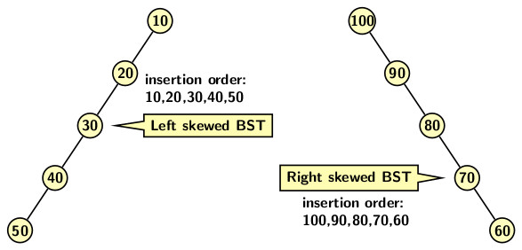

## Maintaining a Balanced Binary Search Tree

The average case analysis of Binary Search Trees (BST) shows that any operation (search, insertion, deletion)  on balanced BSTs requires a worst-case 
time of <i>O(log n)</i>. Before proceeding further, let us formally define the balance property. 

<strong>Balance Property</strong>: A BST possesses balance property if the difference between the heights of the left and the right subtrees of every node 
of the tree is 1, 0, or -1. 

A leaf node has no left or right child. Therefore, the height difference between its left and the right subtree is 0. In other words, every leaf node
of a binary tree possesses the balance property.

We cannot always depend on a nice random input distribution to expect that a BST to preserve balance property. As a BST undergoes a series of 
insertions and deletions, the balance property also gets disturbed. Furthermore, sometimes the initial sequence of insertions may generate a 
completely skewed BST as shown below.
<p align="center">
    
    </p>
For achieving the worst-case time of <i>O(log n)</i> per operation on a BST, we should restore balance property every time tree becomes unbalanced. A BST 
may eventually become unbalanced as a sequence of insertions and deletions is applied over time. It implies that we need to address the following question. 

- How the balance property be restored after a BST becomes unbalanced due to mutating operations? 

We view an insertion or a deletion as a mutating operation because such an operation modifies the BST. However, a search is a non-mutating 
operation because it never alters a tree. 

Adelson-Velsky and Landis (AVL) came up a recursive O(1) operation to balance a BST if it loses the balance property. The operation is known as a
<b>rotation</b>. A rotation is required after an operation if a disbalance occurs at a node in the tree. AVL tree also requires each node to maintain 
height information along with other required information as needed for a BST node. We use the following minimal definition of an AVL tree node:
```
typedef struct node {
    int info, ht;
    struct node *left,*right;
} AVLNODE;
```

The height information will be used to find out the balance factor of each node. The balance factor of a node is the differnce between heights of its left 
and right child. The other normal operations of a BST apply to an AVL tree. However, we need to add additional features to a BST to 
maintain it as height balanced tree as mutating operation may often cause a disbalance at a node. 

The operation which restores balance is known as rotation. A rotation involves a tri-node structure in a BST. The tri-node structure consists of 
- A node where balance factore is disturbed,
- One of its child and
- One of its grandchild.

There rotation types depends on the pattern formed by a tri-node configuration mentioned above. We refer to the tri-node as a <b>zig-zig</b> 
or a <b>zag-zag</b> pattern, where a "<b>zig</b>" to refer to a left and a "<b>zag</b>" to refer to a right branch. So, if the child and grandchild of
the node
are left child of their respective parents then a zig-zig pattern is formed. Similarly, if the child and the grandchild of the node are right child of
of their respective parent then a zag-zag pattern is formed.

There are two types of rotations:
- A single rotation
- A double rotation

A single rotation may either be a left or a right rotation, depending on the direction of rotation. The left rotation applies to the pattern where the 
imbalance at a node occurs due to a zig-zig pattern. A single right rotation can restore the balance in the case of a zig-zig pattern. The figure below 
illustrates the zig-zig tri-node configuration and the result of a single right rotation.
<p align="center">

</p>
We can observe that a rotation operation preserves the BST property. It changes the parent pointers of at most four subtrees T<sub>1</sub>, T<sub>2</sub> 
of node c, T<sub>3</sub> of p, T<sub>4</sub> of node g respectively. Since p goes to top and its value is smaller than g. Further g's right subtree 
T<sub>4</sub> has elements larger than g; and therefore, p is smaller than the elements of T<sub>4</sub>. It implies  both g and its right subtree 
T<sub>4</sub> are correctly placed by the right rotation. Similarly, c being left child of p, both of its subtrees T<sub>1</sub> and T<sub>2</sub> are 
correctly placed with respect to p. But p loses its right subtree T<sub>3</sub> which now becomes left subtree of g. Since T<sub>3</sub> consists of 
elements larger than p but smaller than g. Therefore, by placing T<sub>3</sub> as left subtree of g, the BST property is preserved. On the other hand, if 
the tri-node configuration forms a <b>zag-zag</b> pattern, it implies that the balance factor of a node is disturbed due to a sequence of insertions in its right subtree. A single left rotation shown below can restores the balance. 
<p align="center">

</p>

The imbalance at a node may occur due to the right subtree of the left child of a node in a BST; we refer to the configuration of tri-node structure as 
<b>zig-zag</b> pattern. 
There is also a symmetric pattern of <b>zag-zig</b> where the tri-node structure consists of a node, its right child, and its left grandchild. A single 
rotation cannot fix the balance in the case of a zig-zag or zag-zig configuration. The figure below indicates that a single rotation only flips one 
configuration to the other.
<p align="center">
    
</p>

A double rotation consists of two rotations in sequence. It is either 
- A single right followed by a single left rotation, or
- A single left followed by a single right rotation.

The two rotations types are shown in the figures below. In the first figure we consider the tri-node configuration forming a zig-zag pattern. The first 
rotation converts the tri-node configuration to zig-zig pattern. Then, one more single right rotation on zig-zig pattern can restore the balance factors of 
the node. 
<p align="center">

</p>

In contrast, a single right rotation on the zag-zig pattern converts it so zag-zag pattern. Now a single left rotation can restore the balance of the 
node. 
<p align="center">

</p>
The question that remains unresloved is: where the rotation should be applied? If there is a node suffers from height imbalance, its ancestors also have 
the height violations. The rotation should be applied to the deepest node where height violation occurs. If the height after fixing height violation
becomes the same as the original subtree, then the height violation at ancestor nodes are automatically resolved. 

Expanding details of insertion 

We end this blog here. But continue with AVL tree in the next blog.

[Back to Index](../index.md)


