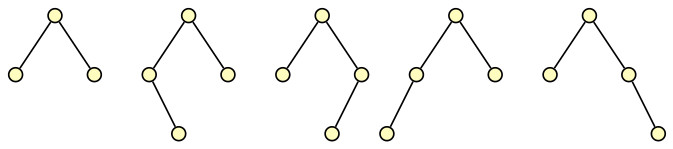

## Height of AVL Tree

<strong>Height Property</strong>: The height of an AVL tree with <i>n</i> nodes is of <i>O(log n)</i>.

Let <i>n(h)</i> be the minimum number of internal nodes in an AVL tree of height <i>h</i>. An AVL tree of height <i>h = 1</i> with of minimum 
number of internal nodes should have at least one internal node (which is the root). An AVL tree of height <i>h = 2</i> must have at least two
internal nodes as shown below. 

We find that balance properties are satisfied by both the trees.

Now recursively define an AVL tree of height <i>h</i> with minimum number of internal nodes as follows:
- A root, which is an internal node,
- One left subtree <i>TL</i> with minimum number of internal nodes, and
- One right subtree <i>TR</i> with minimum number of internal nodes.

Without loss of generality, we assume that height of the left subtree <i>TL</i> is <i>h-1</i>, and the height of right subtree 
<i>TR</i> is <i>h-2</i>. So the minimum number of internal nodes in an AVL tree of height <i>h</i> is:

&space;&&space;2n(h-2)\end{array}" title="\begin{array}{rcl}n(h) & = & 1 + n(h-1) + n(h-2)\\& > & 2n(h-2)\end{array}" />

We now assume the induction hypothesis that the stated AVL height property holds for any AVL tree with height less than <i>h</i>.

By unrolling the inequality of recurrence relation repeatedly, we get

  

By setting <i>h - 2i = 1</i>, we get <i>i = h/2 - 1</i>. Now apply the base case for the minimum number of internal nodes in a AVL tree of 
height <i>h = 1</i> to the above inequality, and simplify. It gives 

&space;2^{h/2-1}" title="n(h) > 2^{h/2-1}" />

which implies 

&space;h/2-1\mbox{,&space;or&space;}&space;h&space;<&space;2\log&space;n(h)" title="\log n(h) > h/2-1\mbox{, or } h < 2\log n(h)" />
  

The total number of nodes in a tree is always greater than the the number of internal nodes in the tree. Therefore, the height of an AVL tree is 
  always less than <i>2 log n</i>, where <i>n</i> is the number of nodes in the AVL tree.
