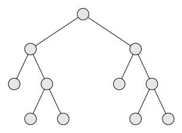
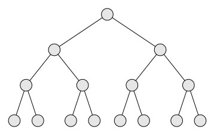

## Basic Properties of Binary Trees

In this blog we focus on a few commonly used properties of binary trees. An 
internal nodes in a binary tree may have either one child or two children. 
A binary tree where each internal node has exactly two children is known as a
<i>strictly binary tree</i>. 
If all the leaf nodes of a strictly binary tree is at the same level then
we call such a binary tree as <i>full binary tree</i>. Figures below shows a strictly binary tree and a full binary tree.

<figure>
  
&nbsp;&nbsp;&nbsp;&nbsp;

  <figcaption><b>A strictly  binary tree and a full binary tree</b></figcaption>
</figure> 
 
 
Since each internal node may have two children, the maximum number of nodes
at level <i>i</i> is $2^i$. It implies that maximum number nodes in
a binary tree of height $h$ is $\sum_i 2^i$.
Therefore, the the number of nodes in a full binary tree of height 
<i>h</i> is 2h+1-1.

Sometimes, we may be interested to know the relationship between internal
nodes and leaf nodes in a binary tree. Let:
<ul>
<li>The number of leaf nodes be:<i>L</i>,</li>
<li>The number of internal nodes be: <i>I</i>.
</ul>
In a strictly binary tree the number of leaf nodes is equal to the number of
its internal nodes plus 1, i.e., <i>L = I+1</i>. We can prove it by induction.
Let the total number of nodes be <i>N</i>, for <i>N=3</i>, the only possible
configuration for a stricly binary tree will be: a root and its two children. 

So, the property stated above is valid. Let the property be true for any
strictly tree of height <i>h</i>. Now consider a strictly binary tree 
<i>T</i> of height <i>h+1</i>. If we delete the root of <i>T</i>, then it
falls apart as two strictly binary trees. Each of these subtrees
<i>TL</i> and <i>TR</i> has a height less than 
<i>h</i>. Therefore, by induction the property must hold separately in each 
of the subtrees. So,
<ul>
<li><i>I(TL)+1 = L(TL)</i> </li>
<li><i>I(TR)+1 = L(TR)</i> </li>
</ul>
The number of leaf and internal nodes in the orignal tree are:
<ul>
<li><i>L(T) = L(TL) + L(TR)</i></li>, and 
<li><i>I(T) = I(TL) + I(TR) + 1</i></li>
 </ul>
Now, we just combine the earlier two equations to conclude the fact that 

<i>L(T) = I(T) + 1</i>

It is simple to observe that any chain of internal nodes can be collapsed to
a single link. It implies, we can convert any binary tree into a strictly
binary tree. Therefore, the relationship between leaf no
<i>L(T)</i> is equal to one more than the number of nodes with two children 

The minimum height of a binary tree with <i>N</i> nodes is *N = &lceil;log (n+1)&rceil; - 1*. 
The formula can be easily proved using induction.
 

[Back to Index](../index.md)

