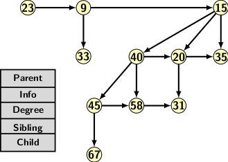
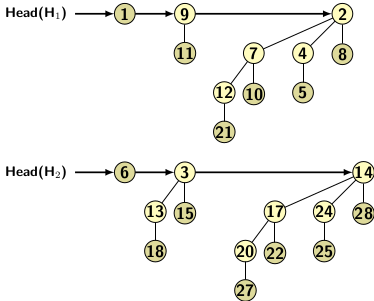
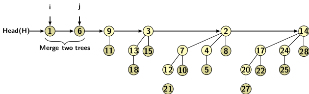
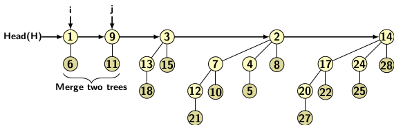
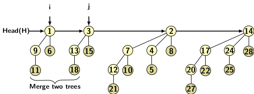
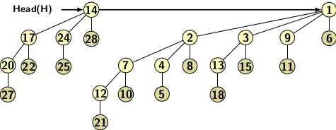
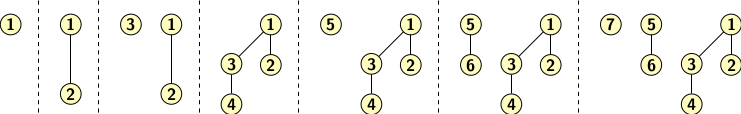
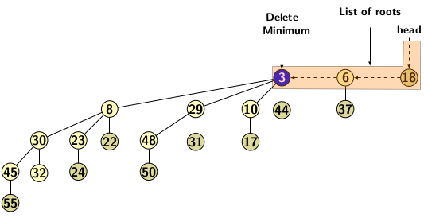
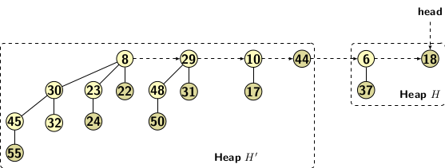
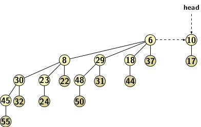

## Binomial Heaps

A binomial heap consists of a binomial forest with each tree preserving heap property. Figure 1 
depicts a binomial heap consisting of 11 elements. The trees are linked together by sibling and
child links, as indicated. 

   
  Figure 1

Union of binomial heaps refers to operation of creating a single heap by merging two heaps.
Since the heap trees are ordered in ascending order, the root of the lowest order tree appears
at the beginning of a list. First we create a new sorted list of binomial trees belonging to
two heaps. Then scan the new list mergeing the trees of lower orders from the beginning.
The union operation stops when no further merging is possible. We have explained merging in 
the previous blog.  Consider the two binomial heaps in Figure 2(a). 

   
  Figure 2(a)   
   
  Figure 2(b)

The sorted list of binomial trees belonging to both heaps shown below in Figure 2(b). 

   
  Figure 2(b)

The union operations are shown below in Figure 2(c), 2(d) and 2(e).

   
  Figure 2(c)  
   
    Figure 2(d)  
   
  Figure 2(e)

For insertion we create a heap of 0-order tree with the new element, then apply union
1-element heap with the existing heap. Creating a <i>n</i> node
heap starting from an empty binomial forest takes O(<i>n</i>) time. It is possible to create the 
binomial heap with <i>n</i>-1 comparisons. Let us try creating binomial queues formed by inserting
elements 1 to 8. 

   
  Figure 3

The deleteMin operation on a binomial heap is implemented by scanning all the roots of 
binomial trees that constitute the heap. Consider the deleteMin operation on the binomial 
heap shown in Figure 4(a). The operation breaks a binomial tree into two, as shown in 
Figure 3(b).

   
  Figure 4(a): Binomial heap before deleteMin operation. 
    
  Figure 4(b): After deleteMin operation.

After the root of a binomial tree is deleted, the corresponding tree breaks into constituent
smaller binomial trees creating two heaps. For convenience in discussion, we use the following notations:

- H1 be the original heap. 
- H be the remaining part of the original heap after deleteMin
- H' be the heap created by constituent smaller binomial trees after deleting the minimum element

Union of H and H' gives us the heap H2 after the deleteMin operation. 
So, the result after merging heaps 
H and H' of Figure 3(b) after deleteMin operation on Figure 3(a) are as follows:

   
  Figure 5

We can maintain the minimum of all roots in a separate variable and update it whenever
it changes during a heap operation. Since binary representation has log <i>n</i> bits, deleteMin requires
O(log <i>n</i>). If the heap trees are sorted in ascending order, deleteMin, then the first root in the
list is the minimum element. Then we have to perform merging if required. Therefore, the deleteMin
operation takes time of O(log <i>n</i>) in the worst-case.

[C Program for Binomial Heaps](../CODES/BHeaps/index.md)

[Back to Index](../index.md)

