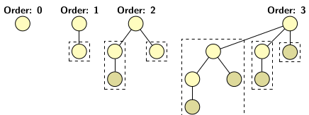
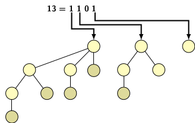
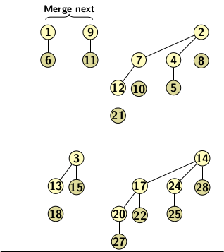
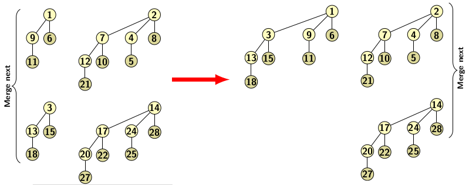
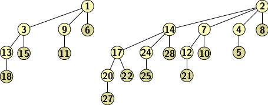

## Binomial Trees

An interesting tree structure is based on the concept of binomial coefficients. Binomial tree has heap properties.
The definition of binomial trees relies on the recursive rules for computation of binomial coefficients.
We define binomial trees using a base case and a recursive rule for generation of higher order binomial trees
as follows:

- A binomial tree order 0 has a single node. 
- A binomial tree of order <i>k</i> is created from two binomial trees of order <i>k-1</i> and making root of
  one tree as the left child of the root of the other tree.
  
Figure 1 illustrates few binomial trees of small orders. 

   
  Figure 1

Let us explore some properties of binomial trees before discussing implementation issues. A binomial tree of
order 0 has one node. Since a binomial tree of order 1 is made of two binomial trees of order 0. It has two
nodes. Similarly, a binomial tree of order 2 has 4 nodes. In general a binomial tree of order <i>k</i> has
2<i>k</i> nodes. The above fact is also indicated in examples shown in Figure 1. More properties 
of binomial trees are as listed below:

- The root of a binomial tree of order <i>k</i> has <i>k</i> children
- The leftmost child of the root is the root of a binomial tree of order 0
- The second leftmost child is the root of a binomial tree of order 1
- In general <i>i</i> th leftmost child is the root of a binomial tree of order  <i>i</i>

A binomial heap is based on binomial tree structure. If the binomial heap has <i>n</i> nodes then 
it has binomial trees equal to the number of 1 bits in binary representation of <i>n</i>. For example if
<i>n=13</i>, the binomial heap representing it consist of two binomial trees 
B4, B3, and B1 that correspond to 1 bits in binary representation of
13, i.e., 1101. Figure 2 illustrates the equivalence.

   
  Figure 2

The deleteMin operation on a binomial heap is implemented by scanning all the roots of binomial trees that
constitue the heap. We can maintain the minimum of all roots in a separate variable, and update it whenever
it changes during a heap operation. Since binary representation has log <i>n</i> bits, deleteMin requires
O(log <i>n</i>). Merging two binomial heaps H1 and H2 is quite easy. 
The merging of binomial trees of same orders in H1 and H2 is carried out
until no pair of binomial trees of same order is left. Let us take an example to illustrate the merging
process. Suppose 

1. H1 consists of three trees B0, B1, B2.
2. H2 consists of two trees B1, B3.

A straightforward merging cannot maintain heap property. To maintain heap property, we choose 
the larger of the roots of the pair of trees a child of the smaller. In the first merging operation 
we choose a B1 from H1 and another from H2. Merging these two trees
B2. Next, we take the B2 from H1 and merge it with the newly
generated tree B2. It produces a B3. So, in the third merging the new 
B3 tree is merged with B3 available in H2. Since only one B0 
is available, it cannot be merged. Therefore, merging process completes with two trees B0
and B4. The merging is illustrated below in Figure 2. 

   
   
   
  Figure 3

Merging of a pair of trees takes O(1) time. There may be O(log <i>n</i>) trees, so the merging takes
O(log <i>n</i>) in the worst-case. We can sort the trees according to height. In this case the merging
stop with the smallest non-existent tree in the existing binomial heap.

Insertion is a special case of merging. We create a 0-order tree with the new element, then merge
with existing forest of binonmial trees. The merging stops after <i>i</i>+1 steps if the smallest 
non-existent binomial tree in the binomial heap is B<i>i</i>. Creating a <i>n</i> node
heap starting from an empty binomial forest takes O(<i>n</i>) time. It is possible to create the 
binomial heap with <i>n</i>-1 comparisons. Let us try creating binomial queues formed by inserting
elements 1 to 8. 

   
  Figure 3

The deleteMin operation is also easy. It breaks a binomial tree into two. Then we have to perform
merging if required. So it takes time of O(log <i>n</i>) in the worst-case.

