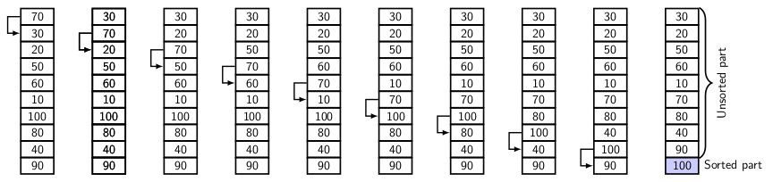

## Bubble Sort

Bubble sort works on the principle of floating the lightest element to the top. We view the input 
as consisting of elements from a totally order set. An element is heavier (lighter) than another 
if the former greater (smaller) than the latter. Bubble sort makes the heavier elements sink to
the bottom, and lighter elements float to the top. Figure below illustrates the first pass of
bubble sort algorithm.
<p style="text-align:center">
  <br>
  Figure 1
</p>
It is a swap-based algorithm. Starting with leftmost end of the input list, it compares
adjacent pair of the elements. If heavier element is on top then the two elements are
swapped. After the first pass of <i>n-1</i> compare-swap operations, the heaviest element
occupies the bottom-most (<i>n</i>th) position of the list. Now the list consist of a 
unsorted part of <i>n-1</i> elements and a sorted part of one element. The sorted part is 
excluded from the next pass of comparison. So, the unsorted list size is reduced to <i>n-1</i>.
With every pass of compare-swap the size of the sorted part increase by one.
Therefore, with <i>n-1</i> passes the size of the sorted part becomes <i>n</i>. The algorithm
is given below.

```
 procedure bubbleSort(A) {
  n = A.length();
  do { 
    swapped = FALSE; // Flag used to indicate swaps
    for(i = 0; i < n; i++) {
      if (A[i] > A[i + 1]) { 
        swap(A[i], A[i + 1]); // Exchanges A[i] and A[i+1]
        swapped = TRUE;
      }
    }
    n--; // Size of unsorted part decreases
  } while(swapped)
}
```

Next we deal with selection sort. It chooses the minimum of the remaining input sequence and places
the element as the next element in sorted order. If we repeatedly execute the method starting with
the input sequence of <i>n</i> elements, then a selection step reduces the input sequence by
one each time. Therefore by <i>n-1</> selection steps we complete sorting of the input sequence. 
Since each selection step requires <i>k</i>, for <i>k=n, n-1,..., 1</i> comparisons, the total
number of comparisons is O(<i>n<sup>2</sup></i>).


