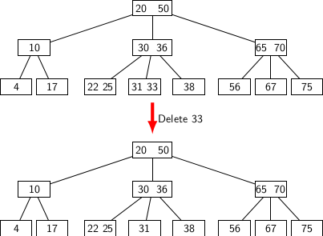
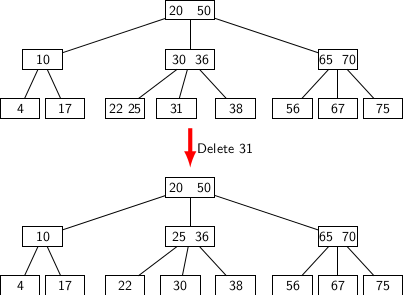
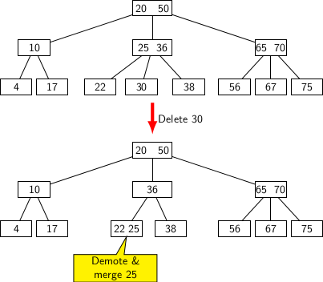
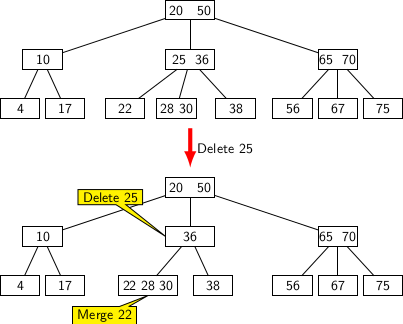
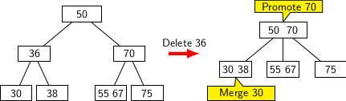

## B-Tree Deletion Operation 
 
Suppose we want to delete a key <i>k</i> from a node <i>n</i>. If <i>n</i> is not in a leaf 
then we can replace <i>k</i> by the largest key <i>k1</i> in the left subtree under node <i>n</i>. The key 
<i>k1</i> would occur in a leaf node <i>L</i>. The deletion process is essentially a generalization of the 
deletion of a key in BST. Therefore, all deletions occur in leaf nodes. It may lead to an underflow. An underflow 
occurs when the number of keys in a leaf node is reduced to <i>M/2 - 1</i>. If the sibling node has surplus keys to 
share, keys can be moved to the deficient node and restore the requirement of B-Tree. However, if the sibling has
just <i>M/2</i> keys we have merge the two siblings into one node. Merging may percolate up and require merging at 
a level up. When children of the root merge together to form one node a new root is created which decrements the height
by 1. Thus repeated deletions may lead to a reduction in tree height.
 
```
deleteKey(k, r) {
    (n, i) = BtreeSearchKey(r, k); // Locate the node and the key position
    if(!isLeaf(n)) {
         // n is an internal node
         removeKey(n, i);
         
         // Find the smallest key k1 greater than k  
         // k1 is guaranteed to be on a leaf node L
         (L, j) = BtreeLocateLargerKey(n,i); 
         
         // Copy L.key[j] in position n.key[i]
         L.key[j] = n.key[i]; 
         
         // Delete L.key[j]
         removeKey(L, j); 
    } else {
        // n is a leaf node 
        if(isUnderflow(n)) {
             m = n.sibling;
             borrow_cum_merge(m, n);
        }
    }
}

borrow_cum_merge(m, n) {
             // m is the sibling of n;
             if( isRich(m)){ 
                  // A key can be borrow from m
                  borrow a key from m via the parent node p;
             } else{ 
                  // m is 1 key away from underflowing 
                  // Pull the key from the parent ’p’, and merge it
                  // with the keys of ’n’ and ’m’ into a new node
                  mergeNodes(n, m); 
                  if( isUnderflow(p)) {
                       // Recursively call borrow_cum_merge 
                       u = p.sibling;
                       borrow_cum_merge(u, p);
                  }
             }
   }
```

Couple of points in the pseudo code need a bit of explanation. 
- The function <tt>removeKey()</tt> may require data movement inside <tt>L</tt>.
- Te functions <tt>isRich()</tt> and <tt>isUnderflow()</tt> just require checking of key count in a node.

The function <tt>isRich</tt> returns <tt>TRUE</tt> if count is greater than <i>M/2</i>. On the other hand, 
<tt>isUnderflow</tt> returns <tt>TRUE</tt> if count is less than <i>M/2</i>. Therefore, <tt>isUnderflow()</tt> and 
<tt>isRich()</tt> can be implemented using one single function.  

Now it is time to examine a few examples of deletions in a B-Tree. Let us begin with the most simple example, i.e.,
deletion of a key from a leaf node. We need to consider three different possibilities in deletion of key from 
a leaf node <i>L</i>. 
- The simplest possibility is when <i>L</i> has more than <i>M/2</i> keys. 
- The second possibility occurs if <i>L</i> has exactly <i>M/2</i> Keys, but the sibling of <i>L</i> has surplus keys.
- The third possibility occurs if both <i>L</i> and its sibling have exactly <i>M/2</i>. 

The first possibility is handled as shown in the figure below.

<p style="text-align:center;"></p>
Deleting 33 from the leaf node having keys {31, 33} has no effect overall configuration of B-Tree as one key is still left
in that leaf. 

The next figure illustrates the second possibility. Deletion of the key 31 leads to elimination of the leaf containing
it. However, the left sibling of concernied leaf has keys {22, 25}. Therefore, we can borrow one key from the sibling
via the parent node. It leads to replacing 31 by the spare key 30 from the parent, while the key 25 is promoted to parent
node.  So, deletion of the key 31 only requires a rearrangement of keys among the leaf nodes and its parent.
<p style="text-align:center;"></p>

The configuration of nodes describing the third possibility appears in the figure below. We attempt to remove key 30. The
sibling of the leaf containing 30 does not have a spare key. 
<p style="text-align:center;"></p>

We may possibly pull a key from the parent node for replacing node containing 30. However, it causes parent to lose a 
child. Therefore, the number child pointers from the parent is reduced by 1. We can handle it by pulling a key from the
parent and merging it with one key in the relevant leaf node. So, 25 is pulled from the parent and merged with the leaf
containing 22.

Having considered all possible situations arising out of deletion of key from a leaf node, let us now consider the
situations that may aries in deletion operation from an internal node. Figure below illustrates one such situation. 
In this case, key 25 is deleted. But deletion results in the left leaf node being orphaned. So, we need to merge its 
keys with the sibling node which is non-full. 
<p style="text-align:center;"></p>

The second situation occurs when we attempt to delete a key from a node having <i>M/2</i> keys. So the deletion leads to
a node having less than the required number of keys.
<p style="text-align:center;"></p>

