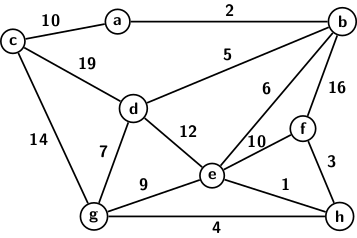

## Implementation of Graphs in C

The next thing we address is that of graph implementation in C. For a graph, we have three items
vertices, edges, and weights associated with edges. We have not discussed weighted graphs.
Weighted graphs represent transportation networks, computer networks, and other purposes where edge weight quantifies the efforts needed for
going from one vertex to another. Weighted graphs may be directed or undirected. An example 
of a weighted graph is shown in the picture below.
<p style="text-align:center">
  
</p>
The graph may be assumed to represent the distances between cities, where nodes are cities, and 
edge labels are distances between cities it connects. The same graph may also represent a computer
network. The nodes are for computers, and edges are for links between the pair of computers it
connects. An edge label denoting the RTT in milliseconds between the computers at the end vertices.
One can think of such weighted graphs as a pipeline network representing quantities of the flow of
oil or water or gas flow between end vertices of edges. So, weighted graphs have a lot of applications. 
The most important problem one would like to solve in weighted graphs is the shortest path. We will
return to the shortest path problem sometime later in the blog.

Having discussed weighted graphs, let us examine the implementation issues. We assume graphs
as static structures unless specified otherwise. So, a graph can be specified by 

- adjacency lists
- a list of edges
- adjacency matrix

When a graph is specified as a list of edges, we should first convert the graph to its adjacency
list or adjacency matrix representation. Because in most applications, we process the graph from its
adjacency list representation.

We assume the graph is specified by edges (pair of end vertices) and the corresponding labels. 
The structure for the implementation of graphs must be able to store three things, pair of 
end vertices and the edge label. The first end vertices are considered the source, and the 
other is the destination. To represent the vertices, we require a data type <t>NODE</t>.
It stores the destination of an edge from the current node. An array of node pointers defines the entire graph structure. More specifically, <t>head[i]</t> denotes the adjacency list of node
<t>i</t> for <t>i = 0, 1, 2, ...</t>. Adjacency list of a vertex <t>i</i> is created by linking all
destination vertices of edges with source <t>i</t>. So, the data type <t>NODE</t> and <t>GRAPH</t>
as specified as follows.

```
typedef struct node {
	int dest; // Denotes the end vertex with which current vertex is connected
        int weight;
	struct node* next;
} NODE;

typedef struct graph {
	// An array of pointers to represent adjacency lists
	NODE* head[N];
} GRAPH;

```

After specifying the <t>GRAPH</t> type, we have to create a graph from the input set of edges. 
The function <t>createGraph</t> given below can create a directed, or an undirected or a 
weighted graph. We specify the graph type by the user's input 'd', 'u,' or 'w.' The input
is accepted from the function <t>main()</t>. <t>createGraph()</t> takes a <t>flag</t> value
for creating the type of graph that the user wants. We store edge labels in a separate field
within the node structure. However, it may not be used for graph processing unless needed for
an application. The rest of the function is self-explanatory. 

```
GRAPH* createGraph(EDGE edges[], int n, int flag) {
	// Allocate storage for the graph data structure
	GRAPH* graph = (GRAPH*)malloc(sizeof(GRAPH));

	// Initialize head for all vertices
	for (int i = 0; i < N; i++) {
		graph->head[i] = NULL;
	}

	// Add edges to the directed graph one by one
	for (int i = 0; i < n; i++) {
		// Get the source and destination 
		int src = edges[i].src;
		int dest = edges[i].dest;
		int weight = edges[i].weight;

		// Allocate a new node of adjacency list from src to dest

		NODE* newNode = (NODE*)malloc(sizeof(NODE));
		newNode->dest = dest;
		newNode->weight = weight; // Save the edge weight

		// Point new node to the current head
		newNode->next = graph->head[src];

		// Point head to the new node
		graph->head[src] = newNode;

		// Allocate a new node of adjacency list from `dest` to `src`
		// for undirected graph
                if (flag==0) {
		    newNode = (NODE*)malloc(sizeof(NODE));
	            newNode->dest = src;
		    newNode->weight = weight;

	    	    // Point new node to the current head
	    	   newNode->next = graph->head[dest];

	    	   // Change head to point to the new node
	           graph->head[dest] = newNode;
               } 

	}

	return graph;
}

```

The only other important function is to print the adjacency lists. The print function is quite 
straightforward. We wrote one print functions for all three graphs. For weighted graphs,
we also print edge weights along with adjacency list. We use an indicator flag <t>w</t> for 
the same. The print function appears below.

```
// Prints adjacency lists of a graph
void printGraph(GRAPH* graph, int w) {
	for (int i = 0; i < N; i++) {
		// Prints the current vertex its neighbors
		NODE* ptr = graph->head[i];
		if (!w) {
            		// Print unweighted graph
            		while (ptr != NULL) {
			    	printf("(%d —> %d)\t", i, ptr->dest);
			    	ptr = ptr->next;
		        }
        	} else {
            		// Print weighted graph
            		while (ptr != NULL) {
                		printf("%d —> %d (%d)\t", i, ptr->dest, ptr->weight);
                		ptr = ptr->next;
           	        }
        	}
      		printf("\n");
	}
}
```

[Link to source code](../CODES/Graphs/index.md)

[Back to Index](../index.md)
