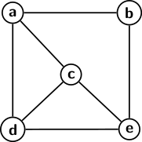
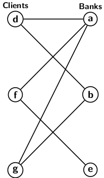
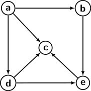

## Graphs

Any relationship between objects or things can be represented using graphs. Suppose, for instance,
we want to pictorially represent a relationship such as siblings (brothers or sisters) among six people. We denote each person by a small point or bubble, as shown in the figure below.
For convenience, let us label the bubbles as <i>a, b, c, d, e</i>. To express the sibling 
relationship between <i>a</i> and <i>b</i>, draw a line connecting the corresponding bubbles. 

   
  Figure 1

 
The figure also represents other sibling relations.

The concept graphs representing relationships are very generic. We can use bubbles to denote different
things and link the bubbles to express different relations. For convenience we use the term 
<i>vertex</i> for a bubble and the <i>edge</i> to denote a line joining a pair of vertices. A graph shown in the figure above may represent different relationships depending on the
context we use.  

- The vertices may represent computers, and the edges may denote if a pair of computers are directly connected. 
- Vertices may even represent cities in the state, and the edges denote whether direct train connectivity exists between a pair of cities.

We may also use graphs to represent the relationship between different objects. For example, the
graph below has two sets of vertices: one set representing banks and the other set as banks' clients. The edges between vertices denote bank and customer relationships.

   
  Figure 2

 

In general, graph abstraction is very powerful. In dealing with complex data structures, we 
find that abstraction allows us to link the complex relationships among objects. So, we need to
define and build graph data structures from the general abstraction of the graph. Before we proceed 
further, let us introduce graph terminology. 

<strong>Directed graphs</strong>: A directed graph <i>G</i> consists of a pair of sets
 
- A set of vertices <i>V</i>. Each vertex <i>v &isin; V</i> represents a record or an object, or a piece of information. 
- A set of edges <i>E</i> &#8838; <i>V &times; V</i>. Each edge <i>e = (u,v) &isin; E</i> joins two distinct vertices <i>u &ne; v</i>. There can be at most one edge between a pair of vertices.

An edge <i>(u, v) &isin; E</i> is directed from <i>u</i> to <i>v</i>. We say, <i>u</i> is the initial
and <i>v</i> is the terminal vertex for the edge.  We use a link with an arrowhead to indicate the
initial distinct from the terminal vertices of an edge in the picture of a directed graph. 
The picture below represents a directed graph.

   
  Figure 3

 
The direction of edges expresses an important feature of using the abstraction of a directed graph.
In processing a graph data structure, we have to visit the vertices and traverse the edges. In a 
directed graph, the edges can only be traversed in the direction of orientations. We cannot traverse an 
edge against the direction of its orientation. It implies we can directly reach vertex <i>b</i> 
from <i>a</i>, but not <i>a</i> from <i>b</i>. There is no way to reach <i>a</i> from any of the 
vertices.

We will return to processing directed graphs and connected terminology sometime later. Let us
now focus on undirected graphs. Formally we define an undirected graph as follows:

<strong>Undirected graphs</strong>:An undirected graph <i>G</i> consists of a pair of sets
 
- A set of vertices <i>V</i>
- A set of edges <i>E</i> &#8838; C(V,2)</i>

There is no distinction between the end vertices of an edge as it exists in the case of a directed
graph. An edge in an undirected graph can be traversed in both directions. There can be
at most &#8739;<i>V(V-1)</i>&#8739; edges in an undirected graph with &#8739;<i>V</i>&#8739; vertices.
Undirected graphs are more flexible in processing. The picture in figure 1 depicts an undirected graph.

In the next blog we continue with graph terminology.

[Back to Index](../index.md)
