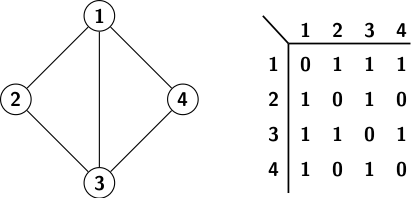
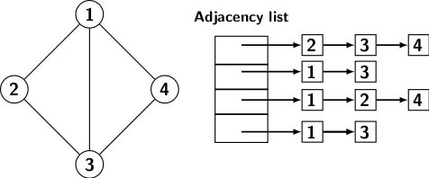

## Computer Representation of Graphs

Let us discuss some well known properties of an undirected graph before exploring the ways to process a
graph. 

<strong>Degree property-1</strong>: An undirected graph has even number of vertices of odd degrees.

The proof of the above property is simple. If we add the degrees of all vertices then 

    &Sigma; deg[v] mod 2 = 0 (the sum is an even number, why?)

But summing of degrees of all even degree vertices gives an even number. It implies that the sum of 
degrees of all odd degree vertices must also be an even number. It implies that there can be only even
number of odd degree vertices.
      
<strong>Degree property-2</strong>: Let <i>G</i> be a graph with <i>n</i> vertices and assume that the
degree of each vertex is at least <i>(n-1)/2</i> then the graph is connected.

Assume that graph has two connected components. Consider any one of the connected components. Since, 
the degree of each vertex is at least <i>(n-1)/2</i>, each vertex is connected to <i>(n-1)/2</i>
other vertices.  It implies that the connected component has at least <i>(n-1)/2 + 1 = (n+1)/2</i> 
vertices. The total number of vertices in the graph is equal to the sum of the vertices in two
connected components. It at least equal to <i>(n+1)/2 + (n+1)/2 = n+1</i>. However, 
by assumption,  the total number of vertices cannot exceed <i>n</i>. Therefore, the graph must be
connected.

<strong>Connected graph property 1</strong>: A connected graph with <i>n</i> vertices has at least
<i>n-1</i> edges.

Let <i>G</i> have 1 vertex. It is obviously connected. So, the property holds. Now let <i>G</i> be
a graph with <i>n &ge; 2</i> vertices. Choose an arbitrary vertex <i>v</i> from <i>G</i>. Consider
the subgraph <i>H = G - {v}</i>. <i>H</i> may consist of <i>k</i> connected components
<i>Zi</i>. Assume that <i>Zi</i> has <i>ni</i> vertices. By 
the induction hypothesis each <i>Zi</i> has at least <i>ni-1</i> edges. To 
connect left out vertex <i>v</i> to each of the subgraphs <i>Zi</i> we require 
<i>k</i> edges. So, the minimum number of edges required to make <i>G</i> connected is 

    &Sigma;i=1</i>k (ni - 1) + k = n-1 - k + k</i> 

      
A graph essentially represents relationships between objects or things. We can use a matrix to capture 
relationships between objects. Therefore, the standard form for computer representation of a graph with
<i>n</i> vertices is a matrix of size <i>n2</i>. An entry 

            <i>a[i, j] = 1</i> if there is edge <i>(i, j) &isin; E</i> 
            <i>a[i, j] = 0</i> otherwise
            
 
In other words, the <i>ij</i>th entry is 1 if the object <i>i</i> is related to the object <i>j</i>. In
the pictorial representation we denote the relationship by an edge joining the related objects. The absence 
of edge is indicated by a 0 entry. The matrix is called adjacency matrix because it represent the 
relationship if a vertex is adjacent to another. Figure 1 illustrates the adjacency matrix representation.

   

Processing of a graph requires every entry of the adjacecny matrix to be accessed. So the any graph 
algorithm requires time of at least O(<i>n2</i>). 

However, if the graph is sparse, then most entries of adjacency matrix are zero. So, representing graphs
using matrix is expensive. We can use a representation which lists the edges incident at every vertex. 
The adjacency list representation of a graph consists of <i>n</i> lists, one corresponding to each vertex.
Every edge is listed twice in such a representation. Adjacency list representation of the graph in 
Figure 1 is given below.

   

