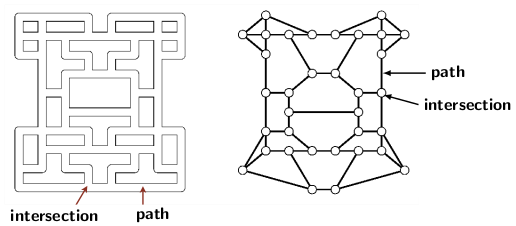
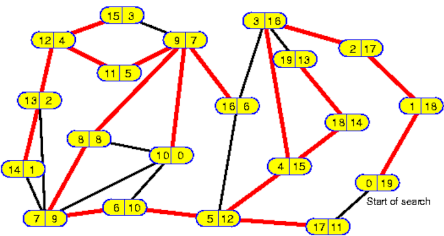

## Depth-First Search of a Graph

Graph search is a fundamental step in processing a graph. The search is a systematic traversal of the
edges and visits of vertices. The search should ensure that no vertex is visited more than its
degree times. However, the search should traverse each edge at least once. The two
requirement leads to the conclusion that a graph search is a systematic way to ensure an edge is 
traversed at least once and at most a constant number of times (preferably &le; 2). 

Tremaux believed it is possible to systematically trace out a path in a maze from the 
available routes. His solution is to unroll a ball of thread from the entrance to the exit. He employed 
to avoid every threaded route that led to a dead-end. It helped him to avoid
all explored paths. So, he was able to find the exit. We construct an equivalent graph of a 
maze by associating a vertex with each intersection and joining every pair of vertices by an edge
if their corresponding intersections are directly reachable. An example of a maze and its 
equivalent graph is given below. The diagram is from Chapter 4 of Rober Sedgewick and 
Kevin Wayne's text on algorithms. 
<p style="text-align:center">
    <br>
    Figure 1: Maze as a graph. (Source: Robert Sedgewick and Kevin Wayne, Chapter 4).
</p>

Tremaux's graph exploration method was simplified later by Robert Tarjan. Tarjan noticed that 
the fundamental idea is to go as much deep as possible using unexplored edges. After reaching a point
where no new vertex could be reached, backtrack and repeat the exploration of the remaining 
graph via the first unexplored edge. Continue the graph exploration until all edges have been
traversed and all vertices are visited at least once. Tarjan named it as Depth-First Search (DFS).
DFS traverses each edge twice and visits each vertex at most twice the degree times.

Tarjan's DFS algorithm appears below.

```
// Initializations
initialization() {
    index = 0;
    for all ( v in V ) {
         mark v "new"
    T = {} // Initialize tree edges to empty set
    
    while (there exists a "new" vertex v in V) {
         DFS(v); // Perform DFS
    }
}

DFS(v) {
    mark v "old";
    dfn[v] = ++index; // DFS numbers
    for all (w in Adj(v)) {
        if (w is "new") {
            T = T + {(v,w)}; // Update T to include edge (v,w)
            DFS(w); // Recursive call
        }
    }
}

```
The DFS number is sometimes referred to as pre-order because it is assigned to a vertex 
when it is marked "old." We may choose to assign the numbering when DFS finally withdraws or 
backtracks from a vertex. That is when no unexplored edges exist at the vertex. The numbering
is known as the postorder number or the reverse DFS number. We will discuss some interesting properties 
involving DFS and reverse DFS numbers later.

Before moving further, let us look at an example appearing in Figure 2.
<p style="text-align:center">
    <br>
    Figure 2: DFS and reverse DFS numbering (Source: unnamed Internet document).
</p>
The tree edges are color-coded by red, and the non-tree edges are color-coded by blue. Every vertex
has a pair of numbers. The first number is the DFS number, and the second is the reverse DFS number of 
the vertex. The graph has 20 vertices and the numbering of the vertices starts from 0. For a connected
graph like the given example, DFS generates a spanning tree. The tree is called DFS spanning tree or
simply DFS tree. The tree edges are those edges that lead to a new vertex during DFS. A non-tree edge
lead to previously a discovered vertex (old vertex). In other words, a non-tree edge joins a pair
of vertices not related by ancestor descendant relations in the DFS tree.

The DFS and the reverse DFS numbers of a vertex <i>v</i> also represents the start
and the finish time of DFS at </i>v</i>. The difference between the two number is equal to the 
number of descendant <i>v</i> in the DFS tree. For example, the vertes with start time 4 has its
finish time 15. It implies that vertex 4 has 11 descendants in the DFS tree, i.e., the subtree rooted
at vertex 4 has 12 vertices including itself.

<strong>DFS start and finish times</strong>: The difference between DFS finish and the DFS start 
time of a vertex <i>v</i> gives the number of descendant of <i>v</i> in the DFS spanning tree.

[Back to Index](../index.md)
