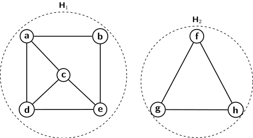

## Graph Terminology

It is convenient to introduce a bunch of terminology in connection with graphs. We will only be 
concerned with undirected graphs. However, a corresponding
terminology exists for the directed graphs for each terminology we describe here. We will deal with directed graphs at a later point
in time. 

The processing of graph data structures is heavily dependent on the ability to quickly and systematically
access vertices of a graph, starting with any initial vertex. Therefore, graph search or accessibility of 
the vertices from one or different vertices is essential. The 
accessibility or reachability in a graph is defined in different contexts as follows:

<strong>Path</strong>: There is a path from a vertex <i>v</i> to another vertex <i>w</i> if there is
a sequence of vertices <i>v, v1, v2, ..., vk, w</i> such that there 
exists edges between every pair of adjacent vertices of the sequence. That is, the graph has the 
following edges:

- <i>(v,v1) &isin; E</i>, 
- <i>(vi,vi+1) &isin; E</i>, for <i>1 &le; i &le; k-1</i>, and 
- <i>(vk, w) &isin; E</i>.

<strong>Degree of vertices</strong>: Degree of a vertex is equal to the number of edges incident on it.

<strong>Simple path</strong>: A path is called a simple path if every vertex on the given path is distinct.

<strong>Length of a path</strong>: The number of edges on a path equals its length. 
So if a path represented by a sequence of <i>k</i> vertices then its length is <i>k-1</i>. 

<strong>Simple cycle</strong>: A simple cycle is a simple path where the two end vertices are also 
connected with an edge. 

<strong>Connected graphs</strong>: A graph <i>G</i> is connected if and only if there exists a
path between every pair of vertices in <i>G</i>.

<strong>Subgraph</strong>: A graph <i>H = (V1, E1)</i> is a subgraph of a
graph <i>G=(V, E)</i>, if <i>V1 &#8838; V</i> and <i>E1 &#8838; E</i>.

<strong>Connected component</strong>: A maximally connected subgraph of a graph is known as a 
connected component of the graph. The maximality of a subgraph means that if we add one more vertex 
from the graph to the subgraph, it no longer remains connected.

<strong>Bipartite graphs</strong>: A graph <i>G = (V, E)</i> whose vertex set <i>V</i> can be divided into
two disjoint sets <i>V1</i> and <i>V2</i> such that any edge has one end point in
<i>V1</i> and the other in <i>V2</i>. 

Let us check some examples to understand the definitions we have learned. We begin with an example of a 
graph in the picture below.

   
  Figure 1

The degree of vertex <i>a</i> is denoted by <i>deg[a]</i>. Since three edges are incident on <i>a</i>,
<i>deg[a] = 3</i>. The table below lists out the degrees of a few of the vertices in the above graph.

| Vertex | Degree  | Vertex  | Degree  | 
|---|---|---|---|
| a  | 3 | e  | 2 | 
| b  | 2 | f  | 2 |
| c  | 3 | g  | 2 |
| d  | 3 |    |   |

The graph shown above is a disconnected graph as there is no path connecting vertex <i>a</i> to any of
the vertices <i>f</i> or <i>g</i> or <i>h</i>. The graph has two connected components as marked H1
and H2 in the picture. There is a path between every pair of vertices belonging either to
H1 or H2. However, if we add vertex <i>c</i> to subgraph H2 then it does
remain connected. Similarly, if adding <i>g</i> to subgraph H1 lead it to become disconnected.
There is a simple cycle between vertices <i>f, g, h</i>. The subgraph H1 has many simple cycles. 
One example for a cycle of length 5 is <i>a, c, d, e, b</i>.

We have already seen an example of a bipartite graph in the previous blog. An example representing the 
relationship between banks and their clients is given there. The banks are independent entities. A client may 
choose to have accounts in multiple banks. But no client is connected to another.

[Back to Index](../index.md)
