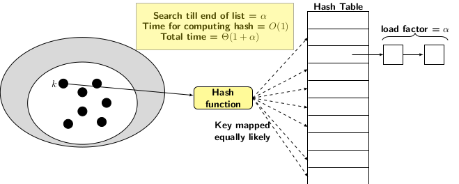

  

## Hashing by Chaining

A simple, uniform hash function spreads a set of random keys so that each key is equally likely to be hashed in any of the table slots.
Let $$P(k)$$ be the probability of $$k$$ being hashed into a table slot. Distributiveness of the hash means each slot 
$$j = 0, 1, \ldots, m-1$$ to be occupied equally likely.  

  $$\sum_{k|h(k) = j} P(k) = \frac{1}{m}$$

In hashing by separate chaining, collision resolution is simple. All keys that map to the same table slot are chanined together
in a linked list. The hash table slots contains pointers to these linked lists. In other words, the hash table is an array of 
ponters of size $$m$$. The expected length of each linked list is $$\frac{n}{m}$$ which is known as load factor and denoted by
$$\alpha$$. The hashing by chaining can be viewed pictorially as follows:

  

  
A lookup or search for an element in the hash table requires two steps:

1. Compute the hash value of the element
2. Index the table using the hash value to reach linked list and search it for the element.

For the analysis of time complexity, we have to consider two cases: 

1. Time for a successful search
2. Time for an unsuccessful search

Analysis of time complexity for unsuccessful search is easy with the assumption that hash function is simple and uniformly. 
Any element we look for may belong to in any of the $$m$$ chains and as explained earlier the length of any of the 
chains or the linked list is $$n/m = \alpha$$. The time to search for an element in a linked list of length $$\alpha$$ is 
$$\alpha$$. Since the searching also involves computing hash value for the table index before searching the corresponding 
linked list, the time  for an unsuccessful search is $$(1+\alpha/2)$$. 

The analysis for time complexity for successful search is a bit involved. We need to visualize the insertions as it happens into
different chains. The first part of the analysis, of course, to assume that the hashing function is simple and uniform. So, 
while inserting any element, we may hit any table slot equally likely. However, after that we append the incoming element 
to the corresponding list. The expected length of the list to which the elemeent $$i$$ gets inserted is $$(i-1)/m$$.  

For calculating the complexity of the unsuccessful search, we need to find the average of all insertions to the hash table.
The expression for the above is:

  $$\begin{split}
  \frac{1}{n}\sum_{1}^{n} (1+\frac{i-1}{m}) & = 1 + \frac{1}{mn}\sum_{1}^n (i-1)\\
  & = 1 + \frac{n(n-1)}{2m.n}\\
  & = 1 + \frac{n-1}{2m}\\
  & = 1 + \alpha/2 - \frac{1}{2m}
  \end{split}$$

Therefore, the average time complexity of an unsuccessful search is $$(1+\alpha/2)$$  
