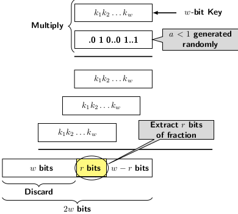

## Hash Functions

Hashing uses a hash function to map a key (element) to an index position in hash table. The function should have the following
characteristics:

- Low cost
- Uniformity
- Deterministic

Low cost implies the hash function should be computable in time of O(1). Uniformity means hash function should distribute the
keys equally likely in its range space or the index space of the hash table. Hash function is deterministic if gives same hash 
value for a given input. If hash function is not deterministic then it might give different index values in different operations.
So, we cannot access a key from the stored slot. 

The well known hash functions use following four methods:

- Division
- Multiplication
- Midsquare
- Folding

Division method is the simplest and most well used hashing function. It is given by:

  <i>h(x)</i> = <i>x</i> mod <i>m</i>, where <i>m</i> is the hash table size.

Let us analyze the characteristics of division function and its impact on different table sizes <i>m</i>.
First consider the value of <i>m = 2p</i>, then division function will map any key <i>x</i> only
to its lower order <i>p</i> bits. Therefore, a table size that is a power of 2 is a bad choice irrespective of key space. In fact, the 
division function maps all values of <i>x = am + b</i> map to same table slot <i>b</i>. Therefore, even the choice of a prime value
for <i>m</i> may not work out. 

Let us try find out the conditions for which division function may work. We assume the base of the number system to be
<i>b</i> such that <i>b</i> &#8801; 1 (mod <i>m</i>). Now consider a key value of the form

  $$k \mod m = \left(\sum_0^{r-1} k_i b^i\right) \mod m $$

Since $$b \equiv 1\mod m$$, we can replace it by $$(qm+1)$$. So, the RHS expression of the above equation becomes 

  $$k \mod m = \left(\sum_0^{r-1} k_i (qm+1)\right) \mod m = \sum_0^{r-1} k_i \mod m$$ 

Hence, base value $$b = 2$$ or $$b = 10$$ are not good for division hash function are not good. Overall analysis points to the
fact that division algorithm is bad. 

The next function is known as multiplication function. It relies on finding product of <i>x</i> by a randomly chosen fraction
between 0 and 1 and extracting the middle bits of the product. Let us view the process of multiplication of a value by a 
fraction in binary. The figure below depicts the long hand process of multiplication. 

  

So, if we take $$r$$ MSBs from the LSB of the product, the extracted value depends on the product. Mathematical expression of the 
multiplication function is: 

  $$\lfloor m.(k.a \mod 1)\rfloor$$ 

The value $$ k.a \mod 1$$ gives the fractional part of the $$w$$ LSBs of the product. This value multiplied by $$m$$ gives the 
table slot.  

Let us examine some examples to find out how multiplication function spreads the hash values. Let $$m = 100$$ and $$a = 1/3$$  

- For $$k = 10, \lfloor 100*(10/3)\rfloor = 33$$
- For $$k = 11, \lfloor 100*(11/33\rfloor = 66$$
- For $$k = 12, \lfloor 100*(12/33\rfloor = 99$$

According to Knuth a good choice for $$a = \left(\sqrt{5}-1\right)/2$$. 

A comparision of two hash functions: division and multiplication is provided in the table below. It shows that multiplicative
function distributes the keys more evenly. Division function leads to more collisions. 

| Key      | $$\lfloor m*(k*a\mod 1)\rfloor$$ | $$k\mod m$$|
|----------|-------------: |----------: |
| 123456   | 4             | 456 |
| 123459   | 858           | 459 |
| 123459   | 725           | 496 |
| 123956   | 21            | 956 |
| 129456   | 208           | 456 |
| 193456   | 383           | 456 |
| 923456   | 195           | 456 |
  
  
  

