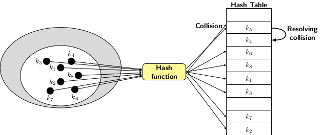
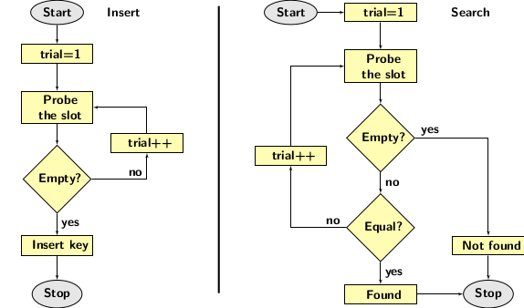

## Hashing with Open Addressing

Hashing with open addressing uses table slots to store the elements. Since chaining is not used, the resolution of collisions has to be performed
directly over the table slots. There are many ways to resolve collisions. We discuss some well-established collision resolution techniques along 
with insertions and deletions. The simplest solution is linear probing. It uses next available empty table slot whenever a collision occurs. Collision
resolution by linear probing clusters the elements with the same hash value together. These elements appear consecutively. An alternative to linear
probing is quadratice probing or random probing. The probing apply hash functions repeatedly to locate an empty alternative slot to when a
collision occurs explained in the diagram below.

                                                           

We can view the probing function as mapping that can specify an ordering of probes for an empty slot in the table. It implies

    $$h:U\times \{0, 1, 2, \ldots, m-1\}_{trials} \longrightarrow  \{0, 1, 2, \ldots, m-1\} $$                                          

The probling order essentially produces a vector 

    $$h(k,1), h(k,2), \ldots, h(k,m-1) $$                                          

that is a permutation of $$\{0, 1, 2,\ldots, m-1}$$.  

The idea is that the probe sequence should examine all slots of the table for discovering an empty slots to resolve a collision. The picture below
describes insert and search processes. The readers may notice that the flowcharts do not specify how many trials can be carried out. 

                                                           

 
