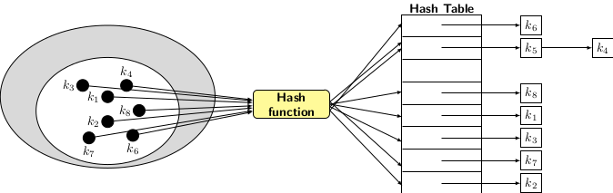
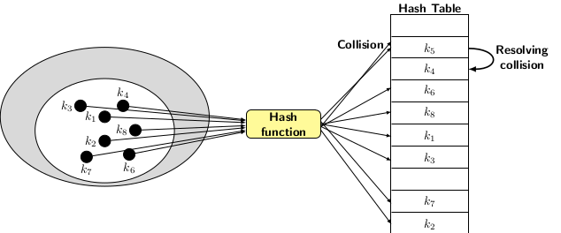

## Introduction to Hashing 

So far, we have learned about BST and balanced BSTs as possible alternative data structures for dictionary operations. As
we know, insert, search and delete together constitute dictionary operations. Balanced binary search trees 
only ensure the worst-case time of O(log <i>n</i>) per operation. Dictionary operations are performed with high frequencies in a large database table application. Therefore, if an application requires a large set of dictionary operations, 
then even O(log <i>n</i>) worst-case time per operation is unacceptable. We will need a data structure that allows
us to perform the operations in O(1) time on average for a given set of operations. A simple yet powerful
way to store the elements in a tabular form and use the index to the table to access and retrieve them when required. The
most clever part of the suggested scheme is computing the index for an element. Since the access has to be performed in O(1)
time, the index should be computable in O(1) time. But the question is: how do we compute the index in O(1) time?
The answer is to define the hash function. 

A hash function function is a mapping <i>h:x &#8594; i</i>, where <i>x</i> is element of the table and <i>i &#8712; {0, 1, 2 ... }</i>.
The most challenging part of hashing is to design a hash function that spreads the elements or symbols evenly among the 
available table slots. How does spreading evenly help? More precisely, if more than one symbol maps to the same index, then 
an attempt to retrieve one specific value may produce some random value that we are not interested in. To make sense of confusion involving collisions in storing symbols in the hash table, we should know about types of hashing. 
  
There are two types of hashing:
 
- Hashing by chaining
- Hashing by open addressing
  
Hashing by chaining uses separate linked lists to store the elements that collide on the same index value. All elements mapping
to the same index are chained together in a linked list. The table index points to the first element of the list. To access the
desired element, we have to traverse the linked list. The important aspect of this type of hashing is to ensure that only
O(1) items may collide with the same hash value when the hash function is applied. The picture of hashing by separate chaining
is given below.

  

Hashing with open addressing, also known as closed hashing, uses table slots directly to store elements. 
There are a few collisions where the elements hash to the same
table slots. There is a set of collision resolution techniques for the resolution of collisions. Some simple
collision resolution techniques are linear probing, quadratic probing, or random probing. We will talk more about
collision resolution techniques separately when describing closed hashing.

  

 
As explained above, hash functions are critical to the working of hash operation. We interchangeably use 
hash operations to mean the dictionary operations insert, search and delete. In the next blog, we discuss hash
functions. 

[Back to Index](../index.md)
