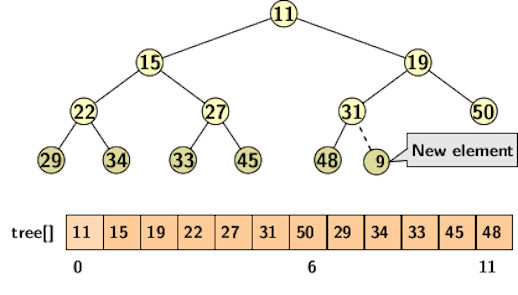
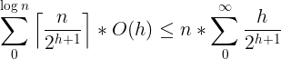
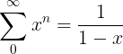
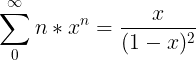
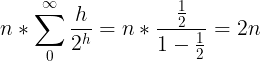

## Heap Sort

Heapsort is a comparison-based algorithm. It allows selection of the minimum element
in O(1) time after the heap is built. However, deletion of the minimum spoils the heap property.
So, the after deletion, we must perform heapify operation to restore the heap property for the
remaining element. Heapify operation takes O(log <i>n</i>) time. Therefore, the running time of
heapsort is O(<i>n</i>log <i>n</i>). We have studied binary heaps in connection with priority
queues. To refresh our memory let us reexamine the process of building heap from a set of
given elements from an ordered set.

<strong>Heap property</strong>

A heap is a complete binary tree such that the value stored in the node is smaller than or equal 
to that stored at any of its children nodes.

The following tree represents a binary heap.

  

The parent of a node at position <i>i</i> is available in the index postion &lceil;<i>i</i>&rceil;-1.

<strong>Building heap</strong>

Building heap is simple. We take one element at a time and build the heap by applying bottom up
heapify operation. The first element defines a heap of one element. Suppose a heap of a few elements 
is already available. The new element joins the heap at the leftmost vacant position in the 
highest level of the binary tree. It ensure the structural property of the heap remains unchanged.
After creating a new node for an incoming element, we apply a bottom-up heapify operation along
the tree path from the new node bottom up which is sometimes known as shiftup. It takes time of 
O(log <i>n</i>) to restore the heap property along the path. 

<strong>Time complexity</strong>

The reader may come to a quick conclusion that build heap has worst-case running time of 
O(<i>n</i>log <i>n</i>). However the bound is not tight. We can compute a tight bound by observing
that shiftup operation requires time of O(<i>h</i>) where <i>h</i> is the height of the tree.
The height increase gradually from 0 to log <i>n</i>. Since heap is stored as a complete
binary tree, we add nodes level-wise. All nodes of a height <i>h</i> require O(<i>h</i>) time
for heapify. In a level <i>h</i> there can be atmost &lceil;<i>n</i>/2h+1&rceil; nodes.

For example, a complete binary tree of 15 nodes has 

- The number of node at height 3 is &lceil;<i>15</i>/23+1&rceil; = 1
- The number of node at height 2 is &lceil;<i>15</i>/22+1&rceil; = 2
- The number of node at height 1 is &lceil;<i>15</i>/21+1&rceil; = 4
- The number of node at height 0 is &lceil;<i>15</i>/22+1&rceil; = 8 

Hence, the building heap requires time 15 units, which is same as the number of nodes in the heap.

Let us check if the heap can indeed be built in time of O(<i>n</i>). Since we add nodes level-wise,
and there are &lceil;<i>n</i>/2h+1&rceil; nodes per level, the time for building heap
is:

  

The final step of simplification RHS of the above equation is explained as follow. We know 

  

Differentiation of both sides of the above equation gives us

  

We substitue <i>x = 1/2</i> to obtain: 

  

Therefore, building of heap of size O(<i>n</i>) requires linear time.

<strong>Sorting using heaps</strong>

Once the heap is available, we can repeatedly use deleteMin operations to select the minimum and
append the deleted element in the sorted list. It produces a sorted list in time of O(<i>n</i> log <i>n</i>).
Therefore, the time complexity for the heap sort is  O(<i>n</i> + <i>n</i> log <i>n</i>) or 
O(<i>n</i> log <i>n</i>).

[Back to Index](../index.md)
