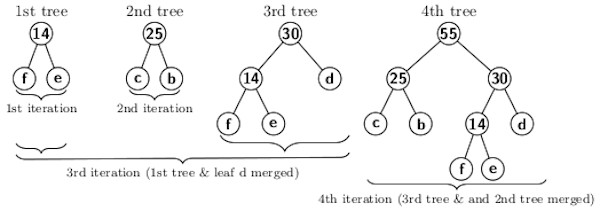
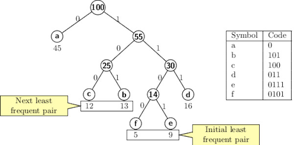

## Huffman Encoding Algorithm  

Huffman encoding uses a greedy approach. Initially, it starts with a forest
of trees. Each symbol is associated with a node of a tree in the forest.
The trees in the forest are merged in a greedy approach. A new joint symbol replaces a pair of
least frequently occurring symbols. The sum of frequencies of the old pair of symbols becomes the frequency of the new symbol. The merging, as explained, reduces the symbol set reduces by one. Therefore, each 
successive merging of trees in the forest reduces the complexity of the problem by 1. Finally, one tree gets built. The figure below illustrates the successive iterations for merging operations. 

 

The method assigns the shortest code to the most frequently occurring 
symbol and the longest code to the least frequent symbol in the 
input. A binary tree is constructed bottom-up for the codewords where each leaf node represents a symbol or a character in the input. A left
branch (pointing to the left child) from a node is labeled a 0 and a
right branch (pointing to the right child) is labeled a 1. Now the string
of labels starting from 
the root of the Huffman tree gives the codeword for a symbol.
The final Huffman tree is obtained by merging the 2nd and the 4th tree. 

 

The codewords for the symbols are shown in the table alongside. 

Now optimality of encoding scheme can be evaluated by computing the number 
of bits used for an input text. Let <i>c</i> and <i>f(c)</i> respectively
denote a character and its frequency in the input. Then the number of bits
is given by the following expression:

Starting with a forest of tree consisting of single nodes representing 
each character, in each iteration a pair of trees with two least frequencies are merged. To prove correctness we use the following recursive formulation  
<ul>
<li>Let initial set of symbols be <i>A</i> in which <i>a</i> and <i>b</i>
are two symbols of least frequencies.</li>
<li>Let <i>A'</i> =  where <i>c</i> is the new symbol replacing
<i>a</i> and <i>b</i> </li>
<li>Recursively use the Huffman algorithm to computer prefix code for <i>A'</i>. </li> 
<li>After getting optimal code for <i>A'</i> put back <i>a</i> 
and <i>b</i> as children of <i>c</i> in the Huffman tree of 
<i>A'</i></li> 
</ul>

The critical part of the proof is to show that there exists an optimal prefix
code where <i>a</i> and <i>b</i> are siblings. We will continue the proof
in the next blog. Click the [link here](../CODES/HuffmanCode/index.MD) for the source code implementing the Huffman encoding scheme. 

[Back to Index](../index.md)
