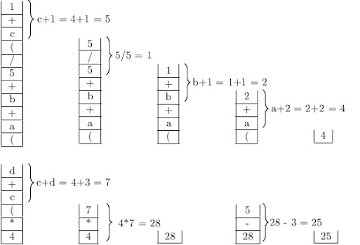

## Evaluation of Arithmetic Expression

One of the applications of stacks is for evaluation of arithmetic expression.
An arithmetic expression consists of operands and operators. Everyone is
familiar with infix arithmetic expressions, in which operators occur between operands as shown in the image below.  

In a computer program, the operands are represented variables. 
The operators are denoted by arithmetic symbols for addition, subtraction,
division, multiplication, power, or roots. Each operator has a priority 
that determines how the operators should be applied to 
the associated operands. Conventionally, the operators are binary,
i.e., each needs two operands. However, unary operators like negation,
power may appear in expressions. In this blog we consider only binary
operators. 

The rules of evaluation are based
on priorities operator. Classically the evaluation rules is referred to as 
"BODMAS" or "PEMDAS" which stands for
<ol>
<li>First evaluate expressions within brackets inside out,</li>
<li>Next evaluate the order of powers or roots,</li>
<li>Perform divisions and multiplications operations,</li>
<li>Perform additions and subtraction operations.</li>
</ol>
PEMDAS stands for parenthesis (P), exponentiation (E), multiplication (M),
division (D), addition (A), subtraction (S). 
The order of evaluating parenthetic expressions is carried out by evaluation 
of expression from the innermost brackets to the outermost brackets. 

The major issue in evaluating an infix arithmetic expression is ensuring that 
operators are evaluated according to their priorities. So, the main problem in 
evaluation is to hold back the evaluation of an operator until priority rules
are satisfied. After an evaluation is performed, the value may become an 
operand for another operator. So the values are temporary till the final
evaluation. A stack is a convenient data structure for holding 
inter-operator evaluation orders. For example, the value can be pushed into the stack after evaluating an expression within a bracket while
waiting for the outermost closing parenthesis.

Let us hand simulate evaluation of the following expression using a stack.

with the values <i>a = 2, b = 1, c = 4, d = 3</i>.

Starting with an stack, the evaluation process is illustrated by the figure below.

After each evaluation, the result is pushed back to the stack. So the temporary results of the evaluation can be reused with appropriate priority rules as 
explained earlier. Program for evaluation of expression with one stack is hard. It is left as an exercise for the reader. However, we provide the source
code of a C program for evaluation of an infix expression with two stack. One stack is used for storing operands and the other stack is for storing the 
operators. [Click here for the header file](../CODES/infixEvalStack/). Going through the program, the reader may get a fairly decent idea about implementation with one stack. 

We will return to evaluation of arithmetic expression when we deal with binary trees.

[Back to Index](../index.md)
