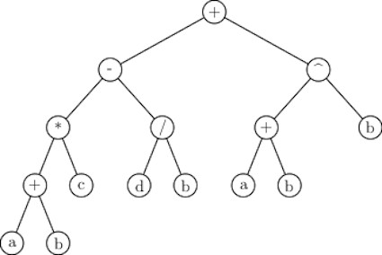
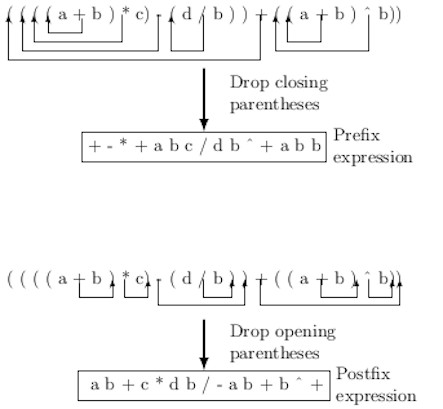

## Converting an Infix Expression to a Equivalent Postfix form
Evaluation of arithmetic expressions was introduced in an earlier blog on 
the stack. The operators we are familiar with are binary, i.e., each requires two operands. It is, therefore, natural to represent arithmetic expressions 
using binary trees. The leaf nodes store operands in a binary expression tree, and internal nodes store operators. A binary expression tree appears in the figure below. 

Traversals of the tree may give different forms of the expression:

- Preorder traversal list gives the prefix form of the expression,
- Postorder traversal list gives the postfix form of the expression,
- Inorder traversal list gives the infix form of the expression.

We are familiar with the infix form of an arithmetic expression. Evaluation infix expression is complicated. 
It requires managing precedence of operators and evaluating parenthetic expressions inside out.  
If we need to evaluate a few arithmetic expressions in a program repeatedly. It will be better to use an expression form that is 
simpler to evaluate. The evaluation is simpler provided:

- If the expression requires one single scan which preserves the rules of evaluation.
- If it does not require any complicated data structure
- If it does not require memory space over the order of expression length
- If it does not require time over the order of expression length

The postfix form of an arithmetic expression satisfies the properties stated above. Before discussing postfix expression, let us briefly examine if
the prefix form of an arithmetic expression can meet the state properties. In prefix form, an operator appears before its operands. 
Consider the following expression given in conventional infix form. 

  

We can get the prefix form from the preorder list of the corresponding expression tree. However, we can also transform the infix form of an 
expression into its prefix form in the following way.

- Fully parenthesize the expression according to desired evaluation order
- Replace each opening parenthesis by its closest operator to right
- Remove all closing parentheses.

For example, the fully parenthesized form of the expression 

 

is given by 

.

After replacing each opening parenthesis by its closest operator to right, we get

  

The prefix expression can be evaluated by scanning from right end. In the following evaluation procedure, we denote the intermediate values by the temporaries 

- Set  the modified expression becomes: 

- Set  modified expression become: 

- Set  , modified expression is: 
 
- Set  modified expression is: 
 
- Set  modified expression is: 
 
- Set   modified expression is 
 

- The final result is:     

The process requires backward and forward scanning of the expression. Therefore, the evaluation of prefix form is not simple.

We can create an equivalent postorder expression from a fully parenthesized expression as follows:

- Replace each closing parenthesis by its closest operator to left,
- Remove all opening parentheses.

The procedure for creating prefix and postfix expressions from an infix expression is illustrated in the figure below.

Evaluation of the postfix form of expression using a stack is quite simple. The stack holds the operands until an operator is encountered. Then repeatedly
perform the following steps.

- Pop two operand from the stack
- two operand from the stack

Once an operator is found, pop the required pair of operands on the top of the stack. Compute the result and push the result back to the stack. 
Repeatedly perform computations until reaching the end of the input. So, the evaluation process is simple.
However, the important initial step is to transform the infix form of an expression to postfix form. If a tree form of the expression is available, 
then the postorder traversal list gives the desired postorder form.  

A C program for coverting the infix form of an expression to its equivalent postfix form is provided for the reader's reference.

[program](../CODES/infixToPostfixConverter/index.md)

[Back to Index](../index.md)
