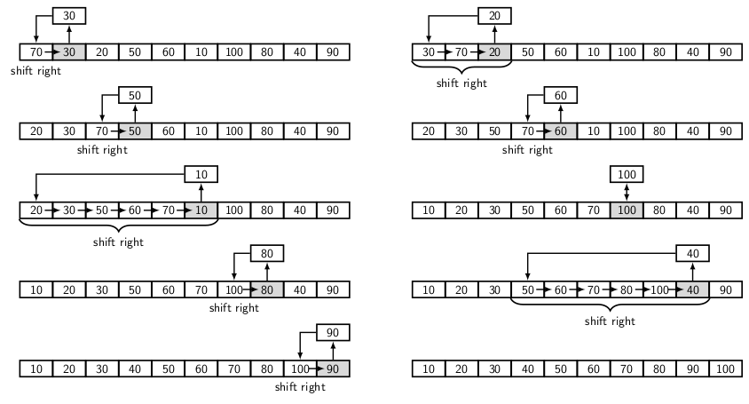

## Insertion Sort

Insertion sort is similar to the way we sort the playing cards in a hand of a bridge game. The
process of sorting a hand is as follows:

- Assume that cards in hand are already sorted,
- Pick a new card from distributed pile,
- Check its appropriate place among the card already in the hand,
- Create a slot for inserting the new card by sliding higher denomination cards to right.

When sorting an array of elements, we assume that that the elements are divided into two
parts, viz., sorted part and unsorted part. The unsorted elements occur to the right of sorted
elements. Initially, only first element is considered as sorted. The process is as follows:

- Pick the leftmost element of the unsorted part, save it as <i>gap</i> element,
- Compare <i>gap</i> beginning with the right most sorted element,
- Shift the sort elements to the right until <i>gap</i> continues to be smaller, 
- Now place <i>gap</i> element at the current place of sorted part of the array.  

Figure below illustrates the insertion sort algorithm. 
<p style="align-text:center">
  
</p>
The key point in insertion sort is data movement. If there is no date movement then the list is
sorted. It is controlled by a pair of loops. The first loops picks the next unsorted element from
the list. The second loop controls the data movement, comparing the picked element with each 
sorted element one by one beginning from right.

- Initially, only the leftmost element of the array is sorted
- Remaining <i>n-1</i> elements to the right is unsorted. 

Since we have to pick one element at time from left of unsorted part, the first loop runs <i>n-1</i>
times. The second loop scans all elements of the sorted part to create a slot where next unsorted
element can be slipped. Since, worst case size of sorted elements is <i>n-1</i>, the second loop
may run for <i>n-1</i> times. Therefore, the worst case running time of insertion sort is 
O(<i>n<sup>2</sup></i>).

The algorithm is as follows:

```
procedure insertionSort(int a[n]) {
  int  i, j, n, gap;

  for(i = 1; i < n; i++) {
        gap = a[i]; // Save the next unsorted element
        j = i-1;    // Compare and shift starting with rightmost sorted element
        while(j >= 0 && a[j] > gap) {
            a[j+1] = a[j]; // Shift elements to right to create slot 
            j--;
        }
        a[j+1] = gap; // Slot for new element
  } 
 
  return;
}

```
[C Program for Insertion Sort](../CODES/InsertionSort/index.md)

[Back to Index](../index.md)
