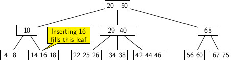
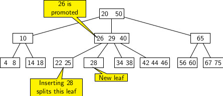

## B-Trees

B-Trees are used to store very large dictionaries. They allow searches, insertions, and deletions in 
logarithmic time.  A B-Tree node may have up to a few thousand nodes. Since B-Trees have very high branching 
factor, the tree tend to be bushy compared to red-black tree. They do not require rebalancing operations like rotations.
But as more and more insertions happen, the nodes cannot accommodate them. So, more nodes must be added to handle insertions.
When deletions take place, it leads to some wastage of storage space. To handle both situations, B-Tree
nodes are restructured by splitting and merging. Splitting of a node occurs more and more keys accumulate for room 
at the node. Similarly, merging occurs when a pair of sibling nodes have lot of vacancies for keys due repeated 
deletions. Merging reduces height as it may propagate up to the root of tree. Splitting also propagate all the way to
the root of a tree causing its height to increase. 


<strong>Defining a B-Tree</strong>

We formalize the definition of a B-Tree specifying the following properties.

- The root is a special node that may have between 2 and <i>M</i> children. 
- An internal node may have between <i>M/2</i> and <i>M</i> children.
- The number of keys stored at a node is one less than the number of children.  
- Each leaf node is at the same depth from the root.
- A leaf node stores at most <i>M-1</i> and at least <i>M/2</i> elements in sorted order. 

The root is the only node in a B-Tree that may be less than half full.

B-Trees do not require rebalancing operations like rotations. But they need nodes to split and merge to handle dynamicity
of key insertions and deletions. Insertions increase the number of stored elements and may require splits. Splits may 
propagate up to the root, causing the tree's height to increase. On the other hand, the merging of nodes occurs with 
deletions. It may cause the height of a B-Tree to decrease. The elements appear in sorted order at nodes. 

The figure below gives the picture of a B-Tree with <i>M=4</i>. 

<p style="text-align:center;"></p>

In the figure, the root has two elements: 20 and 40.
- The elements less than 20 can be reached following the leftmost pointer. 
- The elements between the range (20, 40) are reachable from the pointer to the right of 20. 
- The elements greater than 40 are reachable from the pointer to the right of 40. 

Loosely speaking, the two adjacent numbers <i>a</i>, <i>b</i> in an internal node represent an open interval <i>(a, b)</i>. 
Any number <i>x</i> in <i>(a, b)</i>, if it exists in the tree, may be found in one of the descendant node <i>u</i> of 
<i>v</i> which is accessible from the pointer between the numbers <i>a</i> and  <i>b</i>.  

The minmum number of keys in a tree of height 1 is 1. If we increase height of the tree by 1, the minimum number of keys 
increases by <i>2k - 1</i>, where <i>k</i>=&lceil;<i>M/2</i>&rceil;. So for different heights of the tree in the minimum 
number of nodes is: 
 

| Height | Number of keys | 
| -------- | -------|   
|   1    | 1 |
|   2    | 1+2<i>(k-1)</i>|
|   3    | 1+2<i>(k-1)</i>+2<i>(k-1)k</i>|
|   4    | 1+2<i>(k-1)(1+k+k<sup>2</sup>)</i>|


In general if height is <i>h</i> then the minimum number of keys will be:

<p style="text-align:center;">
<i>2(k-1)(1+k+k<sup>2</sup> + k<sup>3</sup> + ... + k<sup>h</sup>)</i>
</p>
Therefore, for a B-Tree with <i>n</i> nodes the height should be at most 1 + log<i><sub>k</sub></i>((1+<i>n</i>)/2)
<br><br>
In the above example, we do not distinguish between items and their keys. Equivalently, an item and its key are are the same. 
However, typically in real database implementation, a distinction exists between items and their corresponding keys. 
Items are records accessed by providing corresponding primary keys. Therefore, we have two ways of storing items in B-Tree. 

1. Keys are stored at nodes, and items are stored at external nodes. 
2. A key and its corresponding item are stored together at the same position.  

Using different keys and items, we can modify the above example to store data at external nodes, as shown below. 

<p style="text-align:center;"></p>

<strong>Search:</strong> Search operation in a B-Tree is a generalization of the binary search. It combines advantage of a
binary search tree with plain binary search on a sorted list. For convenience in description we use the following notation:
- <i>k</i>: key value for search
- <i>n</i>: Current node

The search typically start from root. We try to find a match for <i>k</i> in the local cache of keys maintained at the
current node <i>n</i>. If a match is found then we return the node and the index of the matched key. If no match is found
in local key cache and <i>n</i> is a leaf, the search terminates without a match for <i>k</i>. Otherwise, we use the left 
child pointer of the smallest key greater than <i>k</i> in the current node, and recursively perform search from the
left child. The pseudo code for searching a <i>k</i> in a given B-Tree appears below.

```
BtreeSearch(n, k) {
     i = 1;   // Start from first key position
     while (i <= n.count and k >= n.key[i])   //n.count gives the number of keys in node n
           i = i + 1;  // Locate the smallest key greater than k
     if (i <= n.count and k == n.key[i]) // n.key[i] matches k
           return (n, i); 
     if (isLeaf(n))
           return NIL   // If current node is leaf then key is absent
     else 
          // Recursively search the child node from the pointer to the left of n.key[i]
           return BtreeSearch(n.child, k);
}
```

<strong>Insertion:</strong> Perform a key search in the given B-Tree for the element. If element is not found 
the search will terminate at a leaf. If the leaf contains less than <i>M-1</i> keys then insert the key there. It will 
require data movements. Some keys may have to be moved to right to make room for the new insertion. If the leaf is full
(i.e., it contains <i>M-1</i> keys) then create a new leaf. Retain the first half the keys in the old leaf and move the
second half of the keys to newly created leaf. Push the median to parent and create an extra child link for the new leaf 
to right of median key pushed to the parent. If parent does not have room, repeat the splitting process again at the parent. 
The recursice process of splitting may finally split the root and increase the height of the tree by adding a new
root.

Essentially, the algoritm for insertion requires two different procedures, namely,
- If the node is full then split the node, place one half of nodes in one and other half in another node of the split.
- If the node is not full then insert the key into the node at proper position by shifting some existing keys to right. 

The algorithm uses a bottom up approach for insertion of a new key. It begins search  a leaf node where the key belongs. 
If the node is not full then the insertion is done by shifting other larger keys to the right. However, if the node is 
full then the node is split into two. The first half of the keys are placed in the original node and a new node is 
allocated for 2nd half of the keys. The median key is promoted to a place in the parent of the original leaf. It may
cause a split in the parent node if the latter is full. The splits can occur recursively all the way to the root. When the
root is split a new root is created and the height of the tree increases. The pseudo code of the algorithm for insertion
is provided below. 

```
B-Tree-Insert(T, k) {
    r = T.root // Start with root
    if (r.count == M - 1) {
       // The root is full, we have to split it
       s = allocate-node(); 
       T.root = s; 	// New root node
       s.leaf = FALSE;  // New node will have some children
       s.count = 0;	// Initialize
       s.c[1] = r;      // Child of s is the old root node
       B-Tree-Split-Child(s, 1, r); // r is split, 1st half of keys goes into r
       B-Tree-Insert-Nonfull(s, k); // s is not full
   } else
       // r is not full, we can insert k into r
       B-Tree-Insert-Nonfull(r, k);               
}
```
The algorithm for an insertion into non-full node appears below. 

```
B-Tree-Insert-Nonfull(n, k)
     i = n.count;
     if (isLeaf(n)) { 
              // Search for a non existing key will terminate when we are about to fall off from 
	      // the tree. So the node must be a leaf node. Shift keys of this leaf node to the 
	      // right up to the point where the new key k should go
                 
	      while (i >= 1 and k < n.key[i] ){ 
                   n.key[i+1] = n.key[i];
                    i--;
             }

             // Put k in its right place and increment the count of keys
            n.key[i+1] = k;
            n.count++;
	    
      } else {
            // Find child where new key belongs traversing the tree down to a leaf. 
            while (i >= 1 and k < n.key[i]) 
	        i--;.

            // If k belongs to n.child[i], then k <= n.key[i]. We should track back the last 
	    // key (least i) where the inequality is violated, and read that node from disk.
            i++;
            Disk-Read (c[i])
	    
            if ((n.child[i]).count = M - 1) {
                  // ith child node is full, we will have to split it

                  B-Tree-Split-Child (n, i, n.child[i]);

                  // Now n.child[i] and n.child[i+1] are the new children, and key[i] may have been changed. 
                  // Find out if k belongs in the first or the second

                  if (k > key[i])
		      i++;
            }

           //Recursively call this procedure to perform the insertion at right non-full node.
           B-Tree-Insert-Nonfull (n.child[i], k);
}
```

A summary of the overall procedure is provided below for reference.

1. Start at the root node and search for the key <i>k</i> to find the place where it can be pushed. Call this node <i>N</i>.
A search terminates only at a leaf node when a key, so  <i>N</i> must be is a leaf node. 
2. If <i>N</i> has space for more keys (non-full) shift the larger element to the right, place <i>k</i>, and terminate.  
3. Otherwise, <i>N</i> is full. Split it two nodes by creating a new node:
   - Retain the smaller half the keys in the original node 
   - Move the larger half of keys to the newly create node.
   - Choose the median of the keys and push it to the parent of original node
   - If parent is full, it may necessitate a split of parent and split may percolate recursively to root. 
 4. Split the root if required and terminate.
 
Splitting of the root creates a new root and increases the height of the tree. However, unlike balanced trees, B-Tree does
not use rotations to fixup or rebalance the tree. 

As discussed above, a new insertion into a non-full leaf node simply fills the node with an extra key. For example, if we 
insert 16 into the B-Tree of figure 1 that appears at the beginning of this blog, the leftmost node becomes full. The figure
below illustrates the result of this insertion. 
<p style="text-align:center;"></p>

However, suppose we insert 28 to the resulting B-Tree, it splits in third leaf that initially had keys 22, 25 and 26.
A new leaf with key 28 is created, and the median key 26 is pushed up to the parent node of the original leaf. The result
of this insertion appears below. 
 <p style="text-align:center;"></p>
 
We end this blog here, and continue with deletion operation on B-Trees in the next blog.

[Back to Index](../index.md)

