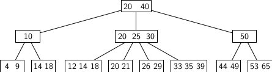
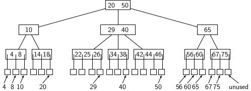

## Introduction to B-Trees

B-Trees are used to store very large dictionaries B-Trees allow searches, insertions, and deletions in amortized 
logarithmic time. Before we describe the node structures, it is important to know about amortized cost. 

<strong>Amortized cost:</strong> is defined over a sequence or a set of operations. If some operations of a given set are 
costly because future operations become cheap, we say time is amortized over the given set of operations. We have learned 
about amortized cost earlier in the context of <b>union</b> and <b>find</b> instructions on disjoint sets. The reader 
might remember that a sequence of O(<i>n</i>) unions and finds can be executed in O(<i>nG(n</i>)) time where <i>G(n)</i>
is an extremely slow-growing function. So, for all practical purpose, each operation of sequence take O(1) amortized
time. Loosely speaking, amortized time is time partitioned over many operations. We will return to amortized time in 
the analysis of B-Tree at a later point.

<strong>Defining a B-Tree</strong>

We specify a B-Tree with the following properties.

- The root is a special node that may have between 2 and <i>M</i> children. 
- An internal node may have between <i>M/2</i> and <i>M</i> children.
- The number of keys stored at a node is 1 less than the number of children.  
- Each leaf node is at the same depth from the root.
- A leaf node stores at most <i>M-1</i> and at least <i>M/2</i> elements in sorted order. 

The root may be the only node that is less than half full.

B-Trees do not require rebalancing operations like rotations. But they may need nodes to split and merge when many 
insertions and deletions occur. Insertions increase the number of stored elements and may require splits. Splits may 
propagate up to the root, causing a tree's height to increase. On the other hand, the merging of nodes occurs with 
deletions. It may cause the height of a B-Tree to decrease. The elements appear in sorted order at nodes. 

The figure below gives the picture of a B-Tree with <i>M=4</i>. 

In the figure, the root has two elements: 20 and 40.
- The elements less than 20 can be reached following the leftmost pointer. 
- The elements between the range (20, 40) are reachable from the pointer to the right of 20. 
- The elements greater than 40 are reachable from the pointer to the right of 40. 

Loosely speaking, the two adjacent numbers <i>a</i>, <i>b</i> in an internal node represent an open interval <i>(a, b)</i>. 
Any number <i>x</i> in <i>(a, b)</i>, if it exists in the tree, may be found in one of the descendant node <i>u</i> of <i>v</i> which 
accessible from the pointer between the numbers <i>a</i> and  <i>b</i>.  

In the worst case, the number of keys in a tree of height 1 is 1. For 1 increase in height of the tree the number of keys 
increases by <i>2k - 1</i>, where <i>k</i>=ceiling(<i>M/2</i>). So for different heights of the tree in the worst case, 
we get
 

| Height | Number of keys | 
| -------- | -------|   
|   1    | 1 |
|   2    | 1+2<i>(k-1)</i>|
|   3    | 1+2<i>(k-1)</i>+2<i>(k-1)k</i>|
|   4    | 1+2<i>(k-1)(1+k+k2)</i>|

In general if height is <i>h</i> then the number of keys will be:

<i>2(k-1)(1+k+k2 + k3 + ... + kh)</i>

In the example given above, we don't distinguish between items and their key. Equivalently, an item and its key are the same. 
However, typically we make a distinction between items and their corresponding keys. Items are records accessed by 
providing corresponding keys. There are two ways of storing items in B-Tree. 

1. Keys are stored at nodes, and items are stored at external nodes. 
2. A key and its corresponding item are stored together at the same position.  

Using different keys and items, we can modify the above example to store data at external nodes, as shown below. 

<strong>Search:</strong> Search operation in a B-Tree is a generalization
of the binary search. 

<strong>Insertion:</strong> For insertion of a key <i>x</i>, we proceed as  follows:

1. Search and find the proper position where the element <i>x</i> may be inserted.
2. If the number of elements in the leaf node <i>l</i> is less than <i>L</i> 
   then place <i>x</i> in sorted position in <i>l</i>. 
3. Otherwise an overflow occurs. Split <i>l</i> into two leaves:
   - Collect first ceiling(L+1/2) keys with one leaf and the next 
     floor(L+1/2) keys in another. 
   - Add new child to the parent for accessing newly added leaf. 
   - If an overflow occurs at parent if it ends up with <i>M+1</i> 
     children. 
4. If an internal node ends up with <i>M+1</i> children then"
   - Split it into two nodes first one with ceiling(M+1/2) children
     and the next one with floor(M+1/2) children.
   - Add a new child to the parent. 
   - If parent has <i>M+1</i> childre then overflow occurs.
5. Split overflowed root into two like an internal node, and create
   a new parent. 
   - hang two children (orinal root) and newly created node under
     the new node.
   - Propagate keys up to the new node which becomes the root. 

Splitting root increase the height of the tree. No rotation or restructuring of the root is required. 
