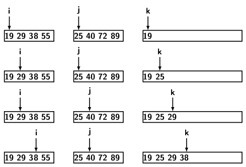
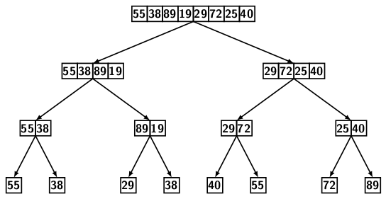
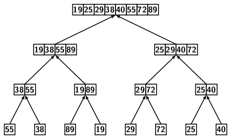
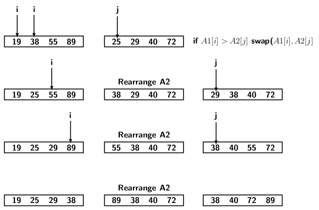

## Merge Sort

Merge sort is suitable for the external sorting algorithm. It can handle a massive amount of data that 
cannot fit into the main memory. The data resides in slow-access memory, such as a disk. We can bring 
chunks of data into the main memory, sort them and write them back to disk. We combine the smaller files into a sorted file through merging. However, we only discuss the internal sorting 
algorithms. So, we assume that the data is small enough to fit into the main memory.

The main operation of mergesort is merging. A single element is vacuously sorted. The merging of
two single elements creates a sorted array of two elements. In general, a merging two sorted 
arrays of length <i>k</i> each and produces a single sorted array of length <i>2k</i>. Therefore,
by O(<i>log n</i>) repeated mergings, we can sort a input sequence of <i>n</i> elements. 
The figure below illustrates the operation of merging two sorted sequences of equal length.
<p style="text-align:center">
  <br>
  Figure 1
</p>
We maintain three cursers, one for the two given input arrays and one for the output array. 

- At each step, we take one element from each array under the respective cursers.
- Compare the elements, and place the smaller one in the output array.
- Advance the cursor for the input array from which element was sent to the output.
- Advance the cursor for the output array
- Repeat the step until all elements of one of the input arrays have been considered

After completing the above steps, one array may have a few unprocessed elements. These elements
will be greater than the output elements. So we can transfer these elements in subsequent positions of 
the output array, maintaining their relative order. The figure shows that the first array is exhausted after moving 40 and 55. However, the second still has 72 and 89, which can be appended to 
the output at subsequent positions. Therefore, the final merged sequence is 19, 25, 29, 38, 40, 55, 
72, 89. The time complexity of merging procedure is O(<i>m + n</i>), where <i>m</i> and <i>n</i> 
are respective sizes of the two arrays. 

The merging algorithm appears below.

```
// Merge two sorted arrays A and B into C 
procedure merge(A[], B[], C[]) {
  
   m = A.length;
   n = B.length;
   C.length = m + n;

  // Maintain current index of input arrays and output array
  i = 0;
  j = 0;
  k = 0;

  // Until we reach either end of either A or B, pick larger among
  // elements A and B and place them in the correct position of array C
  while (i < m && j < n) {
    if (A[i] <= B[j]) {
      C[k] = A[i];
      i++;
    } else {
      C[k] = B[j];
      j++;
    }
    k++;
  }

  // When we run out of elements in either A or B,
  // pick up the remaining elements and put in C[k..m+n]
  while (i < m) {
    C[k] = B[i];
    i++;
    k++;
  }

  while (j < n) {
    C[k] = B[j];
    j++;
    k++;
  }
}

```

The recursive version of mergesort is simple. It first divides the input 
array into two subarrays top-down and calls mergesort on two subarrays. The 
division continues recursively till subarray sizes are one each. Then merge combines
the sorted subarrays bottom up. The algorithm for merge sort is given below.

```
void mergeSort(C[],  left, right) {
  if (left < right) {
    
    // Recursive top-down division of input array into subarrays
    // m is the point where the array is divided into two subarrays
    mid = left + (right-left) / 2;

    mergeSort(C, left, mid);
    mergeSort(C, mid + 1, right);

    // Merge the sorted subarrays bottom up
    merge(C, left, mid, right);
  }
}

```
Figure 3 illustrates the merge sort procedure. 
<p style="text-align:center">
           &nbsp;&nbsp;&nbsp;&nbsp;&nbsp; 
  <br>
  Figure 2
</p>
The left half of the image shows the recursive top-down division of the array into smaller subarrays 
while the right half of the image depicts the recursive merging of the subarrays bottom up. 

<strong>In place merging techniques</strong>

There are many variations of merging. The interesting part of these variations is to merge in place.
That is merging sorted arrays without using a third array for output. Since there is no additional 
array, we must rearrange the positions of elements in the input arrays. The merging step works by 
swapping positions of the element pairs when the first array has a larger element
than that in the second array. The element which goes into the second array is rearranged to
keep the second array always in sorted order. When comparing elements, we always begin with the 
first element of the second array. However, the curser for the first array advances after each merge
step. The figure below depicts the merging procedure.  
<p style="text-align:center">
  <br>
  Figure 3
</p>  
The rearranging elements in the second array are similar to the insertion sort procedure. In Figure 2
the third column depicts the subarray A2 after rearrangement. The second column shows A2 after 
swapping elements between A1 and A2. The first column is for subarray A1.

The worst-case time for comparing every element of the first array with elements of the 
second array is O(<i>n</i>). Since there are <i>m</i> elements in the first array, total 
time for comparison is O(<i>m * n</i>). The rearrangement of the second array is done by 
swapping. It may take a worst-case time of <i>n</i>. So, overall worst-case time including 
rearrangement is O(<i>m * n</i>). Since we are not using extra space, the running time increase.
In other words, there is a tradeoff between time and space.

The next merging technique uses the insertion sort to place elements from 
one subarray into the correct position in the other. The procedure is depicted in 
Figure 4.
<p style="text-align:center">
  <br>
  Figure 4
</p>
The method works as follows. Before comparing the elements of the two subarrays, the last
element of the left subarray A1 is saved in a temporary variable. It allows us to move the
elements of A1 to one position to the right without loss of any data. We set

- i = last-1 index of A2 subarray
- j = last-2 index of A1 subarray
- Iterate over i and j comparing the elements if A1[j] > A2[i] then
    - shift all elements of A1 from A1[j] to A1[last-2] one position to the right
- Let s be the index of the smallest element of the subarray A1  greater than A2[i]
   - Place A2[i] at A1[s] 
   - Placed saved A1[last-1] at A2[i]
- Now update the last index of A1, decrementing it.   

Let us check the first row of Figure 4. A1[last-1] = 89, first we save it. Then compare
elements from A2[last-1] with A1[last-2]. Since A1[last-2] < A2[last-1], s = last-1. 
There are no elements to the right of A1[s]. Therefore, we place A2[last-1] at A[s]. So,
72 is placed at the previous position of 89, and 89 goes to A2[last-1]. Now j is set to
index last-2 of A2. 

Next, consider the second row of Figure 4. A1[last-1] = 72, we save it again. 
Continue the iteration over i and j as explained earlier to locate s = 2, as
A1[2] = 55 and A2[3] = 40 (i.e., 55 > 40). We shift 55 to the right and drop 40
in A1[2]. The saved element 72 is placed at A2[2]. The reader can now easily figure out
the remaining rows in Figure 4. 


[C Program for Merge Sort](../CODES/mergeSort/index.md)

[Back to Index](../index.md)
