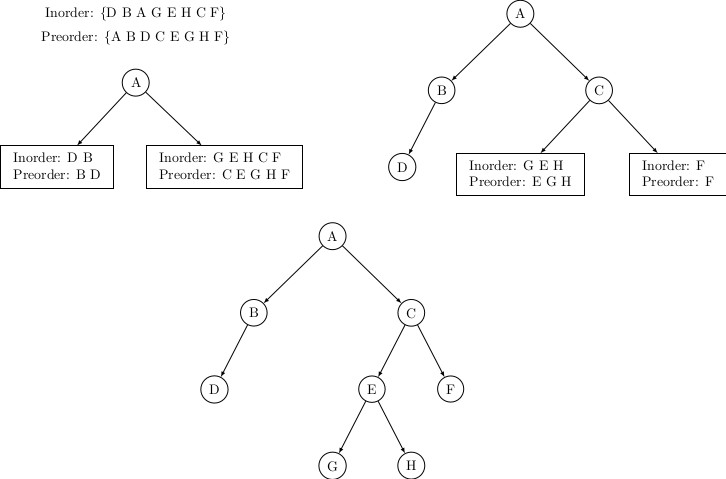
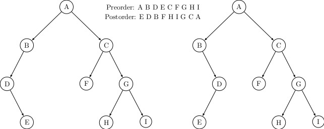
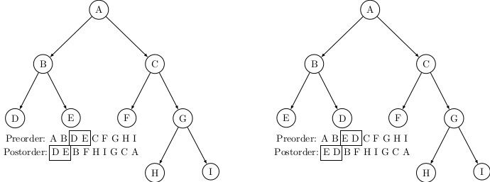

## Properties of Binary Trees (contd.)

We explore traversals of binary trees a bit more deeper in this blog. The 
idea is to explain that knowing traversal of tree is critical to any
processing of tree data structure.  

It is possible to recover or construct a binary tree from traversal lists. 
In a sense, it deals with the inverse problem of constructing a tree
back from traversals. We need two traversal lists: _preorder_ and _inorder_. 
Figure below explains the process of construction. 

The root of a tree <i>T</i> appears as the first node in its preorder list. After 
the root is identified, scan the inorder list of <i>T</i> to separate out the
inorder traversal lists of its left and the right subtrees. The sublist of 
the inorder list to the left of the root is the inorder traversal list of 
left subtree of <i>T</i>. Likewise the sublist to right is the inorder traversal
list of the right subtree. Next scan the preorder list of <i>T</i> for the left
and right subtrees. These sublists appear in one after the other in the 
preorder list. So, the process of separating out the subtrees can be applied
recursively. The construction leads to a unique tree.

However, it is not always possible to create a unique tree when preorder 
and postorder lists are available. Following example shows that two
different trees may have the same pair of lists for preorder and postorder 
traversals. We need an additional condition for constructing a unique tree
from preorder and postorder list. If the tree is known to be a strictly 
binary tree, then a unique tree can be found. Figures below illustrate the
the two cases.

The preorder and postorder cannot uniquely fix the left and right child if
a node has only one child. For example, both the trees shown in above figure have same preorder and postorder traverals lists.
It is not possible to determine whether D is left child or the right child of B. However, if the tree is a strictly binary trees, every internal 
node has two children; so it automatically fixes the topological postions of 
a node with respect to its parent. Figure below illustrates an example for recovering a strictly from its preorder and postorder traversal lists. 

[Back to Index](../index.md)
