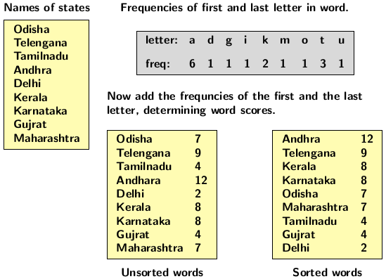
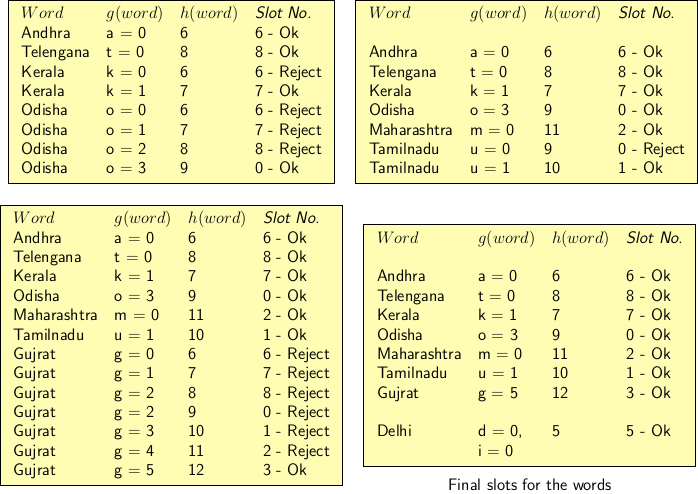

## Perfect Hashing

  

In most hash applications, we do not have information about the actual keys until the hash table is filled and used. However, after  the
hash table is populated and put to use we may have a good idea about hash functions that may have avoided collisions and led to a better 
performance. Changing table size or hash function may be very expensive as it will require rehashing and data movements. To handle such
situation we look for a <i>perfect hashing</i> which maps elements to table slots without collisions. A <i>minimal perfect hashing</i>
is a perfect hashing that uses table size that has equal number of slots and keys. If the key set is known in advance (static) it is 
possible to design a minimal perfect hashing. Designing a perfect hashing is tedious but possible.

Creating a perfect hashing scheme is simple. It requires two-level approach with universal hashing at each level. The first level is 
almost same as chaining. The keys are hashed using a function chosen from a family of universal hash functions. The keys that happen to
hash into same table slot in the primary hash table are stored in a secondary table using an associated hash function. By  carefully
choosing the secondary hash we can guarantee that no collisions occur at the secondary level. However, the guarantee comes with a cost.
We need quadratic space for the secondary level table. For example, if $$n_j$$ is the number of keys hashing into the same primary
table slot in the first level then we require $$n_j^2$$ slots in the secondary table. However, the expected size of space required 
for the two-level hashing scheme is still O($$n$$).

<strong>Theorem 1 (Quadratic Spce Requirement)</strong> 

If we store $$n$$ keys in a hash table of size $$m = n^2$$ using a hash function $$h$$ randomly from a family of universal hash functions
then the probability of a collision is less than 1/2.

<strong>Proof:</strong> There are at most $$\binom{n}{2}$$ pair of keys that may collide. The probability of collision of each pair is $$1/m$$ if
we choose a random hash function from a family of universal hash functions $$\mathcal{H}$$. Since $$m = n^2$$, the expected number of 
collisions is 

$$\begin{split}
    E(K) &= \binom{n}{2}\times \frac{1}{m}\\
         &= \frac{n^2-n}{2}\times\frac{1}{n^2}\\
         &< \frac{1}{2}
  \end{split}
$$

The above analysis is similar to the well-known problem of <i>Birthday Paradox</i>. The problem with above theorem is that the space 
requirement is of O($$n^2$$). If $$n$$ is large then the space requirement is excessive. So, two level hashing is used to cut down the
space requirement for collision free hashing. For the first level hashing the space requirement is $$m = n$$. For the second level the space
requirement is $$n_j^2$$ for only those keys which collide for slot $$j$$ in the primary level. How do we prove that the space requirement
is of O($$n$$)?
    
<strong>Theorem 2 (Linear Expected Space Requirement)</strong>
 
If we store $$n$$ keys in a hash table of size $$m = n$$ using a hash function $$h$$ randomly chosen from a universal class of hash functions
then 

    $$E\left[\sum_{j=0}^{m-1} n_j^2\right] < 2n$$, 

    
where $$n_j$$ is the number of keys hashing to the slot $$j$$ of the first level table.
    
<strong>Proof:</strong>
    
We use the following identity in the simplification of the expression for expected memory requirement.

    $$a^2 = a + \binom{a}{2}$$. 

We have

    $$\begin{split}
    E\left[\sum_{j=0}^{m-1} n_j^2\right] &= E\left[\sum_{j=0}^{m-1}(\left(n_j + 2\binom{n_j}{2}\right)\right]\mbox{ (using the identity)}\\
    &= E\left[\sum_{j=0}^{m-1}n_j\right] + 2E\left[\sum_{j=0}^{m-1} \binom{n_j}{2}\right]\mbox{ (by linearity of expectation)}\\
    &= E(n) + 2E\left[\sum_{j=0}^{m-1} \binom{n_j}{2}\right]\\
    &= n + 2E\left[\sum_{j=0}^{m-1} \binom{n_j}{2}\right]\mbox{ (since }n\mbox{ is not a random variable)}
    \end{split}
    $$

     
The expression $$\sum_{j=0}^{m-1} \binom{n_j}{2}$$ is equal to the number of total number of collisions. The properties of universal hashing
tells us that the expected value of the total number of collisions is at most:

    $$\binom{n}{2}\times\frac{1}{m} = \frac{n(n-1)}{2m} = \frac{n-1}{2}\mbox{, since } m = n$$

   
Therefore, 

    $$
     \begin{split}
        n + 2E\left[\sum_{j=0}^{m-1} \binom{n_j}{2}\right] &\le n + 2\frac{n-1}{2}\\
        &= 2n - 1 < 2n
     \end{split}
    $$

   

[//]: <strong>Birthday paradox:</strong> In a room of $$n$$ people, what’s the probability that at least one pair will have the same birthday?

[//]:The key observation in solving birthday paradox is that the total probability is equal to the sum of:
  
[//]:  1. Probability of at least two persons sharing a birthday.
[//]: 2. Probability of no other person sharing birthday with anyone else.

[//]: The probability for the second part is simple. We know anyone may have 365 choices for a birthday. If someone has a birthday on one of
[//]: 365 days, the choice for the birthday of another persone can be one out of 364 days. So the probability that no one sharing a birthday 
[//]: with anyone else in a group of $$n$$ persons is:
[//]: 

[//]: $$\frac{365}{365}\frac{364}{365}\ldots\frac{365-n+1}{365}$$
[//]: 

[//]: If $$n = 30$$ then the above expression is:
[//]: 

[//]: $$\frac{365\times 364\times 363\times\ldots\times 336}{365^{30}}$$
[//]: 

[//]: Replacing the numerator in terms of factorial, we have
[//]: 

[//]: $$\frac{\frac{365!}{335!}}{365^{30}} \approx 29.37$$%
[//]: 

Perfect hashing for static key sets applies to storing of keywords of a programming language. We use two hash functions $$h$$ and $$g$$
for it. The formula for computation of the hash value is:

 
  $$h(k) = k.len + g(k_0) + g(k_1\ldots k_{k.len-1})$$

where $$k.len$$ is the length of the string $$k$$ and it is referred to as $$h$$ value of the word. Cichelli's method has three steps

1. Mapping,
2. Ordering,
3. Searching.

Mapping consists of determining the frequencies of the first and the last letters of each word and adding the frequencies to get a value for
the word. Ordering simply orders the words according to their values obtained from mapping step. Searching is used to find the $$g$$ values
for the first and the last letter so that the final hash value of each word is distinct. The algorithm may degenerate into exponential 
complexity if the word set is large. 

We use an example to explain the performance issues. Consider the set of words shown in the first table on the left part of the figure below. 
It has nine words (the names of states in India). The letter frequencies of the first and last letters of the words appear in the table in 
gray shade. 

 
  

The scores of each word is computed by adding the frequencies of the first and the last letters. The unsorted list of words with scores
appear in the table to the left bottom. The sorted list appears to right of unsorted table. 

Now we explain the search step where $$g$$ value 0 is assigned to the letters and length of word is added to compute $$h$$ value. If $$h$$
value is unique we assign the corresponding table slot to the word. We continue the computation of the $$h$$ until a collision occurs. 
We resolve the collision by assigning consecutive values to the letter as indicated below.

 
  

The placement of elements in table slot may require repeated search that may degenerate into exponential time. Therefore, Cichelli's method
is applicable for hashing a small finite set of symbols. 

