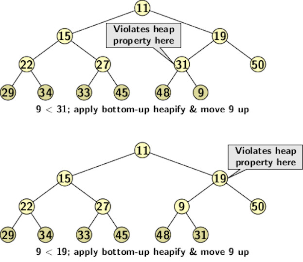
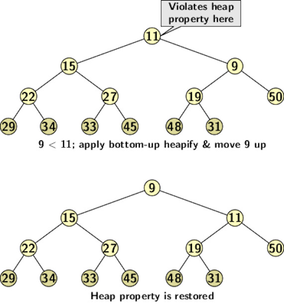

## Priority Queues

A simple queue operates strictly based on the first-come, first-serve.  An element in a queue get service based on its arrival time. 
However, there are situations when the servicing of elements should be based on their urgencies. 
A priority queue is a data structure that allows an element to get service based on its priority. Each element is associated with a priority value which 
estimates its nastiness or niceness to other elements in the queue.

The high priority elements are serviced before others to reduce the nuisance values in the queue.
For example, in the execution of programs, the process scheduler schedules interrupt handlers or system calls before any of the user's jobs. 
A right mix of jobs is needed among the users' programs to increase throughput. Therefore, some user jobs may be chosen for execution in preference to a few 
other jobs that may have arrived earlier. 

The process scheduler for UNIX uses a multi-level priority queue for job scheduling. The programs move from one queue level 
to another during its life cycle. All runnable processes are assigned a priority that determines. The priority determines its time of service with 
respect to other waiting processes. The priorities are updated periodically. UNIX priorities are referred to as <i>nice</i> values. Nice values range 
from -20 to +20. Negative or smaller values are of higher priority than positive or larger values. 

The programs with smaller nice values are nasty to others as they grab the processor ahead of others. The nice value of a process is recomputed after every 40ms (or four clock ticks). A clock tick in UNIX is a little over 10ms. The readjustment of nice value depends on CPU time used by the process, 
the average length of the queue, and the current nice value. The priority of a process may become higher or lower after an update. Then it may move from a higher priority queue to a lower priority queue or vice versa. This strategy ensures that no process is starved and cannot hold the processor for long. The interested readers 
are encouraged to explore it further, as we return to priority queues. 

A priority queue supports two important operations:
- <i>DeleteMin</i>: It is equivalent to <i>dequeue</i> that deletes the element with the highest priority (or the minimum value) in the queue. 
- <i>Insert</i>: Same as <i>enqueue</i>. It inserts an element into the queue according to its priority.  

We may use a linear list to implement a heap. It is possible to use either an unsorted list or a sorted list. If we use an unsorted list, a new insertion is always made at the beginning of the list. It requires time of <i>O(1)</i>.
A deletMin from an unsorted list requires <i>O(n)</i>. 
If a sorted list is used then minimum element is available as the first element of the list. However, a new insertion should preserve the sorted
characteristics of the list. Therefore, it supports <i>deleteMin</i> in <i>O(1)</i> time whereas a new insertion requires an average time of <i>O(n)</i>. 

Can we find a better implementation for a priority queue? If we use the logical structure of a complete binary tree, then we can use an array to store the elements as follows:
- The left child of node <i>i</i> at <i>2i+1</i> and 
- The right child at <i>2i+2</i>
However, unless we have some additional feature in organizing the elements in the array, neither of the two operations can be realized easily. 
We define a property called <i>heap property</i>.

<strong>Heap Property</strong>: A complete binary tree has the heap property if the following property is valid at every node:
The value stored in the node is smaller or equal to that stored at any of its children nodes. 

Maintaining heap property is critical to the functioning of a priority queue. In a dynamic situation where insertions and deletions occur over time, maintaining 
a heap requires additional processing called <i>heapify</i>. 

Let us consider an <i>insert</i> operation with respect to the heap below:
<p align="center">

</p>
A new insertion can happen at the rightmost vacant slot of the deepest level of the tree, i.e., after 48. It may disturb the heap property if the value of the new insertion is smaller than the value of the parent. The <i>bottom-up heapify</i> operation can restore the heap property.  
<p align="center">

</p>
<p align="center">

</p>
The bottom-up heapify operation compares the values of the children and the parent. The process is applied until the value settles at its position. The C 
function below implements the suggested algorithm 

```
void bottomupHeapify(HEAP *h,int index){
    int temp;
    int parent = (index-1)/2;

    if(h->arr[parent] > h->arr[index]){
        //Swap and heapify recursively 
        temp = h->arr[parent];
        h->arr[parent] = h->arr[index];
        h->arr[index] = temp;
        bottomupHeapify(h,parent);
    }
}
```
Heapify takes time to order the tree path from the insertion point to the root in the worst-case case. 
Since the height of a complete binary tree with <i>n</i> nodes is <i>log n</i>, heapify operation take time of <i>O(log n)</i>. 

How does a <i>deleteMin</i> operation work? The element at the root is the smallest. So a deletion amounts to removing the root. If we remove the root, the tree falls into two different trees or heaps. There is no way to combine both heaps into one unless we apply a different way of deleting the 
root. Instead, if we take out the rightmost element from the highest level, heap property is not violated. However, it is not the same as a <i>deletMin</i> operation. Therefore, we apply a simple trick as follows:
- Swap the root with the rightmost element from the highest level.
- Delete the element from the new position.
- Now, apply a topdown heapify to push the new element to its correct position at the root.

Topdown heapify is only a bit different from bottom-up heapify. The process consists of the following steps:
- Copy the root into the variable to be returned.
- Swap the value at the root with that at the rightmost node at the deepest level of the tree. 
- Repeatedly push the out-of-the-place value downwards by swapping it with the smaller values at the two children. 
- Terminate if there is no out the place value.

Topdown heapify operation also depends on the length of the tree path from the root to the deepest level. A C function for topdown heapify appears below.

```
void topdownHeapify(HEAP *h, int parent){
    int left = 2*parent + 1;
    int right = 2*parent + 2;
    int min;
    int temp;

    if(left >= h->nElement || left < 0)
        left = -1;
    if(right >= h->nElement || right < 0)
        right = -1;

    if(left != -1 && h->arr[left] < h->arr[parent])
        min=left;
    else
        min =parent;
    if(right != -1 && h->arr[right] < h->arr[min])
        min = right;

    if(min != parent){
        temp = h->arr[min];
        h->arr[min] = h->arr[parent];
        h->arr[parent] = temp;

        // Recursive  call
        topdownHeapify(h, min);
    }
}
```

Heapify operation is applied until the out-of-the-place element settles in correct position in the tree. It requires a time of <i>O(log n)</i> if there are
<i>n</i> elements in the heap. 

The figure below illustrates the topdown up heapify operation after a <i>deleteMin</i> operation:
