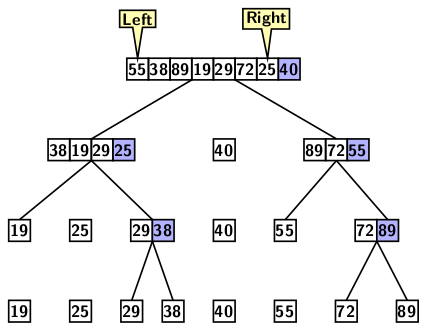
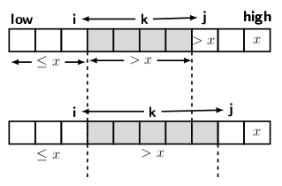
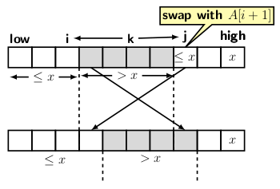

## Quick Sort Algorithm

Tony Hoare discovered the Quick sort algorithm in 1959. Like mergesort, it recursively divides the 
input array into smaller subarrays top-down. Each division operation divides an array into two
smaller subarrays, with one subarray consisting of smaller elements than all the other subarray 
elements. The exchange of elements occurs during division that transfers all smaller elements to one 
side and all larger ones to the other. So, the algorithm belongs to the class
of sorting known as the partition-exchange algorithm. The average cost of quick sort is 
O(<i>n log n</i>) for sorting of an <i>n</i> element array. However, the worst-case time complexity 
is O(<i>n2</i>). We will discuss the average case later in the blog.

Quick sort requires an element for the pivot that works as a fulcrum of balancing scale. 
The choice of pivot is critical to the performance of quicksort. If the pivot is entirely one-sided 
then the size of partitions becomes uneven. For example, if we choose either the first or the 
last element as pivot, then one subarray will consist of <i>n-1</i> elements while the other 
will have only one element. So, the pivot should not be close to the smallest or largest element. The 
best choice for the pivot is the median. However, if the cost of median finding
is high, then performance will degrade because a pivot is also needed for each subsequent partition.
In our description, we assume that the input is sufficiently random. So, we neither
have a sorted nor a reverse sorted sequence as input. In such a situation, we can assume the 
first element to be good enough for a pivot. Sometimes, we can pick the input's first, last, and
middle elements and find the median of three. Then use the median of three as a pivot. 
The median of three captures more randomness than using the first element as a pivot. Since the 
median of three takes constant time, the performance of quick sort is not affected.

Since partitioning is the critical step, we begin with a description of the partitioning method.
The idea of partition is shown below, assuming the first element as a pivot.

   
  Figure 1: Partitioning example

The figure gives an insight of top-down recursive partitioning. However, it does not indicate
how the partitioning method actually works. 

Let us now discuss the partitioning method. The pivot is swapped with last element of the input
array. It shifts the pivot to position away from the rest of element. Then we create two cursors:

- The first cursor <i>i</i> set to one position behnid the leftmost index. 
- The second cursor <i>j</i> set to the leftmost index of the array. 

We now have partition the elements between the leftmost index and the index position before the
pivot into two parts sucht that.

- All elements less than or equal to pivot occur before the elements greater than pivot 

Then drop the pivot at the position where leftmost element greater than the pivot occurs. 
But the question is: 

- How are the elements moved to create the partition?

We advance cursor <i>j</i> as long as elements under it is smaller than pivot. So, we eventually
encounter a situation where

- The element under <i>j</i> is equal to or smaller than the pivot and 
- The element under <i>i + 1</i> is greater than the pivot

Now we swapping the elements at index <i>i + 1</i> with the element, the length of subarray
having element smaller than or equal to the pivot increases. After swapping <i>i</i> advances, 
because it points to the rightmost element smaller or equal to the pivot. But when do the 
partition process terminate?  Analyzing the situation
as shown in Figure 1, the partitioning process should terminate when <i>j</i> has run through 
the array and points to the pivot's position. 

  &nbsp;&nbsp;&nbsp;&nbsp;&nbsp; 
  Figure 1: Partitioning process and its termination

Since <i>i</i> points to the rightmost element smaller or equal to the pivot, all elements at 
index position <i>i+1</i> and beyond should be greater than the pivot. So, by swapping
the pivot with the element at the index <i>i + 1</i>, we place the pivot at its correct position. 
Hence the partitioning should terminate. Figure 2 gives an example of the partitioning.

   
  Figure 1: Partitioning example

<strong>Average case analysis</strong>

Quick sort average case analysis is based on the following assumptions:

- All permutation of input sequence is equally likely, so we can choose first element as pivot
- The pivots used at all recursive levels are random 

Therefore, the recurrence formula for time complexity is:

  

Since we move the pivot out of the way during partitioning, one comparisons takes place for
each of <i>n-1</i> elements. The remaining part of the recurrence relation is explained as 
follows. If <i>i</i> elements are in one partition then <i>n-i-1</i> elements are in the other
partition. Now by symmetry of expression within summation sign, we simplify the recurrence
relation as:

  

                                                                
We multiply both sides of the above equation by <i>n</i> and substract <i>T(n-1)</i>
from <i>T(n)</i> and get:                                                              

  

Rearranging terms and simplifying, we have:

  

Now the recurrence is in a form which we can solve by unfolding the recurrence.

  

Approximating summation by integral 

  

we get:

  

