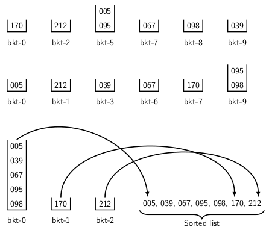

## Radix Sort

Radix sort uses <i>b</i> buckets, where <i>b</i> is the base or the radix of the number system. 
For the decimal numbers the base is 10. So, we have to use 10 buckets to sort a set of decimal numbers.
It consists of log <i>n</i> passes. At each pass, we distribute the numbers into buckets starting
with the least significant digit to the most significant digit. We expand the numbers by 
prepending necessary number of zeros to make every number having the same the number of digits. 
For example, if {170, 67, 39, 212, 98, 10, 5} is the input sequence, then prepend:

- A zero to all two digit numbers, 
- Two zeros to all single digit numbers.

The input sequence, thus, becomes {170, 067, 039, 212, 098, 010, 005}. In first and second passes
the distribution of numbers to buckets are as shown in the two tables below.

  

  
At each pass, we distribute the numbers into the buckets in the sequence starting with bucket zero.
On third pass, when we distribute the numbers to buckets, 005, 039, 067, 095, 098 are placed in
bucket 0. The numbers 170 and 212 are placed in buckets 1 and 2. For sorted sequence, we empty
the buckets starting from bucket number 0 in sequence as shown in the figure above. 

[C Program for Radix Sort](../CODES/radixSort/index.md)

[Back to Index](../index.md)
