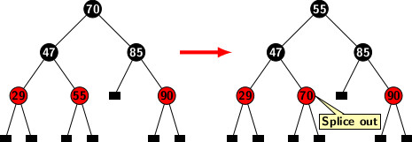
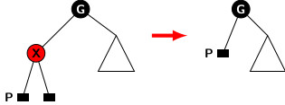
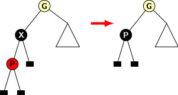
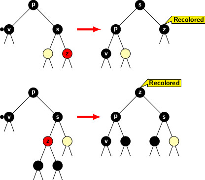
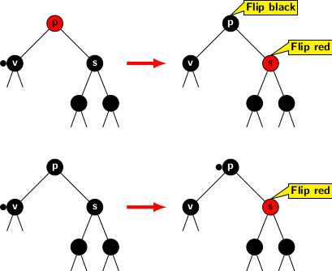
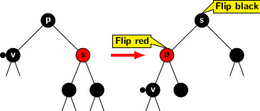

## Deletions in Red-Black Trees

A deletion operation in a red-black tree should handle two problems: 

1. Preserving BST property.
2. Checking if color properties are violated then restore them.

The problem of preserving BST property without the complications of maintaining the color properties of a red-black tree is relatively simple. We 
discussed the complexities of deletion in BST earlier. For completeness, we briefly summarize the deletion rules for BST.  The deletion of a node 
<i>X</i> from a BST depends on whether it is a leaf or an internal node. A quick recap of these rules  is provided below: 

There are three cases for BST deletion:

1. <i>X</i>'s is leaf node. 
2. <i>X</i> has only one child.
3. <i>X</i>'s both children are nodes. 
We did not consider external leaf nodes in BST. However, external nodes do not introduce any added complications. An external leaf node of a red-black
tree is an external node with NULL pointers. A leaf node in a BST is mapped to a node having external nodes as its children in the corresponding 
red-black tree. We will refer to a BST leaf as an internal leaf in red-black tree to distinguish it from an external leaf node.  

The rules for the deletion of a node <i>X</i> in a BST are as follows:

1. If <i>X</i> is a leaf node, delete it. It does not affect BST property of the tree after deletion. 
2. If <i>X</i> has one child <i>Y</i>, eliminate <i>X</i> and make the parent of <i>X</i> adopt <i>Y</i> as its child. 
3. If <i>X</i> has two children then first copy the value stored in the in-order successor, say <i>Y</i>, in <i>X</i>'s position then delete <i>Y</i>.

We have already proved that the in-order successor of node in a BST either has  no children or has only one right child. Figure below illustrates rule
3 of a deletion in a BST, 

The little black rectangles in the figure represent external leaf nodes. The deletion of a node <i>X</i> may splice out 
a node at a position different from <i>X</i> unless <i>X</i> is a node with two external leaves. For example, the removal of 70 executed by removing the
node that had 55. However, it does not create any loss of information as the content of spliced node is copied in advance at the position where 70 was 
originally stored. 

As indicated earlier, an external leaf node contains no information. All external leaf nodes are black. We will refer to an internal leaf 
simply as a leaf node. It is a node with two external leaves as children. A non-leaf red node cannot have one external leaf as one of its children as it 
violates the black height property of a legal red-black tree.

The rules for deletion of a node <i>X</i> from a red-black tree depends on the position of the node to be deleted.

1. If <i>X</i> is a red leaf then there is no problem. No color properties will be disturbed if <i>X</i> is deleted.
2. If <i>X</i> is black and it has only one valid node <i>Y</i> as child, then <i>Y</i> must be red. <i>Y</i> replaces <i>X</i> and is recolored black.
3. If <i>X</i> has two internal nodes as children, then the inorder successor node <i>Y</i> should be deleted. if <i>Y</i> is a black 
   leaf then we have to apply color compensation operations. Otherwise, one of the aforementioned cases should apply. So, the deletion can be done using
   the applicable rule.
   
Figure below illustrates deletion operations involving case 1 and case 2. 

 <b> Case 1:</b> Deletion of a red leaf

     <b>Case 2:</b> Deletion of a black node with a single red child.

Case 3 occurs when we attempt to delete a black leaf as stated above. It promotes an external leaf to occupy the position of the deleted node. The
new external leaf acquires an excess black due to the removal of the black leaf as indicated in the figure below.

     <b>Case 3:</b> Deletion of a black leaf node.

The removal of a node <i>X</i> in a red-black tree promotes at least one node at a lower level. We shall refer to the node occupying the earlier 
position of <i>X</i> as the promoted node <i>P</i>, because it moves closer to the root. The color <i>P</i> as double black. The major issue in deletion
is to handle distribution of the extra black acquired by <i>P</i>. The figure below illustrates two situations stated above. 

We need to consider a few structural conditions of the tree when a deletion occurs. In the following discussion, we denote the node acquiring excess 
black as <i>v</i>. 

<strong>Case 3a:</strong> <i>v</i>'s sibling is black with a red child. 

Figure below illustrates the two subcases 
1. when right child of <i>s</i> is red  
2. when left child of <i>s</i> is red.

Handle the first subcase as follows. 

- Perform a restructuring by a single rotation around the sibling <i>s</i>.
- Recolor <i>s</i>'s red child with black. 

The rotation operation promotes sibling <i>s</i> while recoloring red child increases the black height of the correspoinding subtree by 1. The other 
subtree of <i>s</i> is acquired by <i>p</i>. So the black height both subtrees of <i>s</i> are balanced. The excess black at <i>v</i> is  
absorbed by the recolor of right child of <i>s</i>.  

The readers can convince themselves that the recoloration followed by restructuring is correct for the second subcase. Two successive single rotations 
perform the restructuring of the tree: first a right rotation and then a left rotation around <i>z</i>. The first
rotation bring <i>z</i> one level up and pushes <i>s</i> one level down. It may increase the black height of the right subtree of <i>z</i>
after the first rotation. However, after second rotation <i>z</i>'s level is increases by 1 again and <i>p</i> is pushed one level
down. Since <i>z</i> goes one level up, its right subtree also pushed one level up. So the original configuration of <i>s</i> and its
two subtrees are restored.  Recoloring <i>z</i>, it contributes 1 to the black heights of:

- <i>s</i> and its descendants, and
- <i>p</i> and its descendants.

Therefore, we can remove the excess black of <i>v</i> as <i>p</i> also acquires the original left subtree of <i>z</i>.

<strong>Case 3b:</strong> <i>v</i>'s sibling <i>s</i> is black and so are its children.
In this case also there are two subcases depending on whether the parent <i>p</i>'s color. 

If <i>p</i> is red then exchanging colors of 
<i>p</i> and <i>s</i> we get rid of excess black from <i>v</i>. It adjusts the black height of <i>p</i>'s right subtree to the original
value by removing black color from <i>s</i>. But due to <i>p</i> acquiring black color, we could remove excess black from <i>v</i>. 

The second subcase arises when <i>p</i> is black. In this case, we cannot readjust excess black. But the excess black is transferred 
to <i>p</i>. So, the issue of excess black is pushed one level up the tree.  Figure below illustrates both subcases.

<strong>Case 3c:</strong> Final case we need to consider is when sibling <i>s</i> is red.

The case is illustrated in the following figure.

First restructure the case into one of previous cases where sibling of node with double black is black. We apply a left 
rotation around <i>s</i>. It brings <i>s</i> to position of <i>p</i>, and <i>p</i> is pushed down one level below. The 
color is flipped between the sibling <i>s</i> and the parent <i>p</i>. Now sibling of double black node <i>v</i> is black. 
Hence one of the previous cases applies.

We have discussed the deletion process by specifying general rules for handling extra black acquired by a node 
after deletion. So, it is time to examine some examples to familiarize the reader with actual operations. In the next blog
we will deal with examples.

[Back to Index](../index.md)
