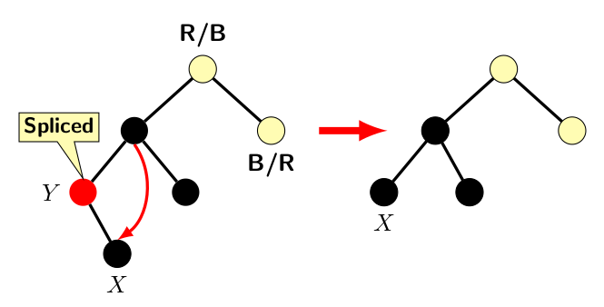

## Deletions in Red-Black Trees

Deletions in a red-black tree must address two problems, namely,

1. Preserving BST property
2. Check if color properties are violated and restore them.

First, lets us focus only on the issue of preserving BST property without introducing the complications of node colors. 
We handle color violations at a later stage. The complexity of BST deletion of a node node <i>X</i> depends on 
whether it a leaf node or an internal node.   

As explained earlier in the BST Blog, there are three cases for deletion:

1. <i>X</i>'s is leaf node. 
2. <i>X</i> has only one valid child.
3. <i>X</i>'s both children are valid nodes. 

We have not considered external leaf nodes in BST. However, in red-black tree leaf nodes are external nodes which store only NULL pointers. 
Therefore, a valid leaf node in BST is a node in the corresponding red-black with only external nodes as its children. 

Case 1 is easiest to handle. After deleting <i>X</i> and its both leaf nodes, one external leaf node is at <i>X</i>'s position.  

Case 2 requires promoting <i>X</i>'s child one level up.  <i>X</i>'s parent becomes its child's parent. 
In other words, grandparent of the orphaned child is adopted by the grandparent. 

Case 3 is toughest to handle. However, the inorder successor of <i>X</i> must be a node that satisfies either case 1 or case 2. 
We have discussed detail in the blog for Binary Search Tree. A curious reader may refer back to the previous blog on BST. For the sake of 
completeness, we just provide an illustration of case 3 below.  

The spliced node <i>Y</i> may be different from <i>X</i>.  
However, splicing out <i>Y</i> does not create any complication as the content of <i>Y</i> is stored in advance. 
However, for restoring color invariance we need to address the color issues with respect to spliced out node. 

If <i>Y</i> were a red node, then splicing it does not affect color properties. 
Figure below depicts the case where <i>X</i> has no valid children.\

The above figure illustrates only the part of the tree of interest for deletion operation. The node pair labeled R/B and B/R 
imply that if the first node is red and the second is black or vice versa.   

