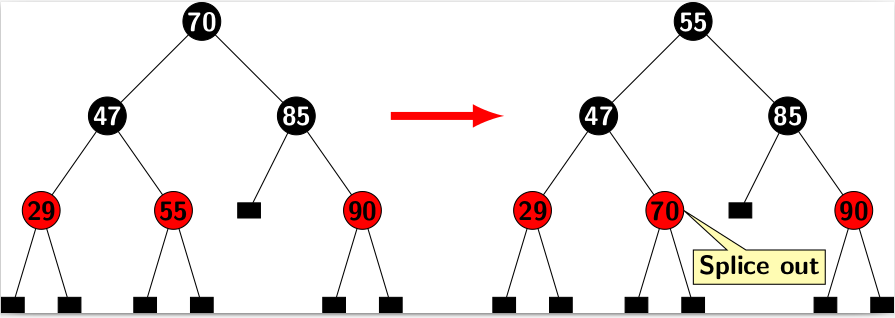
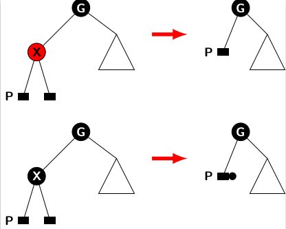
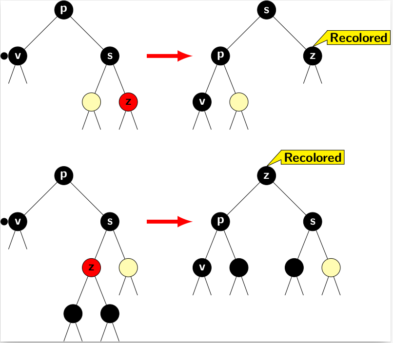

## Deletions in Red-Black Trees

A deletion operation in a red-black tree should handle two problems: 

1. Preserving BST property.
2. Checking if color properties are violated then restore them.

The problem of preserving BST property without the complications of maintaining color properties of red-black tree is 
relatively simple. The complexities of deletion in BST had been discussed earlier. For the sake of completeness, we briefly 
summarize the deletion rules for BST.  The deletion of a node node <i>X</i> from a BST depends on whether <i>X</i> 
is a leaf node or an internal node. A quick recap of these rules  is provided below: 

There are three cases for BSR deletion:

1. <i>X</i>'s is leaf node. 
2. <i>X</i> has only one child.
3. <i>X</i>'s both children are nodes. 

We did not consider external leaf nodes in BST. However, external nodes do not introduce any added complication. 
A leaf node of a red-black trees is an external node with NULL pointers. Therefore, a leaf node in a BST  
is mapped to a node having external nodes as its children in the corresponding red-black tree. 

The rules for the deletion of a node $n$ in a BST are as follows:

1. If <i>X</i> is a leaf node, delete it.  
2. If <i>X</i> has one child <i>Y</i>, eliminate <i>X</i> and let the grandparent adopt <i>Y</i> as its child. 
3. If <i>X</i> has two children then first copy its in-order successor <i>Y</i>'s value in <i>X</i> then delete <i>Z</i>. 

We have already proved that the in-order successor of node in a BST either has  no children or has only a right child.  
Figure below illustrates rule 3 of a deletion in a BST, 

It indicates that any removal operation is equivalent deletion of a node that has at least one external child. 
In other words, the deletion of a node <i>X</i> in a BST may splice out a node at a position different 
from <i>X</i> unless <i>X</i> is a leaf node. For example, the removal of 70 executed by removing the node 
that actually had 55. However, it does not create any loss of information as the content of spliced node is copied 
in advance at the position where 70 was originally stored. 

We shall refer to the node occupying the place of earlier position of <i>X</i> as the promoted node <i>P</i> 
because, it moves closer to the root. If <i>X</i> is red, then color <i>P</i> as black. Otherwise, color 
<i>P</i> as double black. The major issue in deletion is to handle distribution of the extra black acquired by
<i>P</i>. The figure below illustrates two situations stated above. 

If the spliced out node is red there is no problem. The problem occurs only when spliced out node is black.  

We need to consider a few structural conditions of the tree when a deletion
occurs. In following discussion, we denote the node acquiring excess black as
<i>v</i>. 

<strong>Case 1:</strong> <i>v</i>'s sibling is black with a red child. 

Figure below illustrates the two subcases 
1. when right child of <i>s</i> is red  
2. when left child of <i>s</i> is red.

The first subcase is. 

- Perform a restructuring by a single rotation around the sibling <i>s</i>.
- Recolor <i>s</i>'s red child with black. 

The rotation operation promotes sibling <i>s</i> while recoloring red child
increases the black height of the correspoinding subtree by 1. The other subtree of <i>s</i> is acquired 
by <i>p</i>. So the black height both subtrees of <i>s</i> are balanced. The excess black at <i>v</i> is  
absorbed by the recolor of right child of <i>s</i>.  

The readers can convince themselves that the recoloration following by restructuring is correct for the second subcase. The restructuring
of the tree is performed by two successive single rotations: first a right rotation and then a left rotation  around <i>z</i>. The first
rotation bring <i>z</i> one level up and pushes <i>s</i> one level down. It may increase the black height of right subtree of <i>z</i>
after the first rotation. However, after second rotation <i>z</i>'s level is increases by 1 again and <i>p</i> is pushed one level
down. Since <i>z</i> goes one level up, its right subtree also pushed one level up. So the original configuration of <i>s</i> and its
two subtrees are restored. After recoloring <i>z</i>, it contributes 1 to black heights of 

- <i>s</i> and its descendants, and
- <i>p</i> and its descendants.

Therefore, we can remove the excess black of <i>v</i> as <i>p</i> also acquires the original left subtree of <i>z</i>.

