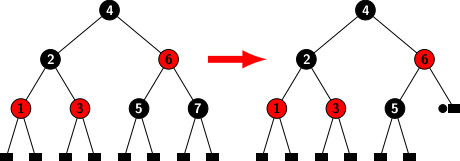
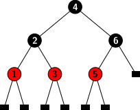
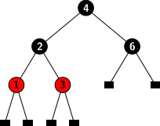
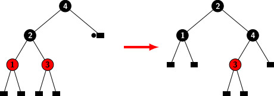

## Deletion Operations on Red-Black Trees (Examples)

In the previous blog, we looked at the concepts that govern deletion operations on red-black trees. Cases 1 and 2 are simple
and straoghtforward to handle. Therefore, the focus of this blog is on Case 3. Let's start with a red-black tree, as seen in
the illustration below.

Let's say we want to remove number 7. Because node 7 is a black node, its removal results in an excess of black color, as 
shown in the diagram above. We need to restructure and color compensate to get rid of the surplus black. The leaf with excess 
black is the sibling of Node 5. It has two black children. Therefore, the configuration fits into subcase 1 of case 3b that 
we have discussed in the previous blog. The color of sibling 5 must be changed to red. The outcome is shown in the diagram 
below.

The black height of 5 is reduced to one. Remove the extra color from the right leaf of the 6. The black height of the right
and left subtrees of 6 is balanced. The black heights of the root 4's subtrees are equally evenly balanced.

Consider removing 5 from the modified tree. It does create any double black nodes. It is an example of a symmetric case of 
case 1. We may delete the node without requiring any restructuring or color compensation operation. After removing 5 from 
the tree, it becomes:

When we take 6 out of the above tree, we have an excess black problem. The right child of Node 4 is a leaf with an excess
of black.It matches Case 3a's configuration (black sibling with a red child). We can apply restructure and color
compensation to either of the two subcases because both children of the black sibling are red. More exactly, we rotate the 
left sibling of the node with excess black to the right. It moves the sibling up one level and the parent down one level.
It adjusts the black height at the parent to compensate for the excess black. The outcome is depicted in the diagram below.

[Red-Black Tree Header File](../CODES/rbTree.md)

[Driver Program](../CODES/newRBtree.md)

[Back to index](../index.md)
