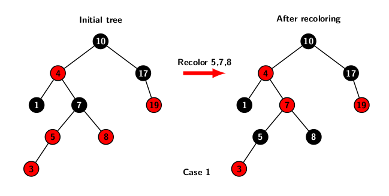
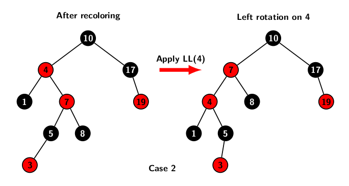
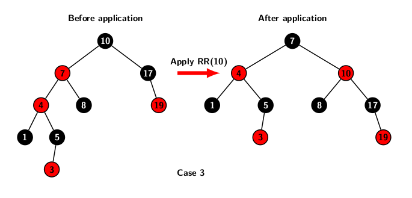

## Examples for Insertions in Red-Black Tree

As we discussed in the last blog, there are several cases of violations of color properties when new nodes are inserted into an 
existing red-black tree. In this blog, our focus is on illustrating these violations and their solutions through a set of examples. 

The tree on the left part of figure below shows a violation of color invariance when key value 3 is inserted into the existing tree 
consisting of set of keys \{1, 4, 5, 7, 8, 10, 17, 19\}. 

Key 3 is inserted as as red node below 5 replacing its left external leaf node. For brevity, the figure does not show external nodes. 
Node 3 is painted red at the time of insertion. Its parent (node 5) is also red. Therefore, it leads to a color violation. 
It is a depiction of case 1, because the sibling of node 5 is 8, and node 8 is painted red. Applying two color resolution operations for 
case 1: 

- Node 7's color is transferred to 5 and 8.  
- Node 7 is painted red.

It leads to the tree shown in right half of the picture. The color violation  now appears one level up at nodes 4 and 7. 
However, it an instance of case 2. 

As far as case 2 is concerned, the first restructuring operation is to apply a left rotation. The hight disturbances due to rotation 
affect only red nodes. Therefore, it rotation does disturb black height of the subtrees. So, case 2 turns into case 3. 
The figure below illustrates the rotation operation. 

The resolution of case 3 requires a right rotation and color flipping as indicated below.  

A high level description of the algorithm for color fixing is given below:
'''
insertionRedblackTree(T, x) {
    color[x] = red;
    while (x <> root(T) && color[p(x)] == red) {
        if (p(x) == left(g(x)){
            y = right(g(x));
            if (color[y] == red) {
                case 1;
            } else if (x == right(p(x))) {
                case 2;
            }
            case 3; // case 2 turns into case 3
        } else {
            if clause with left and right interchanged for
                handling three symmetric cases;
        }
    }
    color[root(T)] = black;
}
'''

Recoloring takes O(1) time. Each rotation operation also has time complexity of O(1). So restoring color invariance at 
each level of the tree takes O(1) time. Since the height of the tree is O(<i>log n</i>), the worst case time 
for resolution of color violation may take O(<i>log n</i>) time in the worstcase. 

[Back to Index](../index.md)
