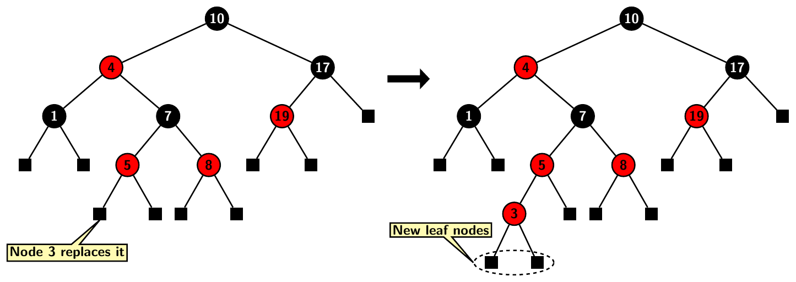
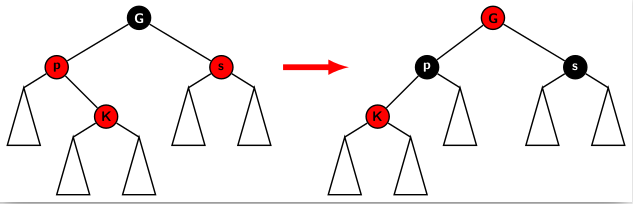
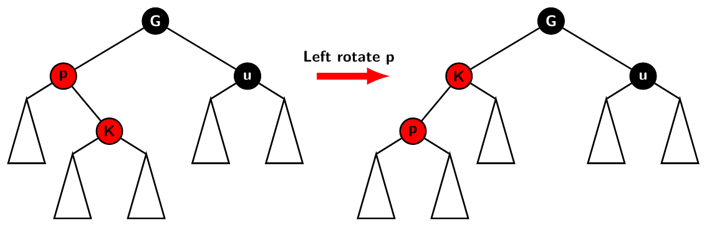
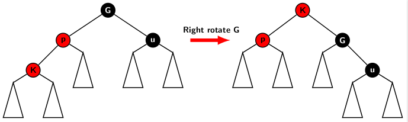

## Fixing Colors on Insertion in Red-Black Trees

In a mutating operation on a red-black tree, such as insertion of a new node or deletion of a node from a BST, we search for the existence of the 
value and proceed along a tree path towards an external node. 

- A deletion is possible if the value exists in the BST.
- An insertion operation replaces an external node.

However, these mutating operations could violate color properties. In case of insertion, we need to specify the color of the incoming node. Our effort 
will be to restrict the violations so that we can restore color properties with minimal effort. The restructuring 
efforts should not cost more than O(<i>log n</i>). 

The problem is that it requires us to consider several different cases. It is easy to memorize all cases 
correctly and apply corresponding restructuring operations. That, precisely, is the reason for labeling the exercise of 
learning red-black trees as more of an intellectual exercise in understanding the intricacies of manipulating data structures. 
However, we will make an effort to deal with the case from the perspective of identifying the cases. It will make 
our effort a bit systematic.

The newly inserted node gets two external leaf nodes. The new node is painted red. For example, insertion of
node 3 into the red-black tree <i>T</i> results in <i>T'</i> shown to the right. 

<cener>

Painting a new node with red color preserves four out of five color properties. By doing so, we violate only the color invariant property. There is a 
possibility that the newly inserted node's parent is also red. Fixing color invariant is the most difficult restructuring operation for carrying out BST 
operations on red-black trees. 

If the parent of the newly inserted node is black, then the color invariant is not violated. We, therefore, focus on the problem when the parent's color is red. 
Furthermore, we only consider three cases for restoring color invariant. There are three other symmetric cases. The three cases we discuss here are:  

1. The newly inserted node is the left child of its parent, and the parent sibling is a red node. 
2. The newly inserted node is the right child of its parent, and the parent's sibling is black. 
3. The newly inserted node is the left child of its parent, and the parent's sibling is black. 

Case 1 is the simplest of the cases to handle. As both uncle and parent of the new node are red, the grandparent must be black. The color fixing operations in
These cases are:

- Transfer the black color of the grandparent to the parent and the uncle, and 
- Paint the grandparent red. 

The color flipping operation does not disturb black height. However, the issue of color invariance may reappear one level up towards the root with the grandparent and the parent of the grandparent being red.  

Case 2 occurs if the incoming node is the right child of its parent, and the parent's sibling is black. In this case, color flipping is not possible. 
First, we apply a left rotation around the parent. The rotation brings the child one level up and the parent's sibling. 
now becomes the sibling of the new node. The configuration involving newly inserted node, the parent and the old sibling is 
illustrated below.

  

The restructuring operation converts case 2 to an instance of case 3 as we can
see in the right half of the above picture. To fully handle case 2, we need to deal with case 3. 

The instance of case 3 occurs when incoming node is the left child of its parent and the parent's sibling is black. As 
we explained above, restructuring of case 2 produces case 3. The figure below depicts this case. 

The grandparent slips one level down and towards right subtree. As both the grandparent and its right child are black, the 
right subtree gains black height by one. Furthermore, due to right rotation, the left subtree loses its height by one. 
Hence, we can just flip the color of the grandparent and the incoming node after right rotation. It will restore the 
black of both right and left subtrees of the incoming node in the restructured tree.

In the next blog, we will a few examples of insertions.

[Back to index](../index.md)
