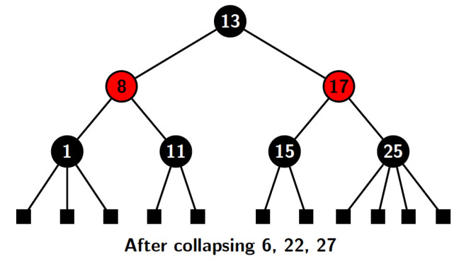
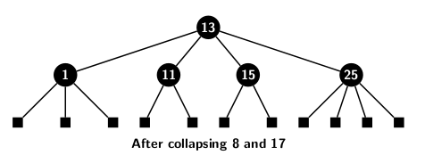

## Introduction to Red-Black Trees

AVL trees is a self-balancing BST tree. Every node of the tree maintains a height difference between the left and 
the right sub-tree as 0, -1 or 1. Therefore, any BST operation, such as a search, or an insertion, or a deletion, on an AVL 
tree with <i>n</i> nodes requires O(<i>log n</i>) time. If and when the balance is disturbed, the balance can be restored by applying rotation. The rotation operation should be applied as often as the tree loses its balance. We have explored AVL tree 
in sufficient detail in the last couple of blogs. 

Red-black tree is also a self-balancing BST.  It relaxes the requirement for frequent maintenance of node balance. The 
readers may refer to [wikipedia for the history](https://en.wikipedia.org/wiki/Red%E2%80%93black_tree) around the discovery 
of red-black trees. The performance of red-black trees is about 10-20% faster than that of AVL trees. A red-black tree 
makes fewer structural changes to a BST than AVL. If the performance is not very important, AVL is simpler and  preferable.
If performance is important, then probably preference will be to use B-trees. However, red-black tree is a 
challenging exercise for the students for mastering data structures. 

A red-black tree has two different types of nodes, viz., red and black. The nodes are distinguished by storing a color bit 
with each. A 0, and a 1 represent red and black nodes, respectively. The important characteristics of a red-black tree 
are as follows:

1. <b>Order invariant</b>: It preserves the ordering property of a BST.
2. <b>Node colors</b>: The nodes are either colored red or black.
3. <b>External nodes</b>: Leaf nodes black are external nodes, they 
store NULL pointers and are colored black.
4. <b>Internal nodes</b>: An internal node stores a key, pointers to left and right child. Any or both child pointers may point to leaf nodes.
5. <b>Black root</b>: The root is always colored black, and all leaf nodes are colored black. 
6. <b>Color invariant</b>: No two consecutive nodes are colored red. Equivalently no red node has a red child.
7. <b>Height invariant</b>: The number of black nodes on any path from the root to a leaf is the same.

A new node gets red color when it is inserted. A new insertion may, therefore, violate color invariant. Two red nodes may 
appear as parent and child in the tree after insertion. A color fixing operation is applied whenever two red nodes appear 
consecutively. The fixing is performed by recoloring the nodes so that the height invariant (black height) is preserved. 
Maintaining black height is important because the timecomplexities of an operation depend on black height. 

<strong>Black height</strong>: Black height of a node <i>n</i> in a red-black tree is equal to the number of black height from <i>n</i> to the farthest leaf node from <i>n</i>.

Figure below depicts a red-black tree of black height 3. It does not include external nodes. 

The black height of the above tree is 3. Every path from the root to any leaf node has exactly 3 black-colored nodes. The black height of node 8 is two. 
All leaf nodes are external nodes. A leaf node does not store actual elements. However, the presence of external nodes 
makes the tree strictly binary. Therefore, a red-black tree is not only a self-balancing BST but also a strictly binary 
tree. 

The black height of a red-black tree <i>T</i> with root <i>r</i> is denoted by <i>bh(r)</i>. We can prove the following property about black height.

<strong>Minimum number of internal node</strong>: Let the black height of a RBT <i>T</i> with root <i>r</i> be <i>bh(r)</i>. Then <i>T</i> consists of at least 
<i>2{bh(r)}-1</i> internal nodes. 

The proof relies on a recurrence relation and induction. If <i>r</i> is a leaf node then <i>T</i> has no internal node. It 
consist of <i>20 - 1</i> internal nodes. 

<u>Induction hypothesis</u>: Assume that any sub-tree of <i>T</i> with height less <i>bh(r)</i> satisfies the stated property.

<u>Induction step</u>: Since the root is alway black, it implies each of the two sub-trees of <i>r</i> has a black height of <i>bh(r)-1</i>. 
We apply the induction to both sub-tree separately and reach the following conclusions:

- Right sub-tree of <i>T</i> has at least <i>2bh(r)-2</i> internal nodes
- Left sub-tree of <i>T</i> has at least <i>2bh(r)-2</i> internal nodes

Combining the above two results, we conclude that tree <i>T</i> must have <i>2*2bh(r)-2 = 2bh(r)-1</i>.  

<strong>Height of a red-black tree</strong>:  The height of a red-black tree with <i>n</i> nodes is <i>O(log n)</i>.

If a red-black tree <i>T</i> with root <i>r</i> has a black of height of </i>bh(r)</i>, then we know from the previous property that <i>n > 2bh(r)-1</i>. 
Further, at least half the nodes in a path from root to a leaf node in any red-black tree are black. Leaf is also black. Therefore, <i>bh(r) &nbsp;&le;&nbsp; h/2</i>, where
<i>h</i> is the height of <i>T</i>. It implies, <i>h/2 &nbsp;&ge;&nbsp; log (n+1)</i>. Hence, <i>h = O(log n)</i>.

Another way of proving the above property is by collapsing the nodes of a red-black tree. The pictures below depict the 
sequence of collapsing operation on the nodes of a red-black tree.

We observe the following points about the tree after collapsing operation is complete:

- Each node in the compact red-black tree consists of only black nodes 
- All the external nodes are at the same depth from the root 
- An internal node may have 2, or 3, or at most four children
- The height of the collapsed tree <i>h'&nbsp;&ge;&nbsp; h/2</i>

The number of internal nodes in the collapsed tree 
<i> n&nbsp;&ge;&nbsp; 2h' - 1 &nbsp;&ge;&nbsp; 2h/2 -1</i>
Therefore, <i> h&nbsp;&le;&nbsp; 2 log (n+1)</i>2 log (n+1)</i> 

We summarize the properties again for the readers' understanding:

1. A node is colored either red or black. 
2. The root node is always black. 
3. A leaf or an external node is always colored black.
4. A leaf stores null pointers for its right and left child.
5. A red node does not have a red child. Its children must be black.
6. A black node may have a red node as one of its children 
7. All paths from a node to descendant leaves must have the same number of black nodes. 

[Back to Index](../index.md)
