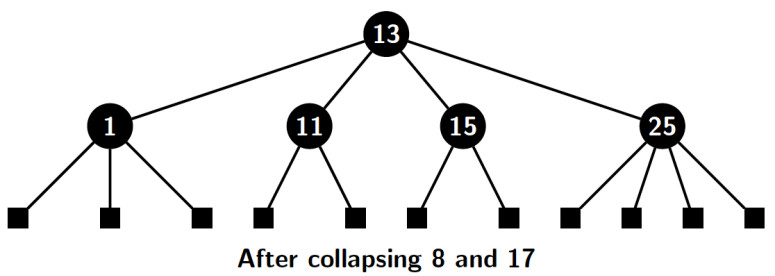

## Introduction to Red-Black Trees

In the previous two blogs, we discussed AVL trees for Maintaining BSTs as balanced trees. It led to O(log n) time operations on BSTs. 
An additional rotation operation is applied to maintain balance for AVL trees. The operation has to be used as frequently as the BST loses 
balance. AVL techniques maintain a careful balance which ensures that the height difference between two subtrees of a node is never more than 1. 
The red-black tree is also a self-balancing BST that relaxes the frequent maintenance of node balances. The readers may refer to 
[wikipedia for the history](https://en.wikipedia.org/wiki/Red%E2%80%93black_tree) around the discovery of red-black trees.
Red black trees perform about 10-20% faster than AVL trees. A red-black tree makes fewer structural changes to a BST than AVL. 
If performance is not very important, then AVL is simpler and preferable. However, if performance is important, then probably preference 
will be to use B-trees. 

A red-black tree is a self-balancing binary search tree (BST) with two different nodes types. The nodes are distinguished by a color bit where 
0, and 1 represent red and black colors, respectively. The important characteristics of a red-black tree are as follows:

- Order invariant: preserves ordering property of a BST
- Color invariants:
- 
     - Node colors: nodes are either colored red or black 
     - Blackroot and leaves: the root is always colored black, and all leaf nodes are colored black
     - no two consecutive nodes are colored red

- Height invariant: the number of black nodes on any path from the root of a leaf  is the same 

A newly inserted node is colored red. It may violate color invariant, i.e., two red-colored nodes may appear as parent-child in the tree after the insertion.
So, insertion may require color fixing if two red nodes appear consecutively. The fixing must be done by recoloring the nodes so that the height 
invariant (black height) is preserved. Maintaining black height is important because the time complexities of the operation depend on black height. 

<strong>Black height</strong>: Black height of a node <i>n</i> in a red black tree is equal to the number of black height from <i>n</i> to the farthest leaf 
node from <i>n</i>.

Figure below depicts a red black tree of black height 3. It does not include external nodes. It includes black external nodes which are leaf nodes of the tree.

The black height of the above tree is 3. Every path from the root to any leaf node has exactly three black-colored nodes. The black height of 8 is two. All leaf nodes
are external nodes. These nodes do not store actual elements but make the tree strictly binary. So, the tree is a BST, and its node has 
exactly two children. The black height of a red-black tree <i>T</i> with root <i>r</i> is denoted by <i>bh(r)</i>. We can prove the following property about black height.

<strong>Minimum number of internal node</strong>: Let the black height of a RBT <i>T</i> with root <i>r</i> be <i>bh(r)</i>. Then <i>T</i> consists of at least 
<i>2{bh(r)}-1</i> internal nodes. 

The proof relies on recurrence relation and induction. If <i>r</i> is a leaf node then <i>T</i> has no internal node. It consist of <i>20 - 1</i> 
internal nodes. 

<u>Induction hypothesis</u>: Assume that any subtree of <i>T</i> with height less <i>bh(r)</i> satisfies the stated property.

<u>Induction step</u>: Since root is alway black, it implies each of the two subtrees of <i>r</i> has a black height of <i>bh(r)-1</i>. 
We apply the induction to both subtree separately and reach the following conclusions:

- Right subtree of <i>T</i> has at least <i>2bh(r)-2</i> internal nodes
- Left subtree of <i>T</i> has at least <i>2bh(r)-2</i> internal nodes

Combining the above two results, we conclude that tree <i>T</i> must have <i>2*2bh(r)-2 = 2bh(r)-1</i>.  

<strong>Height of a red black tree</strong>:  The height of a red black tree with <i>n</i> nodes is <i>O(log n)</i>.

If a red black tree <i>T</i> with root <i>r</i> has a black of height of </i>bh(r)</i>, then we know from the previous property that <i>n > 2bh(r)-1</i>. 
Further, at least half the nodes in a path from root to a leaf node in any red black tree are black. Leaf is also black. Therefore, <i>bh(r) &nbsp;&le;&nbsp; h/2</i>, where
<i>h</i> is the height of <i>T</i>. It implies, <i>h/2 &nbsp;&ge;&nbsp; log (n+1)</i>. Hence, <i>h = O(log n)</i>.

Another way of proving the above property is by collapsing the nodes of a red-black tree. The pictures below depict the sequence of collapsing operation 
on the nodes of a red-black tree.

The next set of parallel collapsing operations reduce the tree to the figure shown below:

We observe the following points about the tree after the two sets of collapsing operations are complete:

- Each node in the compact red-black tree consists of only black nodes 
- All the external nodes are at the same depth from the root 
- An internal node may have 2, or 3 or at most four children
- The height of the collapsed tree <i>h'&nbsp;&ge;&nbsp; h/2</i>

Except for point three, all other points are easy to understand. A black node in a red-black tree may have

- Two red children, or
- One black child and one red child, or
- Two black children

Collapsing two red children gives four black children to the parent. However, if one of the black node children is black, it can provide three black children 
after the collapse operation. The third case is obvious.

The number of internal nodes in the collapsed tree 
<i> n&nbsp;&ge;&nbsp; 2h' - 1 &nbsp;&ge;&nbsp; 2h/2 -1</i>. Therefore, <i> h&nbsp;&le;&nbsp; 2 log (n+1)</i>. In the next blog we plan to 
focus on operations on red-black trees.

[Back to Index](../index.md)
