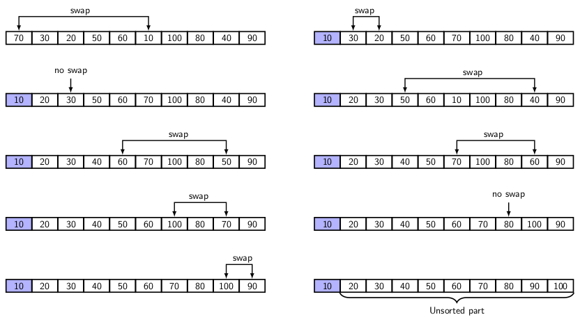

## Selection Sort

Initially, the entire set of <i>n</i> elements of the input sequence is considered as unsorted. The
selection sort selects the minimum of the remaining unsorted elements and places the selected element
at the next position. Recursively speaking, after <i>k</i> elements have been sorted, 

- We select the minimum from the remaining <i>n-k</i> elements and 
- Placed the selected element at the position <i>k+1</i>. 

The unsorted part then reduced to <i>n-k-1</i> elements. We repeat the above two steps until unsorted
part is left with one element which is the maximum element. So, the sorting is complete. The figure
below illustrates the selection sorting:
<p style="text-aling:center">
  
</p>
The algorithm appears below.

```
procedure selectionSort(int a[], int n) {
  int  i, j, minIndex;

    for(i = 0; i < n; i++) {
        minIndex = i; // Start with the first element of 
                      // the unsorted part of the array 
        for(j = i+1; j < n; j++) {
            if (a[j] < a[minIndex]) {
                minIndex = j; // Update the current minIndex 
            }
        }
        // Found the index of the overall minimum 
        // Exchange a[i] and a[minIndex]
        swap(a[i], a[minIndex]); 
    }

    return;
}
```

[C Program for Selection Sort](../CODES/selectionSortAlgorithm/index.md)

[Back to Index](../index.md)
