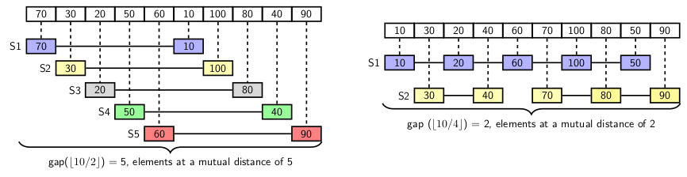
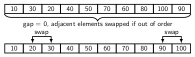

## Shell Sort Algorithm

Shell sort is a generalization of insertion sort. It creates logical subarrays of a given array
by gathering elements at a fixed distance called interval. Initially, interval length is 
<i>n/2</i>, where <i>n</i> is the number of elements to be sorted. We reduce the interval length
in each pass by half. When interval length is 1, we use compare-and-swap to sort the array.
Many researchers used different interval lengths to explore shell sort's efficiency. However,
in our description we use conventional interval length starting with <i>n/2</i>. 

We consider the elements at a gap of <i>g</i> and use insertion sort process to sort the
elements. For example, when <i>g</i> = n/2</i>, we compare elements at a gap of n/2 starting
with first element. Assuming that input sequence is represented by arr[0], arr[1], ..., arr[n-1],
we have to sort <i>n/2</i> subsequences, where each subsequence consists of one pair of elements.

In the second pass <i>g = n/4</i>. So we have to carray independent sorting of the following 
sub-sequences of the input 

- The subsequence: {arr[0], arr[n/4], arr[n/2], arr[3n/4]}
- The subsequence: {arr[1], arr[(n/4)+1], arr[(n/2)+1], arr[(3n/4)+1]}
- The subsequence: {arr[2], arr[(n/4)+2], arr[(n/2)+2], arr[(3n/4)+2]}
- and so on.

In general, if we sort the subarrays consisting of elements at a gap of <i>g</i> then 

- The subsequence: {arr[0], arr[g], arr[2g], arr[3g], ..., arr[kg]}, where k = &lfloor;n/g&rfloor;
- The subsequence: {arr[1], arr[g+1], arr[2g+1], arr[3g+1]. arr[kg+1]}
- The subsequence: {arr[2], arr[g+2], arr[2g+2], arr[3g+2]. arr[kg+2]}
- and so on.

We use insertion sort to sort the subsequences. After sorting all subsequences, we say the original sequence to 
be g-sorted, where g is the gap. So, the sequence is (n/2)-sorted, (n/4)-sorted, (n/8)-sorted and so on. When
it is 0-sorted the sorting is complete. Let us consider the example given below to understand sorting
process.

  
  
  

We use a reducing sequences {5, 2, 1, 0} for creating the sublists. When the gap is 0, each pair of adjacent elements
are compared and swapped if necessary. In last pass, we require only 2 swaps.
