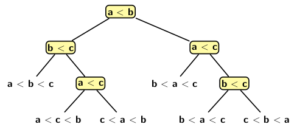
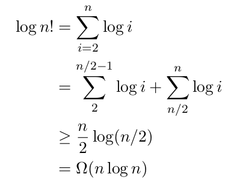
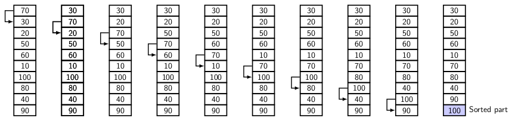

## Sorting Algorithms

We have used sorting in numerous contexts in the previous blogs.  Some operations on linked
lists become efficient if the lists are maintained in sorted order. Searching for an element in a list
becomes efficient if the list is sorted. Binary search is applicable to a sorted list.
However, we have not considered the problem of sorting in isolation. A list may be presented as
a collection of elements in any order, not necessarily in sorted order. So, the question is: 
how do we get a sorted list in the first place? There are many sorting algorithms. We can classify
them according to several characteristics. 

- Based on the complexity  
- Based on the number of comparisons 
- Based on the number of movements
- Based on memory usage
- Based on stability
- Based on adaptability

The three measures of computational complexity are the best case, the average case, and the worst
case. Since the lower bound of sorting is O(<i>n log n</i>) for input size of <i>n</i>, the best 
case computational complexity for sorting is O(<i>n log n</i>). The worst case of sorting <i>n</i> is 
O(<i>n<sup>2</sup></i>). The average case is equal to the computational efforts by the sorting 
algorithm averaged over all possible input distributions. Typically, we consider all possible inputs 
equally likely and define a probability measure. We determine the computational complexity for 
placing the elements in sorted order using the probability measure. 

Sorting is defined only as a collection of elements on which a total order is possible. A comparison
between a pair of elements is the fundamental operation for finding the relative position of an 
element with respect to others in an input list. Therefore, the number of comparisons determines
the running time of a sorting algorithm. A sorting network consists of a wired set 
of comparators. Counting the number of comparisons that turns an input into a sorted list gives 
the computation complexity. However, as we will see later, algorithms such as radix 
sort or counting sort do not use comparisons. So, the running time of these algorithms is not 
defined based on the number of comparisons.

Most comparison-based algorithms use swaps or data exchanges. In bubble sort, we move the elements
to the right of the sorted section to create a vacant slot for the next element
from the unsorted selection of the list. As we find, bubble sort progressively builds the
sorted list from a single element to including all the elements in the input list. In radix sort
the elements is placed in <i>k</i> bins if the radix is <i>k</i> in each pass. 

Memory usage tells whether the algorithm requires extra (auxiliary) space for carrying out 
sorting operations or whether the operations are possible without any extra space. If a sorting 
algorithm does not require additional space, we call it an "in place" sorting algorithm.

A stable sort does not disturb the relative position of the equal elements. So equal keys maintain
their relative order in the sorted list. If elements are distinct, then stability distinction
is meaningless. However, some algorithms fail to maintain stability in the presence of equal elements 
in the input.

Adaptability influences the sorting time for some sorting algorithms. Some sorting algorithms take 
presortedness of the elements to reduce running time. Such algorithms are classified
as adaptable. 

<strong>Lower bound</strong>: 

In a comparison-based sorting algorithm, for every pair of elements <i>a<sub>i</sub></i> and
<i>a<sub>j</sub></i> we carry out five tests:

- <i>a<sub>i</sub></i> &lt; <i>a<sub>j</sub></i>
- <i>a<sub>i</sub></i> &le; <i>a<sub>j</sub></i>
- <i>a<sub>i</sub></i> == <i>a<sub>j</sub></i>
- <i>a<sub>i</sub></i> &ge; <i>a<sub>j</sub></i>
- <i>a<sub>i</sub></i> &gt; <i>a<sub>j</sub></i>

Assuming elements are distinct, we can dispose the equality test. The remaining four test produce
identical results on releative ordering. So, we just need one comparison and choose "&le;" test.

Figure 1 illustrates a decision tree model for sorting three elements:
<p style="text-align:center">
  <br>
  Figure 1
</p>
Every node of the decision tree model represent a comparison. The left subtree represents all
subsequent comparisons when <i>a<sub>i</sub></i> &le; <i>a<sub>j</sub></i>. Similarly, the 
right subtree represents all subsequent comparisons when <i>a<sub>i</sub></i> &gt; <i>a<sub>j</sub></i>.
Each leaf denotes a sorting order. So, by tracing a path from the root of the decision tree down
to a leaf node we get minimum number of comparisons to reach a sorting sequence from a given
input sequence. Tracing a path in decision tree amounts to finding correct permutation for 
sorting a list of <i>n</i> elements. There are <i>n!</i> permutations of <i>n</i>. So, the 
decision tree model with <i>n</i> has <i>n!</i> leaves. The height of the tree is <i>log (n!)</i>.
Simplifying the expression <i>log (n!)</i> we get:
<p style="text-align:center">
  <br>
  Figure 2
</p>

Now let us deal with three simple algorithms:

- Bubble sort
- Insertion sort
- Selection sort

<strong>Bubble Sort</strong>

Bubble sort works on the principle of floating the lightest element to the top. We view the input 
as consisting of elements from a totally order set. An element is heavier (lighter) than another 
if the former greater (smaller) than the latter. Bubble sort makes the heavier elements sink to
the bottom, and lighter elements float to the top. Figure below illustrates the first pass of
bubble sort algorithm.
<p style="text-align:center">
  <br>
  Figure 3
</p>
It is a swap-based algorithm. Starting with leftmost end of the input list, it compares
adjacent pair of the elements. If heavier element is on top then the two elements are
swapped. After the first pass of <i>n-1</i> compare-swap operations, the heaviest element
occupies the bottom-most (<i>n</i>th) position of the list. Now the list consist of a 
unsorted part of <i>n-1</i> elements and a sorted part of one element. The sorted part is 
excluded from the next pass of comparison. So, the unsorted list size is reduced to <i>n-1</i>.
With every pass of compare-swap the size of the sorted part increase by one.
Therefore, with <i>n-1</i> passes the size of the sorted part becomes <i>n</i>. The algorithm
is given below.

```
 procedure bubbleSort(A) {
  n = A.length();
  do { 
    swapped = FALSE; // Flag used to indicate swaps
    for(i = 0; i < n; i++) {
      if (A[i] > A[i + 1]) { 
        swap(A[i], A[i + 1]); // Exchanges A[i] and A[i+1]
        swapped = TRUE;
      }
    }
    n--; // Size of unsorted part decreases
  } while(swapped)
}
```

Next we deal with selection sort. It chooses the minimum of the remaining input sequence and places
the element as the next element in sorted order. If we repeatedly execute the method starting with
the input sequence of <i>n</i> elements, then a selection step reduces the input sequence by
one each time. Therefore by <i>n-1</> selection steps we complete sorting of the input sequence. 
Since each selection step requires <i>k</i>, for <i>k=n, n-1,..., 1</i> comparisons, the total
number of comparisons is O(<i>n<sup>2</sup></i>).


