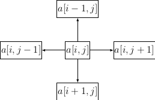
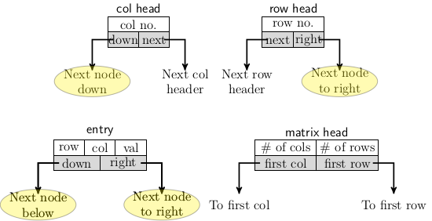
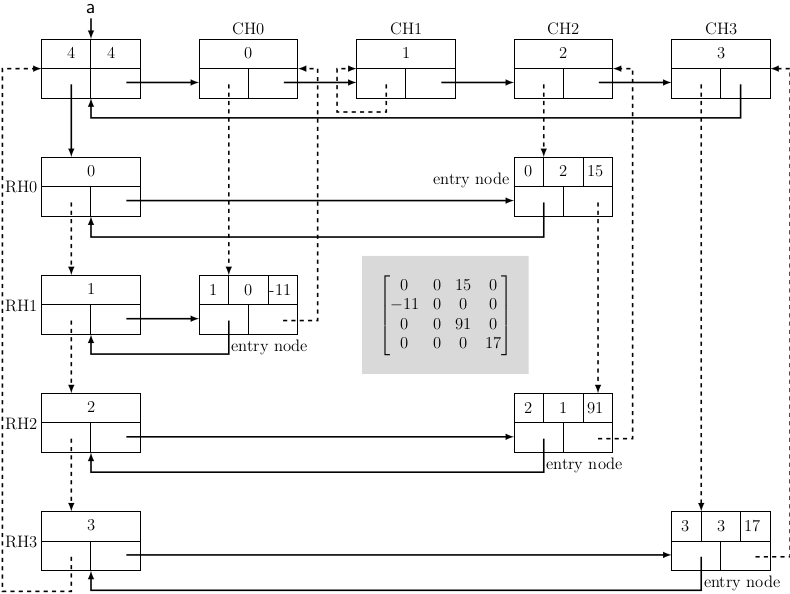
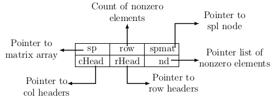

## Sparse Matrix

A sparse matrix of dimension <i>m</i>x<i>n</i> consists of fewer than <i>mn/2</i> non-zero elements. That is, it has more zero than non-zero elements. When operating with multiple sparse matrices of high dimensionality, 
storing and operating on them become challenging. The major problem lies in storing the sparse matrices. We
require a bit of careful organization taking advantage of the fact that it has many zero elements. While 
investigating linked lists, we noticed that in these data structures, each element could store references  
sequentially next element in the list. We can also use multiple link pointers to associate each node with a linked list
to different sequential lists. Examining the structure and operations on matrices, one may
realize that each matrix entry can be associated with four other entries to the left, right, top, and  
bottom. Therefore, we use linked lists to store a sparse matrix. The figure below depicts the relation of 
an entry with other neighboring entries in a sparse matrix.
<p style="text-align:center">
  
</p>
The picture indicates that we can create a node structure that lets each entry of a sparse matrix be a
part of at least two linked lists:

- a linked list of entries in a single column
- a linked list of entries in a single row

So, the structure of each node for matrix entries shall have two link pointers. Since non-zero elements
are distributed over different matrix positions, we should store the row and column positions along
with their values. The zero elements are not stored physically. So, the node structure of a matrix entry 
has five fields:

- The value of the entry, row, and column number to which the entry belongs.
- The pointers to the next entry are in the same row and the next in the same column.

We need header nodes to access a row or a column of the matrix. The header node of a column
allows us to access the first non-zero entry in that column. A similar header node for a row
is also needed to access rows and the first element of each row. 

We also need a header node for the entire matrix. It should be able to point to the first 
column and the first row headers. So, the four different node structures we have defined are
the figure below gives a pictorial illustration of the four node structures:
<p style="text-align:center">
  <br>
  Figure 1
</p>

Figure 2 shows an example of storing a sparse matrix with the nodes structures we have 
explained above. 
<p style="text-align:center">
  <br>
  Figure 2
</p>

We use a unified node structure for the code to understand the organization of matrix
nodes corresponding to a sparse matrix. The structure of this node is explained in the
diagram below.
<p style="text-align:center">
  <br>
  Figure 3
</p>
Now let us convert each node structure to a corresponding C-structure. The dimensions of 
the matrix are denoted by constants <i>MAX1</i> and <i>MAX2</i>. As we have already explained, an 
entry node has two pointers and a triplet that defines the non-zero element's row_no,
col_no, and the value. So, the C-structure corresponding to an entry node is as follows:

```
#define MAX1 4 // row dimension
#define MAX2 4 // column dimension

// Structure to store a non-zero element 
typedef struct Node { 
    int row; // row number
    int col; // col number
    int val; // Value of the entry
    struct Node* right; // Ptr to next element in the same row
    struct Node* down;  // Ptr to next element in the same col
} ENTRY;
```

The next two C-structures are for column and row headers. Each structure has one piece of
information (row or col) and two pointers. The column header should store the column number and point to the next
header node and the next element in the same column. Similarly, a row header stores the row number
and pointers to the next element in the same row and the next row header. For uniformity the next
header nodes are accessible from <i>next</i> pointers in corresponding header nodes. The next element
in the same row occurs to the right and is accessible from the <i>right</i> pointer of an entry node. The next
element in the same column occurs below the current entry node. So it is accessible from the
<i>down</i> pointer. The first element in a column and the first element in a row are accessible
from corresponding header nodes by <i>right</i> and <i>down</i> pointers from respective headers. 
```
// Structure for column headnode 
typedef struct cHead {
    int colno;
    ENTRY * down;
    struct cHead* next;
} CHAD;

// Structure for row headnode 
typedef struct read {
    int rowno;
    ENTRY * right;
    struct rHead* next;
} RHEAD;
```
Since we are using linked lists to implement a sparse matrix, we need a node that allows us 
to access all the sparse matrix, including headers and entries. So, we create a <i>spmat</i> 
node. It should have pointers to the first row and the first column and store information regarding 
the number of rows and columns in the matrix. A C-structure to implement it is given below.

```
// Structure for matrix headnode
typedef struct spmat {
    RHEAD * firstRow;
    CHEAD * firstCol;
    int nRows;
    int nCols;
} SPMAT;
```
Finally, we must create the triplets for
non-zero elements from a user's input to experiment with our implementation. A composite structure for sparse matrix creation and 
subsequent operations is defined below. 

```
// Use for accessing whole of sparse matrix including
// all elements which allows us to also build triplets 
typedef struct sparse {
    int* sp; // Storage for all elements
    int row; // Number of non-zero elements in matrix
    SPORT * smat;
    CHEAD * cHead[MAX2];
    RHEAD * rhead[MAX1];
    ENTRY * and;
} SPARSE;


```

Each non-zero element is a triplet of the form (row_no, col_no, value). Let <i>nonZero</i> be the number of non-zero
elements, and <i>mn</i> is the dimension of the matrix. Then the ratio of <i>mn-nonZero</i> and <i>mn</i>
defines the sparsity of the matrix. If sparsity exceeds 0.5, then the matrix is sparse. The sparse matrix is shown in
Figure 3 has only four non-zero elements. Therefore the sparsity of the matrix = 0.75. 

We can create a sparse matrix by creating an entry node for each non-zero element. The entry node is placed in 
the position corresponding to its row and column number. The code for creating the entry node is given below.

```
// Create an array MAX1 x Max2 for matrix 
void createArray(SPARSE * p) {
    int n, i;

    p->sp = (int*)malloc(MAX1 * MAX2 * sizeof(int));

    // Read values and store in array 
    for (i = 0; i < MAX1 * MAX2; i++) {
        printf("Enter element no. %d:", i);
        scanf("%d", &n);
        *(p->sp + i) = n;
    }
}
```

The entire source code for creating, inserting, and printing non-zero elements of a sparse matrix
is available from the link below. We have not examined matrix operations. There are many algorithms
for operations on sparse matrix. These algorithms do not come under the scope of data structures.
 
[Source code for sparse matrix](../../CODES/SPMAT/index.md)

[Back to index](../index.md)
